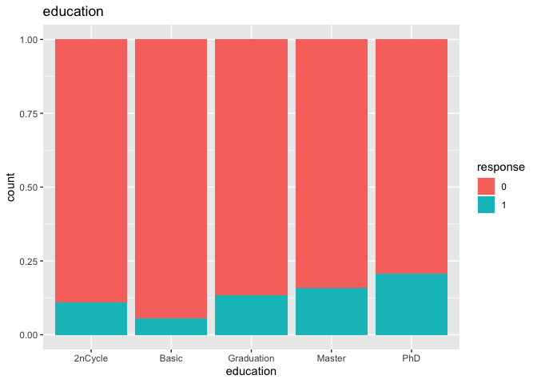
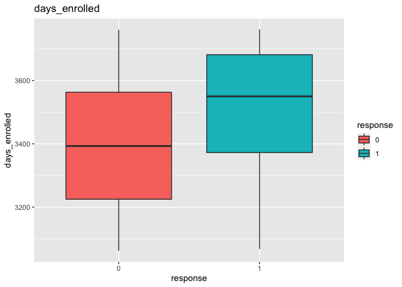
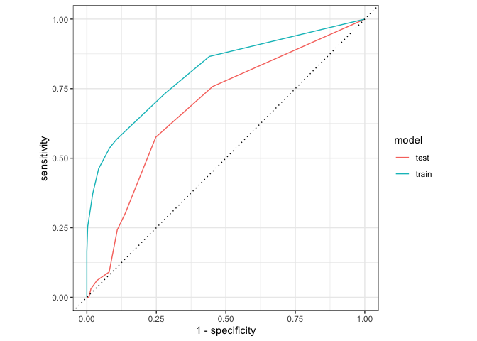
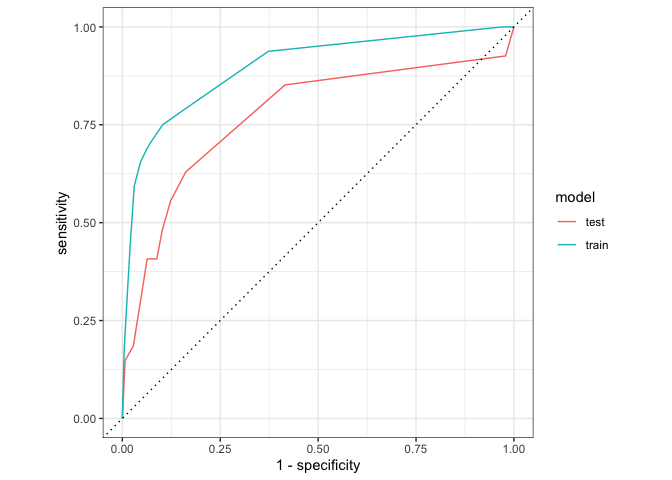

Marketing Campaign Strategy
================

# load libraries / install packages

``` r
options(scipen = 999)
options(yardstick.event_first = FALSE)

library(tidyverse)
library(tidymodels)
library(tidytext)
library(janitor)
library(skimr)
library(kableExtra)
library(GGally)
library(kableExtra) 
library(vip)        
library(fastshap)   
library(MASS)
library(ISLR)
library(tree)
library(dplyr)
library(ggplot2)
library(imputeMissings)

#install.packages("factoextra")
library(factoextra)

library(lubridate)
```

# Read Data

``` r
market1 <- read_csv("marketing_campaign.csv") %>% clean_names()


#drop rejected variables
market = subset(market1,select = -c(z_cost,z_rev))
head(market) 
```

    ## # A tibble: 6 × 27
    ##      id birth education  mar_s…¹ income  kids teens dt_cu…² recency wines fruits
    ##   <dbl> <dbl> <chr>      <chr>    <dbl> <dbl> <dbl> <chr>     <dbl> <dbl>  <dbl>
    ## 1  5524  1957 Graduation Single   58138     0     0 4/9/20…      58   635     88
    ## 2  2174  1954 Graduation Single   46344     1     1 8/3/20…      38    11      1
    ## 3  4141  1965 Graduation Partner  71613     0     0 21-08-…      26   426     49
    ## 4  6182  1984 Graduation Partner  26646     1     0 10/2/2…      26    11      4
    ## 5  5324  1981 PhD        Married  58293     1     0 19-01-…      94   173     43
    ## 6  7446  1967 Master     Partner  62513     0     1 9/9/20…      16   520     42
    ## # … with 16 more variables: meat <dbl>, fish <dbl>, sweets <dbl>, gold <dbl>,
    ## #   deals <dbl>, web <dbl>, catalog <dbl>, store <dbl>, visits <dbl>,
    ## #   cmp3 <dbl>, cmp4 <dbl>, cmp5 <dbl>, cmp1 <dbl>, cmp2 <dbl>, cmplain <dbl>,
    ## #   response <dbl>, and abbreviated variable names ¹​mar_stat, ²​dt_customer

``` r
cust_new <- read_csv("new_customers_mkt.csv") %>% clean_names()

head(cust_new)
```

    ## # A tibble: 6 × 26
    ##      id birth education  mar_s…¹ income  kids teens dt_cu…² recency wines fruits
    ##   <dbl> <dbl> <chr>      <chr>    <dbl> <dbl> <dbl> <chr>     <dbl> <dbl>  <dbl>
    ## 1   111  1946 Graduation Partner  37760     0     0 31-08-…      20    84      5
    ## 2   112  1949 Master     Married  76995     0     1 28-03-…      91  1012     80
    ## 3   113  1985 2nCycle    Single   33812     1     0 3/11/2…      86     4     17
    ## 4   114  1982 Graduation Married  37040     0     0 8/8/20…      41    86      2
    ## 5   115  1979 Graduation Married   2447     1     0 6/1/20…      42     1      1
    ## 6   116  1949 PhD        Married  58607     0     1 23-12-…      63   867      0
    ## # … with 15 more variables: meat <dbl>, fish <dbl>, sweets <dbl>, gold <dbl>,
    ## #   deals <dbl>, web <dbl>, catalog <dbl>, store <dbl>, visits <dbl>,
    ## #   cmp3 <dbl>, cmp4 <dbl>, cmp5 <dbl>, cmp1 <dbl>, cmp2 <dbl>, cmplain <dbl>,
    ## #   and abbreviated variable names ¹​mar_stat, ²​dt_customer

# Explanatory Analysis

## Skim

``` r
market <- market %>%
  mutate(format1 = as.Date(dt_customer,format("%d/%m/%Y"))) %>%
  mutate(format2 = as.Date(dt_customer,format("%d-%m-%Y"))) %>%
  mutate(days_enrolled = as.numeric(difftime(today(),as.Date(ifelse(is.na(format1), format2, format1),origin = "1970-01-01")))) %>%
  subset(.,select = -c(format1,format2,dt_customer)) %>%
  mutate_if(is.character,factor) %>%
  mutate(response=as.factor(response))
  

market %>% skim()
```

<table style="width: auto;" class="table table-condensed">
<caption>
Data summary
</caption>
<tbody>
<tr>
<td style="text-align:left;">
Name
</td>
<td style="text-align:left;">
Piped data
</td>
</tr>
<tr>
<td style="text-align:left;">
Number of rows
</td>
<td style="text-align:left;">
2240
</td>
</tr>
<tr>
<td style="text-align:left;">
Number of columns
</td>
<td style="text-align:left;">
27
</td>
</tr>
<tr>
<td style="text-align:left;">
\_\_\_\_\_\_\_\_\_\_\_\_\_\_\_\_\_\_\_\_\_\_\_
</td>
<td style="text-align:left;">
</td>
</tr>
<tr>
<td style="text-align:left;">
Column type frequency:
</td>
<td style="text-align:left;">
</td>
</tr>
<tr>
<td style="text-align:left;">
factor
</td>
<td style="text-align:left;">
3
</td>
</tr>
<tr>
<td style="text-align:left;">
numeric
</td>
<td style="text-align:left;">
24
</td>
</tr>
<tr>
<td style="text-align:left;">
\_\_\_\_\_\_\_\_\_\_\_\_\_\_\_\_\_\_\_\_\_\_\_\_
</td>
<td style="text-align:left;">
</td>
</tr>
<tr>
<td style="text-align:left;">
Group variables
</td>
<td style="text-align:left;">
None
</td>
</tr>
</tbody>
</table>

**Variable type: factor**

<table>
<thead>
<tr>
<th style="text-align:left;">
skim_variable
</th>
<th style="text-align:right;">
n_missing
</th>
<th style="text-align:right;">
complete_rate
</th>
<th style="text-align:left;">
ordered
</th>
<th style="text-align:right;">
n_unique
</th>
<th style="text-align:left;">
top_counts
</th>
</tr>
</thead>
<tbody>
<tr>
<td style="text-align:left;">
education
</td>
<td style="text-align:right;">
0
</td>
<td style="text-align:right;">
1
</td>
<td style="text-align:left;">
FALSE
</td>
<td style="text-align:right;">
5
</td>
<td style="text-align:left;">
Gra: 1127, PhD: 486, Mas: 370, 2nC: 203
</td>
</tr>
<tr>
<td style="text-align:left;">
mar_stat
</td>
<td style="text-align:right;">
0
</td>
<td style="text-align:right;">
1
</td>
<td style="text-align:left;">
FALSE
</td>
<td style="text-align:right;">
8
</td>
<td style="text-align:left;">
Mar: 864, Par: 580, Sin: 480, Div: 232
</td>
</tr>
<tr>
<td style="text-align:left;">
response
</td>
<td style="text-align:right;">
0
</td>
<td style="text-align:right;">
1
</td>
<td style="text-align:left;">
FALSE
</td>
<td style="text-align:right;">
2
</td>
<td style="text-align:left;">
0: 1904, 1: 336
</td>
</tr>
</tbody>
</table>

**Variable type: numeric**

<table>
<thead>
<tr>
<th style="text-align:left;">
skim_variable
</th>
<th style="text-align:right;">
n_missing
</th>
<th style="text-align:right;">
complete_rate
</th>
<th style="text-align:right;">
mean
</th>
<th style="text-align:right;">
sd
</th>
<th style="text-align:right;">
p0
</th>
<th style="text-align:right;">
p25
</th>
<th style="text-align:right;">
p50
</th>
<th style="text-align:right;">
p75
</th>
<th style="text-align:right;">
p100
</th>
<th style="text-align:left;">
hist
</th>
</tr>
</thead>
<tbody>
<tr>
<td style="text-align:left;">
id
</td>
<td style="text-align:right;">
0
</td>
<td style="text-align:right;">
1.00
</td>
<td style="text-align:right;">
5592.16
</td>
<td style="text-align:right;">
3246.66
</td>
<td style="text-align:right;">
0
</td>
<td style="text-align:right;">
2828.25
</td>
<td style="text-align:right;">
5458.5
</td>
<td style="text-align:right;">
8427.75
</td>
<td style="text-align:right;">
11191
</td>
<td style="text-align:left;">
▇▇▇▇▇
</td>
</tr>
<tr>
<td style="text-align:left;">
birth
</td>
<td style="text-align:right;">
0
</td>
<td style="text-align:right;">
1.00
</td>
<td style="text-align:right;">
1968.81
</td>
<td style="text-align:right;">
11.98
</td>
<td style="text-align:right;">
1893
</td>
<td style="text-align:right;">
1959.00
</td>
<td style="text-align:right;">
1970.0
</td>
<td style="text-align:right;">
1977.00
</td>
<td style="text-align:right;">
1996
</td>
<td style="text-align:left;">
▁▁▂▇▅
</td>
</tr>
<tr>
<td style="text-align:left;">
income
</td>
<td style="text-align:right;">
24
</td>
<td style="text-align:right;">
0.99
</td>
<td style="text-align:right;">
52247.25
</td>
<td style="text-align:right;">
25173.08
</td>
<td style="text-align:right;">
1730
</td>
<td style="text-align:right;">
35303.00
</td>
<td style="text-align:right;">
51381.5
</td>
<td style="text-align:right;">
68522.00
</td>
<td style="text-align:right;">
666666
</td>
<td style="text-align:left;">
▇▁▁▁▁
</td>
</tr>
<tr>
<td style="text-align:left;">
kids
</td>
<td style="text-align:right;">
0
</td>
<td style="text-align:right;">
1.00
</td>
<td style="text-align:right;">
0.44
</td>
<td style="text-align:right;">
0.54
</td>
<td style="text-align:right;">
0
</td>
<td style="text-align:right;">
0.00
</td>
<td style="text-align:right;">
0.0
</td>
<td style="text-align:right;">
1.00
</td>
<td style="text-align:right;">
2
</td>
<td style="text-align:left;">
▇▁▆▁▁
</td>
</tr>
<tr>
<td style="text-align:left;">
teens
</td>
<td style="text-align:right;">
0
</td>
<td style="text-align:right;">
1.00
</td>
<td style="text-align:right;">
0.51
</td>
<td style="text-align:right;">
0.54
</td>
<td style="text-align:right;">
0
</td>
<td style="text-align:right;">
0.00
</td>
<td style="text-align:right;">
0.0
</td>
<td style="text-align:right;">
1.00
</td>
<td style="text-align:right;">
2
</td>
<td style="text-align:left;">
▇▁▇▁▁
</td>
</tr>
<tr>
<td style="text-align:left;">
recency
</td>
<td style="text-align:right;">
0
</td>
<td style="text-align:right;">
1.00
</td>
<td style="text-align:right;">
49.11
</td>
<td style="text-align:right;">
28.96
</td>
<td style="text-align:right;">
0
</td>
<td style="text-align:right;">
24.00
</td>
<td style="text-align:right;">
49.0
</td>
<td style="text-align:right;">
74.00
</td>
<td style="text-align:right;">
99
</td>
<td style="text-align:left;">
▇▇▇▇▇
</td>
</tr>
<tr>
<td style="text-align:left;">
wines
</td>
<td style="text-align:right;">
0
</td>
<td style="text-align:right;">
1.00
</td>
<td style="text-align:right;">
303.94
</td>
<td style="text-align:right;">
336.60
</td>
<td style="text-align:right;">
0
</td>
<td style="text-align:right;">
23.75
</td>
<td style="text-align:right;">
173.5
</td>
<td style="text-align:right;">
504.25
</td>
<td style="text-align:right;">
1493
</td>
<td style="text-align:left;">
▇▂▂▁▁
</td>
</tr>
<tr>
<td style="text-align:left;">
fruits
</td>
<td style="text-align:right;">
0
</td>
<td style="text-align:right;">
1.00
</td>
<td style="text-align:right;">
26.30
</td>
<td style="text-align:right;">
39.77
</td>
<td style="text-align:right;">
0
</td>
<td style="text-align:right;">
1.00
</td>
<td style="text-align:right;">
8.0
</td>
<td style="text-align:right;">
33.00
</td>
<td style="text-align:right;">
199
</td>
<td style="text-align:left;">
▇▁▁▁▁
</td>
</tr>
<tr>
<td style="text-align:left;">
meat
</td>
<td style="text-align:right;">
0
</td>
<td style="text-align:right;">
1.00
</td>
<td style="text-align:right;">
166.95
</td>
<td style="text-align:right;">
225.72
</td>
<td style="text-align:right;">
0
</td>
<td style="text-align:right;">
16.00
</td>
<td style="text-align:right;">
67.0
</td>
<td style="text-align:right;">
232.00
</td>
<td style="text-align:right;">
1725
</td>
<td style="text-align:left;">
▇▁▁▁▁
</td>
</tr>
<tr>
<td style="text-align:left;">
fish
</td>
<td style="text-align:right;">
0
</td>
<td style="text-align:right;">
1.00
</td>
<td style="text-align:right;">
37.53
</td>
<td style="text-align:right;">
54.63
</td>
<td style="text-align:right;">
0
</td>
<td style="text-align:right;">
3.00
</td>
<td style="text-align:right;">
12.0
</td>
<td style="text-align:right;">
50.00
</td>
<td style="text-align:right;">
259
</td>
<td style="text-align:left;">
▇▁▁▁▁
</td>
</tr>
<tr>
<td style="text-align:left;">
sweets
</td>
<td style="text-align:right;">
0
</td>
<td style="text-align:right;">
1.00
</td>
<td style="text-align:right;">
27.06
</td>
<td style="text-align:right;">
41.28
</td>
<td style="text-align:right;">
0
</td>
<td style="text-align:right;">
1.00
</td>
<td style="text-align:right;">
8.0
</td>
<td style="text-align:right;">
33.00
</td>
<td style="text-align:right;">
263
</td>
<td style="text-align:left;">
▇▁▁▁▁
</td>
</tr>
<tr>
<td style="text-align:left;">
gold
</td>
<td style="text-align:right;">
0
</td>
<td style="text-align:right;">
1.00
</td>
<td style="text-align:right;">
44.02
</td>
<td style="text-align:right;">
52.17
</td>
<td style="text-align:right;">
0
</td>
<td style="text-align:right;">
9.00
</td>
<td style="text-align:right;">
24.0
</td>
<td style="text-align:right;">
56.00
</td>
<td style="text-align:right;">
362
</td>
<td style="text-align:left;">
▇▁▁▁▁
</td>
</tr>
<tr>
<td style="text-align:left;">
deals
</td>
<td style="text-align:right;">
0
</td>
<td style="text-align:right;">
1.00
</td>
<td style="text-align:right;">
2.33
</td>
<td style="text-align:right;">
1.93
</td>
<td style="text-align:right;">
0
</td>
<td style="text-align:right;">
1.00
</td>
<td style="text-align:right;">
2.0
</td>
<td style="text-align:right;">
3.00
</td>
<td style="text-align:right;">
15
</td>
<td style="text-align:left;">
▇▂▁▁▁
</td>
</tr>
<tr>
<td style="text-align:left;">
web
</td>
<td style="text-align:right;">
0
</td>
<td style="text-align:right;">
1.00
</td>
<td style="text-align:right;">
4.08
</td>
<td style="text-align:right;">
2.78
</td>
<td style="text-align:right;">
0
</td>
<td style="text-align:right;">
2.00
</td>
<td style="text-align:right;">
4.0
</td>
<td style="text-align:right;">
6.00
</td>
<td style="text-align:right;">
27
</td>
<td style="text-align:left;">
▇▃▁▁▁
</td>
</tr>
<tr>
<td style="text-align:left;">
catalog
</td>
<td style="text-align:right;">
0
</td>
<td style="text-align:right;">
1.00
</td>
<td style="text-align:right;">
2.66
</td>
<td style="text-align:right;">
2.92
</td>
<td style="text-align:right;">
0
</td>
<td style="text-align:right;">
0.00
</td>
<td style="text-align:right;">
2.0
</td>
<td style="text-align:right;">
4.00
</td>
<td style="text-align:right;">
28
</td>
<td style="text-align:left;">
▇▂▁▁▁
</td>
</tr>
<tr>
<td style="text-align:left;">
store
</td>
<td style="text-align:right;">
0
</td>
<td style="text-align:right;">
1.00
</td>
<td style="text-align:right;">
5.79
</td>
<td style="text-align:right;">
3.25
</td>
<td style="text-align:right;">
0
</td>
<td style="text-align:right;">
3.00
</td>
<td style="text-align:right;">
5.0
</td>
<td style="text-align:right;">
8.00
</td>
<td style="text-align:right;">
13
</td>
<td style="text-align:left;">
▂▇▂▃▂
</td>
</tr>
<tr>
<td style="text-align:left;">
visits
</td>
<td style="text-align:right;">
0
</td>
<td style="text-align:right;">
1.00
</td>
<td style="text-align:right;">
5.32
</td>
<td style="text-align:right;">
2.43
</td>
<td style="text-align:right;">
0
</td>
<td style="text-align:right;">
3.00
</td>
<td style="text-align:right;">
6.0
</td>
<td style="text-align:right;">
7.00
</td>
<td style="text-align:right;">
20
</td>
<td style="text-align:left;">
▅▇▁▁▁
</td>
</tr>
<tr>
<td style="text-align:left;">
cmp3
</td>
<td style="text-align:right;">
0
</td>
<td style="text-align:right;">
1.00
</td>
<td style="text-align:right;">
0.07
</td>
<td style="text-align:right;">
0.26
</td>
<td style="text-align:right;">
0
</td>
<td style="text-align:right;">
0.00
</td>
<td style="text-align:right;">
0.0
</td>
<td style="text-align:right;">
0.00
</td>
<td style="text-align:right;">
1
</td>
<td style="text-align:left;">
▇▁▁▁▁
</td>
</tr>
<tr>
<td style="text-align:left;">
cmp4
</td>
<td style="text-align:right;">
0
</td>
<td style="text-align:right;">
1.00
</td>
<td style="text-align:right;">
0.07
</td>
<td style="text-align:right;">
0.26
</td>
<td style="text-align:right;">
0
</td>
<td style="text-align:right;">
0.00
</td>
<td style="text-align:right;">
0.0
</td>
<td style="text-align:right;">
0.00
</td>
<td style="text-align:right;">
1
</td>
<td style="text-align:left;">
▇▁▁▁▁
</td>
</tr>
<tr>
<td style="text-align:left;">
cmp5
</td>
<td style="text-align:right;">
0
</td>
<td style="text-align:right;">
1.00
</td>
<td style="text-align:right;">
0.07
</td>
<td style="text-align:right;">
0.26
</td>
<td style="text-align:right;">
0
</td>
<td style="text-align:right;">
0.00
</td>
<td style="text-align:right;">
0.0
</td>
<td style="text-align:right;">
0.00
</td>
<td style="text-align:right;">
1
</td>
<td style="text-align:left;">
▇▁▁▁▁
</td>
</tr>
<tr>
<td style="text-align:left;">
cmp1
</td>
<td style="text-align:right;">
0
</td>
<td style="text-align:right;">
1.00
</td>
<td style="text-align:right;">
0.06
</td>
<td style="text-align:right;">
0.25
</td>
<td style="text-align:right;">
0
</td>
<td style="text-align:right;">
0.00
</td>
<td style="text-align:right;">
0.0
</td>
<td style="text-align:right;">
0.00
</td>
<td style="text-align:right;">
1
</td>
<td style="text-align:left;">
▇▁▁▁▁
</td>
</tr>
<tr>
<td style="text-align:left;">
cmp2
</td>
<td style="text-align:right;">
0
</td>
<td style="text-align:right;">
1.00
</td>
<td style="text-align:right;">
0.01
</td>
<td style="text-align:right;">
0.11
</td>
<td style="text-align:right;">
0
</td>
<td style="text-align:right;">
0.00
</td>
<td style="text-align:right;">
0.0
</td>
<td style="text-align:right;">
0.00
</td>
<td style="text-align:right;">
1
</td>
<td style="text-align:left;">
▇▁▁▁▁
</td>
</tr>
<tr>
<td style="text-align:left;">
cmplain
</td>
<td style="text-align:right;">
0
</td>
<td style="text-align:right;">
1.00
</td>
<td style="text-align:right;">
0.01
</td>
<td style="text-align:right;">
0.10
</td>
<td style="text-align:right;">
0
</td>
<td style="text-align:right;">
0.00
</td>
<td style="text-align:right;">
0.0
</td>
<td style="text-align:right;">
0.00
</td>
<td style="text-align:right;">
1
</td>
<td style="text-align:left;">
▇▁▁▁▁
</td>
</tr>
<tr>
<td style="text-align:left;">
days_enrolled
</td>
<td style="text-align:right;">
0
</td>
<td style="text-align:right;">
1.00
</td>
<td style="text-align:right;">
3415.58
</td>
<td style="text-align:right;">
202.12
</td>
<td style="text-align:right;">
3062
</td>
<td style="text-align:right;">
3242.75
</td>
<td style="text-align:right;">
3417.5
</td>
<td style="text-align:right;">
3591.00
</td>
<td style="text-align:right;">
3761
</td>
<td style="text-align:left;">
▇▇▇▇▇
</td>
</tr>
</tbody>
</table>

## Taget Variable

``` r
market_response <- market %>% 
  count(response) %>%
  mutate(pct = n/sum(n))


market_response %>%
  ggplot(aes(.,x=as.factor(response),y=pct)) +
  geom_col()  + 
  geom_text(aes(label = paste(round(pct*100,1),"%")), vjust = 1.2, colour = "white") +
  labs(title="How many people accepted the offer in the last campaign?", x="Response", y="PCT")
```

<!-- -->

## Categorical & Numerical overview

### What is the overall demographic makeup of our customer base (age? married? Single? Kids at home? Educated?)?

``` r
market_cat <- market %>%
  mutate(across(c(cmp3,cmp4,cmp5,cmp1,cmp2,cmplain),factor))

# Categorical 
market_cat %>%
  pivot_longer(cols = !where(is.numeric), names_to = "column", values_to="value") %>%
  dplyr::select(column, value) %>%
  group_by(column, value) %>%
  summarise(count=n()) %>%
  ggplot(aes(x = reorder_within(value, -count, count), y = count, fill = as.factor(value))) +
  theme(axis.text.x = element_text(angle = 90,size = 5.5)) +
  geom_col(show.legend = FALSE) +
  labs(title = "Categorical Variable Frequency Distribution", x = "value", y = "count") +
  facet_wrap(~column, ncol = 5,scales = "free") +
  scale_x_reordered()
```

    ## `summarise()` has grouped output by 'column'. You can override using the
    ## `.groups` argument.

<!-- -->

``` r
# Numerical
market_cat %>%
  pivot_longer(cols = where(is.numeric), names_to = "column", values_to="value") %>%
  dplyr::select(column, value) %>%
  group_by(column) %>%
  summarise(count = n(),
            n_miss = sum(is.na(value)),
            n_distinct = n_distinct(value),
            mean = mean(value, na.rm = TRUE),
            median = median(value, na.rm = TRUE),
            min = min(value, na.rm = TRUE),
            max = max(value, na.rm = TRUE),
            sd = sd(value, na.rm = TRUE),
            )
```

    ## # A tibble: 18 × 9
    ##    column        count n_miss n_distinct      mean median   min    max        sd
    ##    <chr>         <int>  <int>      <int>     <dbl>  <dbl> <dbl>  <dbl>     <dbl>
    ##  1 birth          2240      0         59  1969.     1970   1893   1996    12.0  
    ##  2 catalog        2240      0         14     2.66      2      0     28     2.92 
    ##  3 days_enrolled  2240      0        663  3416.     3418.  3062   3761   202.   
    ##  4 deals          2240      0         15     2.33      2      0     15     1.93 
    ##  5 fish           2240      0        182    37.5      12      0    259    54.6  
    ##  6 fruits         2240      0        158    26.3       8      0    199    39.8  
    ##  7 gold           2240      0        213    44.0      24      0    362    52.2  
    ##  8 id             2240      0       2240  5592.     5458.     0  11191  3247.   
    ##  9 income         2240     24       1975 52247.    51382.  1730 666666 25173.   
    ## 10 kids           2240      0          3     0.444     0      0      2     0.538
    ## 11 meat           2240      0        558   167.       67      0   1725   226.   
    ## 12 recency        2240      0        100    49.1      49      0     99    29.0  
    ## 13 store          2240      0         14     5.79      5      0     13     3.25 
    ## 14 sweets         2240      0        177    27.1       8      0    263    41.3  
    ## 15 teens          2240      0          3     0.506     0      0      2     0.545
    ## 16 visits         2240      0         16     5.32      6      0     20     2.43 
    ## 17 web            2240      0         15     4.08      4      0     27     2.78 
    ## 18 wines          2240      0        776   304.      174.     0   1493   337.

# Clustering Model

## Plots

``` r
for (c in names(market_cat %>% dplyr::select(!c(id,response)))) {
  if (c %in% names(market_cat %>% dplyr::select(where(is.factor)))) {
    # -- for each character column create a chart
    print( market_cat %>%
             ggplot(., aes(!!as.name(c))) + 
             geom_bar(aes(fill = response), position = "fill")  +labs(title = c))
  } else {
    # -- comparative boxplots
    print(ggplot(market_cat, aes(x=response, y=!!as.name(c), fill=response))+ geom_boxplot() +labs(title = c))
  }
}
```

<!-- --><!-- --><!-- -->

    ## Warning: Removed 24 rows containing non-finite values (stat_boxplot).

<!-- --><!-- --><!-- --><!-- --><!-- --><!-- --><!-- --><!-- --><!-- --><!-- --><!-- --><!-- --><!-- --><!-- --><!-- --><!-- --><!-- --><!-- --><!-- --><!-- --><!-- --><!-- -->

``` r
#What percentage of customers shop via the different channels?

channels <- market %>%
  dplyr::select(web,catalog,store)
channels
```

    ## # A tibble: 2,240 × 3
    ##      web catalog store
    ##    <dbl>   <dbl> <dbl>
    ##  1     8      10     4
    ##  2     1       1     2
    ##  3     8       2    10
    ##  4     2       0     4
    ##  5     5       3     6
    ##  6     6       4    10
    ##  7     7       3     7
    ##  8     4       0     4
    ##  9     3       0     2
    ## 10     1       0     0
    ## # … with 2,230 more rows

``` r
### Sum the data using apply & use this for beautiful barplot
sumdata<-data.frame(value=colSums(channels)/sum(channels))
ggplot(data=sumdata, aes(x=rownames(sumdata),y=value)) +
geom_bar(stat="identity") + labs(title = "What percentage of customers shop via the different channels?", x = "channels", y = "pct") + geom_text(aes(label = paste(round(value*100,1),"%")), vjust = 1.2, colour = "white")
```

<!-- -->

``` r
channels %>% bind_cols(response=market$response) %>%
  group_by(response) %>%
  summarise(webn = median(web))
```

    ## # A tibble: 2 × 2
    ##   response  webn
    ##   <fct>    <dbl>
    ## 1 0            3
    ## 2 1            5

``` r
channels %>% bind_cols(response=market$response) %>%
  group_by(response) %>%
  summarise(storen = median(store))
```

    ## # A tibble: 2 × 2
    ##   response storen
    ##   <fct>     <dbl>
    ## 1 0             5
    ## 2 1             6

``` r
channels %>% bind_cols(response=market$response) %>%
  group_by(response) %>%
  summarise(catan = median(catalog))
```

    ## # A tibble: 2 × 2
    ##   response catan
    ##   <fct>    <dbl>
    ## 1 0            1
    ## 2 1            4

``` r
channels %>% bind_cols(response=market$response) %>%
  mutate(utilize3 = as.numeric(ifelse(web > 0 & catalog > 0 & store >0,1,0))) %>%
  group_by(response) %>%
  summarise(n = sum(utilize3))
```

    ## # A tibble: 2 × 2
    ##   response     n
    ##   <fct>    <dbl>
    ## 1 0         1330
    ## 2 1          312

``` r
#What are the most popular items (in terms of amount spent) that are purchased from the retailer?

items <- market %>%
  dplyr::select(wines,fruits,meat,fish,sweets,gold)
items
```

    ## # A tibble: 2,240 × 6
    ##    wines fruits  meat  fish sweets  gold
    ##    <dbl>  <dbl> <dbl> <dbl>  <dbl> <dbl>
    ##  1   635     88   546   172     88    88
    ##  2    11      1     6     2      1     6
    ##  3   426     49   127   111     21    42
    ##  4    11      4    20    10      3     5
    ##  5   173     43   118    46     27    15
    ##  6   520     42    98     0     42    14
    ##  7   235     65   164    50     49    27
    ##  8    76     10    56     3      1    23
    ##  9    14      0    24     3      3     2
    ## 10    28      0     6     1      1    13
    ## # … with 2,230 more rows

``` r
### Sum the data using apply & use this for beautiful barplot
sumdata<-data.frame(value=colSums(items))
ggplot(data=sumdata, aes(x=reorder(rownames(sumdata),value),y=value)) +
geom_bar(stat="identity") + labs(title = "What are the most popular items?", x = "items", y = "$ spent") + geom_text(aes(label = value), vjust = 1.2, colour = "white")
```

<!-- -->

## Data Preperation for Clustering

``` r
# impute missing variables
market_prep <- impute(market)

# create dummy variables for education and marital status

market_prep <- market_prep %>%
  mutate(basic = ifelse(education == "Basic",1,0)) %>%
  mutate(graduation = ifelse(education == "Graduation",1,0)) %>%
  mutate(master = ifelse(education == "Master" | education == "2nCycle",1,0)) %>%
  mutate(phd = ifelse(education == "PhD",1,0)) %>%
  mutate(married = ifelse(mar_stat == "Married",1,0)) %>%
  mutate(partner = ifelse(mar_stat == "Partner",1,0)) %>%
  mutate(single = ifelse(mar_stat != "Married" & mar_stat != "Partner",1,0))


#standardize numeric variables

market_prep <- market_prep %>%
    mutate(birth_s = scale(birth),
           income_s = scale(income),
           recency_s = scale(recency),
           wines_s = scale(wines),
           fruits_s = scale(fruits),
           meat_s = scale(meat),
           fish_s = scale(fish),
           sweets_s = scale(sweets),
           gold_s = scale(gold),
           days_enrolled_s = scale(days_enrolled))
  
market_prep %>% skim()
```

<table style="width: auto;" class="table table-condensed">
<caption>
Data summary
</caption>
<tbody>
<tr>
<td style="text-align:left;">
Name
</td>
<td style="text-align:left;">
Piped data
</td>
</tr>
<tr>
<td style="text-align:left;">
Number of rows
</td>
<td style="text-align:left;">
2240
</td>
</tr>
<tr>
<td style="text-align:left;">
Number of columns
</td>
<td style="text-align:left;">
44
</td>
</tr>
<tr>
<td style="text-align:left;">
\_\_\_\_\_\_\_\_\_\_\_\_\_\_\_\_\_\_\_\_\_\_\_
</td>
<td style="text-align:left;">
</td>
</tr>
<tr>
<td style="text-align:left;">
Column type frequency:
</td>
<td style="text-align:left;">
</td>
</tr>
<tr>
<td style="text-align:left;">
factor
</td>
<td style="text-align:left;">
3
</td>
</tr>
<tr>
<td style="text-align:left;">
numeric
</td>
<td style="text-align:left;">
41
</td>
</tr>
<tr>
<td style="text-align:left;">
\_\_\_\_\_\_\_\_\_\_\_\_\_\_\_\_\_\_\_\_\_\_\_\_
</td>
<td style="text-align:left;">
</td>
</tr>
<tr>
<td style="text-align:left;">
Group variables
</td>
<td style="text-align:left;">
None
</td>
</tr>
</tbody>
</table>

**Variable type: factor**

<table>
<thead>
<tr>
<th style="text-align:left;">
skim_variable
</th>
<th style="text-align:right;">
n_missing
</th>
<th style="text-align:right;">
complete_rate
</th>
<th style="text-align:left;">
ordered
</th>
<th style="text-align:right;">
n_unique
</th>
<th style="text-align:left;">
top_counts
</th>
</tr>
</thead>
<tbody>
<tr>
<td style="text-align:left;">
education
</td>
<td style="text-align:right;">
0
</td>
<td style="text-align:right;">
1
</td>
<td style="text-align:left;">
FALSE
</td>
<td style="text-align:right;">
5
</td>
<td style="text-align:left;">
Gra: 1127, PhD: 486, Mas: 370, 2nC: 203
</td>
</tr>
<tr>
<td style="text-align:left;">
mar_stat
</td>
<td style="text-align:right;">
0
</td>
<td style="text-align:right;">
1
</td>
<td style="text-align:left;">
FALSE
</td>
<td style="text-align:right;">
8
</td>
<td style="text-align:left;">
Mar: 864, Par: 580, Sin: 480, Div: 232
</td>
</tr>
<tr>
<td style="text-align:left;">
response
</td>
<td style="text-align:right;">
0
</td>
<td style="text-align:right;">
1
</td>
<td style="text-align:left;">
FALSE
</td>
<td style="text-align:right;">
2
</td>
<td style="text-align:left;">
0: 1904, 1: 336
</td>
</tr>
</tbody>
</table>

**Variable type: numeric**

<table>
<thead>
<tr>
<th style="text-align:left;">
skim_variable
</th>
<th style="text-align:right;">
n_missing
</th>
<th style="text-align:right;">
complete_rate
</th>
<th style="text-align:right;">
mean
</th>
<th style="text-align:right;">
sd
</th>
<th style="text-align:right;">
p0
</th>
<th style="text-align:right;">
p25
</th>
<th style="text-align:right;">
p50
</th>
<th style="text-align:right;">
p75
</th>
<th style="text-align:right;">
p100
</th>
<th style="text-align:left;">
hist
</th>
</tr>
</thead>
<tbody>
<tr>
<td style="text-align:left;">
id
</td>
<td style="text-align:right;">
0
</td>
<td style="text-align:right;">
1
</td>
<td style="text-align:right;">
5592.16
</td>
<td style="text-align:right;">
3246.66
</td>
<td style="text-align:right;">
0.00
</td>
<td style="text-align:right;">
2828.25
</td>
<td style="text-align:right;">
5458.50
</td>
<td style="text-align:right;">
8427.75
</td>
<td style="text-align:right;">
11191.00
</td>
<td style="text-align:left;">
▇▇▇▇▇
</td>
</tr>
<tr>
<td style="text-align:left;">
birth
</td>
<td style="text-align:right;">
0
</td>
<td style="text-align:right;">
1
</td>
<td style="text-align:right;">
1968.81
</td>
<td style="text-align:right;">
11.98
</td>
<td style="text-align:right;">
1893.00
</td>
<td style="text-align:right;">
1959.00
</td>
<td style="text-align:right;">
1970.00
</td>
<td style="text-align:right;">
1977.00
</td>
<td style="text-align:right;">
1996.00
</td>
<td style="text-align:left;">
▁▁▂▇▅
</td>
</tr>
<tr>
<td style="text-align:left;">
income
</td>
<td style="text-align:right;">
0
</td>
<td style="text-align:right;">
1
</td>
<td style="text-align:right;">
52237.98
</td>
<td style="text-align:right;">
25037.96
</td>
<td style="text-align:right;">
1730.00
</td>
<td style="text-align:right;">
35538.75
</td>
<td style="text-align:right;">
51381.50
</td>
<td style="text-align:right;">
68289.75
</td>
<td style="text-align:right;">
666666.00
</td>
<td style="text-align:left;">
▇▁▁▁▁
</td>
</tr>
<tr>
<td style="text-align:left;">
kids
</td>
<td style="text-align:right;">
0
</td>
<td style="text-align:right;">
1
</td>
<td style="text-align:right;">
0.44
</td>
<td style="text-align:right;">
0.54
</td>
<td style="text-align:right;">
0.00
</td>
<td style="text-align:right;">
0.00
</td>
<td style="text-align:right;">
0.00
</td>
<td style="text-align:right;">
1.00
</td>
<td style="text-align:right;">
2.00
</td>
<td style="text-align:left;">
▇▁▆▁▁
</td>
</tr>
<tr>
<td style="text-align:left;">
teens
</td>
<td style="text-align:right;">
0
</td>
<td style="text-align:right;">
1
</td>
<td style="text-align:right;">
0.51
</td>
<td style="text-align:right;">
0.54
</td>
<td style="text-align:right;">
0.00
</td>
<td style="text-align:right;">
0.00
</td>
<td style="text-align:right;">
0.00
</td>
<td style="text-align:right;">
1.00
</td>
<td style="text-align:right;">
2.00
</td>
<td style="text-align:left;">
▇▁▇▁▁
</td>
</tr>
<tr>
<td style="text-align:left;">
recency
</td>
<td style="text-align:right;">
0
</td>
<td style="text-align:right;">
1
</td>
<td style="text-align:right;">
49.11
</td>
<td style="text-align:right;">
28.96
</td>
<td style="text-align:right;">
0.00
</td>
<td style="text-align:right;">
24.00
</td>
<td style="text-align:right;">
49.00
</td>
<td style="text-align:right;">
74.00
</td>
<td style="text-align:right;">
99.00
</td>
<td style="text-align:left;">
▇▇▇▇▇
</td>
</tr>
<tr>
<td style="text-align:left;">
wines
</td>
<td style="text-align:right;">
0
</td>
<td style="text-align:right;">
1
</td>
<td style="text-align:right;">
303.94
</td>
<td style="text-align:right;">
336.60
</td>
<td style="text-align:right;">
0.00
</td>
<td style="text-align:right;">
23.75
</td>
<td style="text-align:right;">
173.50
</td>
<td style="text-align:right;">
504.25
</td>
<td style="text-align:right;">
1493.00
</td>
<td style="text-align:left;">
▇▂▂▁▁
</td>
</tr>
<tr>
<td style="text-align:left;">
fruits
</td>
<td style="text-align:right;">
0
</td>
<td style="text-align:right;">
1
</td>
<td style="text-align:right;">
26.30
</td>
<td style="text-align:right;">
39.77
</td>
<td style="text-align:right;">
0.00
</td>
<td style="text-align:right;">
1.00
</td>
<td style="text-align:right;">
8.00
</td>
<td style="text-align:right;">
33.00
</td>
<td style="text-align:right;">
199.00
</td>
<td style="text-align:left;">
▇▁▁▁▁
</td>
</tr>
<tr>
<td style="text-align:left;">
meat
</td>
<td style="text-align:right;">
0
</td>
<td style="text-align:right;">
1
</td>
<td style="text-align:right;">
166.95
</td>
<td style="text-align:right;">
225.72
</td>
<td style="text-align:right;">
0.00
</td>
<td style="text-align:right;">
16.00
</td>
<td style="text-align:right;">
67.00
</td>
<td style="text-align:right;">
232.00
</td>
<td style="text-align:right;">
1725.00
</td>
<td style="text-align:left;">
▇▁▁▁▁
</td>
</tr>
<tr>
<td style="text-align:left;">
fish
</td>
<td style="text-align:right;">
0
</td>
<td style="text-align:right;">
1
</td>
<td style="text-align:right;">
37.53
</td>
<td style="text-align:right;">
54.63
</td>
<td style="text-align:right;">
0.00
</td>
<td style="text-align:right;">
3.00
</td>
<td style="text-align:right;">
12.00
</td>
<td style="text-align:right;">
50.00
</td>
<td style="text-align:right;">
259.00
</td>
<td style="text-align:left;">
▇▁▁▁▁
</td>
</tr>
<tr>
<td style="text-align:left;">
sweets
</td>
<td style="text-align:right;">
0
</td>
<td style="text-align:right;">
1
</td>
<td style="text-align:right;">
27.06
</td>
<td style="text-align:right;">
41.28
</td>
<td style="text-align:right;">
0.00
</td>
<td style="text-align:right;">
1.00
</td>
<td style="text-align:right;">
8.00
</td>
<td style="text-align:right;">
33.00
</td>
<td style="text-align:right;">
263.00
</td>
<td style="text-align:left;">
▇▁▁▁▁
</td>
</tr>
<tr>
<td style="text-align:left;">
gold
</td>
<td style="text-align:right;">
0
</td>
<td style="text-align:right;">
1
</td>
<td style="text-align:right;">
44.02
</td>
<td style="text-align:right;">
52.17
</td>
<td style="text-align:right;">
0.00
</td>
<td style="text-align:right;">
9.00
</td>
<td style="text-align:right;">
24.00
</td>
<td style="text-align:right;">
56.00
</td>
<td style="text-align:right;">
362.00
</td>
<td style="text-align:left;">
▇▁▁▁▁
</td>
</tr>
<tr>
<td style="text-align:left;">
deals
</td>
<td style="text-align:right;">
0
</td>
<td style="text-align:right;">
1
</td>
<td style="text-align:right;">
2.33
</td>
<td style="text-align:right;">
1.93
</td>
<td style="text-align:right;">
0.00
</td>
<td style="text-align:right;">
1.00
</td>
<td style="text-align:right;">
2.00
</td>
<td style="text-align:right;">
3.00
</td>
<td style="text-align:right;">
15.00
</td>
<td style="text-align:left;">
▇▂▁▁▁
</td>
</tr>
<tr>
<td style="text-align:left;">
web
</td>
<td style="text-align:right;">
0
</td>
<td style="text-align:right;">
1
</td>
<td style="text-align:right;">
4.08
</td>
<td style="text-align:right;">
2.78
</td>
<td style="text-align:right;">
0.00
</td>
<td style="text-align:right;">
2.00
</td>
<td style="text-align:right;">
4.00
</td>
<td style="text-align:right;">
6.00
</td>
<td style="text-align:right;">
27.00
</td>
<td style="text-align:left;">
▇▃▁▁▁
</td>
</tr>
<tr>
<td style="text-align:left;">
catalog
</td>
<td style="text-align:right;">
0
</td>
<td style="text-align:right;">
1
</td>
<td style="text-align:right;">
2.66
</td>
<td style="text-align:right;">
2.92
</td>
<td style="text-align:right;">
0.00
</td>
<td style="text-align:right;">
0.00
</td>
<td style="text-align:right;">
2.00
</td>
<td style="text-align:right;">
4.00
</td>
<td style="text-align:right;">
28.00
</td>
<td style="text-align:left;">
▇▂▁▁▁
</td>
</tr>
<tr>
<td style="text-align:left;">
store
</td>
<td style="text-align:right;">
0
</td>
<td style="text-align:right;">
1
</td>
<td style="text-align:right;">
5.79
</td>
<td style="text-align:right;">
3.25
</td>
<td style="text-align:right;">
0.00
</td>
<td style="text-align:right;">
3.00
</td>
<td style="text-align:right;">
5.00
</td>
<td style="text-align:right;">
8.00
</td>
<td style="text-align:right;">
13.00
</td>
<td style="text-align:left;">
▂▇▂▃▂
</td>
</tr>
<tr>
<td style="text-align:left;">
visits
</td>
<td style="text-align:right;">
0
</td>
<td style="text-align:right;">
1
</td>
<td style="text-align:right;">
5.32
</td>
<td style="text-align:right;">
2.43
</td>
<td style="text-align:right;">
0.00
</td>
<td style="text-align:right;">
3.00
</td>
<td style="text-align:right;">
6.00
</td>
<td style="text-align:right;">
7.00
</td>
<td style="text-align:right;">
20.00
</td>
<td style="text-align:left;">
▅▇▁▁▁
</td>
</tr>
<tr>
<td style="text-align:left;">
cmp3
</td>
<td style="text-align:right;">
0
</td>
<td style="text-align:right;">
1
</td>
<td style="text-align:right;">
0.07
</td>
<td style="text-align:right;">
0.26
</td>
<td style="text-align:right;">
0.00
</td>
<td style="text-align:right;">
0.00
</td>
<td style="text-align:right;">
0.00
</td>
<td style="text-align:right;">
0.00
</td>
<td style="text-align:right;">
1.00
</td>
<td style="text-align:left;">
▇▁▁▁▁
</td>
</tr>
<tr>
<td style="text-align:left;">
cmp4
</td>
<td style="text-align:right;">
0
</td>
<td style="text-align:right;">
1
</td>
<td style="text-align:right;">
0.07
</td>
<td style="text-align:right;">
0.26
</td>
<td style="text-align:right;">
0.00
</td>
<td style="text-align:right;">
0.00
</td>
<td style="text-align:right;">
0.00
</td>
<td style="text-align:right;">
0.00
</td>
<td style="text-align:right;">
1.00
</td>
<td style="text-align:left;">
▇▁▁▁▁
</td>
</tr>
<tr>
<td style="text-align:left;">
cmp5
</td>
<td style="text-align:right;">
0
</td>
<td style="text-align:right;">
1
</td>
<td style="text-align:right;">
0.07
</td>
<td style="text-align:right;">
0.26
</td>
<td style="text-align:right;">
0.00
</td>
<td style="text-align:right;">
0.00
</td>
<td style="text-align:right;">
0.00
</td>
<td style="text-align:right;">
0.00
</td>
<td style="text-align:right;">
1.00
</td>
<td style="text-align:left;">
▇▁▁▁▁
</td>
</tr>
<tr>
<td style="text-align:left;">
cmp1
</td>
<td style="text-align:right;">
0
</td>
<td style="text-align:right;">
1
</td>
<td style="text-align:right;">
0.06
</td>
<td style="text-align:right;">
0.25
</td>
<td style="text-align:right;">
0.00
</td>
<td style="text-align:right;">
0.00
</td>
<td style="text-align:right;">
0.00
</td>
<td style="text-align:right;">
0.00
</td>
<td style="text-align:right;">
1.00
</td>
<td style="text-align:left;">
▇▁▁▁▁
</td>
</tr>
<tr>
<td style="text-align:left;">
cmp2
</td>
<td style="text-align:right;">
0
</td>
<td style="text-align:right;">
1
</td>
<td style="text-align:right;">
0.01
</td>
<td style="text-align:right;">
0.11
</td>
<td style="text-align:right;">
0.00
</td>
<td style="text-align:right;">
0.00
</td>
<td style="text-align:right;">
0.00
</td>
<td style="text-align:right;">
0.00
</td>
<td style="text-align:right;">
1.00
</td>
<td style="text-align:left;">
▇▁▁▁▁
</td>
</tr>
<tr>
<td style="text-align:left;">
cmplain
</td>
<td style="text-align:right;">
0
</td>
<td style="text-align:right;">
1
</td>
<td style="text-align:right;">
0.01
</td>
<td style="text-align:right;">
0.10
</td>
<td style="text-align:right;">
0.00
</td>
<td style="text-align:right;">
0.00
</td>
<td style="text-align:right;">
0.00
</td>
<td style="text-align:right;">
0.00
</td>
<td style="text-align:right;">
1.00
</td>
<td style="text-align:left;">
▇▁▁▁▁
</td>
</tr>
<tr>
<td style="text-align:left;">
days_enrolled
</td>
<td style="text-align:right;">
0
</td>
<td style="text-align:right;">
1
</td>
<td style="text-align:right;">
3415.58
</td>
<td style="text-align:right;">
202.12
</td>
<td style="text-align:right;">
3062.00
</td>
<td style="text-align:right;">
3242.75
</td>
<td style="text-align:right;">
3417.50
</td>
<td style="text-align:right;">
3591.00
</td>
<td style="text-align:right;">
3761.00
</td>
<td style="text-align:left;">
▇▇▇▇▇
</td>
</tr>
<tr>
<td style="text-align:left;">
basic
</td>
<td style="text-align:right;">
0
</td>
<td style="text-align:right;">
1
</td>
<td style="text-align:right;">
0.02
</td>
<td style="text-align:right;">
0.15
</td>
<td style="text-align:right;">
0.00
</td>
<td style="text-align:right;">
0.00
</td>
<td style="text-align:right;">
0.00
</td>
<td style="text-align:right;">
0.00
</td>
<td style="text-align:right;">
1.00
</td>
<td style="text-align:left;">
▇▁▁▁▁
</td>
</tr>
<tr>
<td style="text-align:left;">
graduation
</td>
<td style="text-align:right;">
0
</td>
<td style="text-align:right;">
1
</td>
<td style="text-align:right;">
0.50
</td>
<td style="text-align:right;">
0.50
</td>
<td style="text-align:right;">
0.00
</td>
<td style="text-align:right;">
0.00
</td>
<td style="text-align:right;">
1.00
</td>
<td style="text-align:right;">
1.00
</td>
<td style="text-align:right;">
1.00
</td>
<td style="text-align:left;">
▇▁▁▁▇
</td>
</tr>
<tr>
<td style="text-align:left;">
master
</td>
<td style="text-align:right;">
0
</td>
<td style="text-align:right;">
1
</td>
<td style="text-align:right;">
0.26
</td>
<td style="text-align:right;">
0.44
</td>
<td style="text-align:right;">
0.00
</td>
<td style="text-align:right;">
0.00
</td>
<td style="text-align:right;">
0.00
</td>
<td style="text-align:right;">
1.00
</td>
<td style="text-align:right;">
1.00
</td>
<td style="text-align:left;">
▇▁▁▁▃
</td>
</tr>
<tr>
<td style="text-align:left;">
phd
</td>
<td style="text-align:right;">
0
</td>
<td style="text-align:right;">
1
</td>
<td style="text-align:right;">
0.22
</td>
<td style="text-align:right;">
0.41
</td>
<td style="text-align:right;">
0.00
</td>
<td style="text-align:right;">
0.00
</td>
<td style="text-align:right;">
0.00
</td>
<td style="text-align:right;">
0.00
</td>
<td style="text-align:right;">
1.00
</td>
<td style="text-align:left;">
▇▁▁▁▂
</td>
</tr>
<tr>
<td style="text-align:left;">
married
</td>
<td style="text-align:right;">
0
</td>
<td style="text-align:right;">
1
</td>
<td style="text-align:right;">
0.39
</td>
<td style="text-align:right;">
0.49
</td>
<td style="text-align:right;">
0.00
</td>
<td style="text-align:right;">
0.00
</td>
<td style="text-align:right;">
0.00
</td>
<td style="text-align:right;">
1.00
</td>
<td style="text-align:right;">
1.00
</td>
<td style="text-align:left;">
▇▁▁▁▅
</td>
</tr>
<tr>
<td style="text-align:left;">
partner
</td>
<td style="text-align:right;">
0
</td>
<td style="text-align:right;">
1
</td>
<td style="text-align:right;">
0.26
</td>
<td style="text-align:right;">
0.44
</td>
<td style="text-align:right;">
0.00
</td>
<td style="text-align:right;">
0.00
</td>
<td style="text-align:right;">
0.00
</td>
<td style="text-align:right;">
1.00
</td>
<td style="text-align:right;">
1.00
</td>
<td style="text-align:left;">
▇▁▁▁▃
</td>
</tr>
<tr>
<td style="text-align:left;">
single
</td>
<td style="text-align:right;">
0
</td>
<td style="text-align:right;">
1
</td>
<td style="text-align:right;">
0.36
</td>
<td style="text-align:right;">
0.48
</td>
<td style="text-align:right;">
0.00
</td>
<td style="text-align:right;">
0.00
</td>
<td style="text-align:right;">
0.00
</td>
<td style="text-align:right;">
1.00
</td>
<td style="text-align:right;">
1.00
</td>
<td style="text-align:left;">
▇▁▁▁▅
</td>
</tr>
<tr>
<td style="text-align:left;">
birth_s
</td>
<td style="text-align:right;">
0
</td>
<td style="text-align:right;">
1
</td>
<td style="text-align:right;">
0.00
</td>
<td style="text-align:right;">
1.00
</td>
<td style="text-align:right;">
-6.33
</td>
<td style="text-align:right;">
-0.82
</td>
<td style="text-align:right;">
0.10
</td>
<td style="text-align:right;">
0.68
</td>
<td style="text-align:right;">
2.27
</td>
<td style="text-align:left;">
▁▁▂▇▅
</td>
</tr>
<tr>
<td style="text-align:left;">
income_s
</td>
<td style="text-align:right;">
0
</td>
<td style="text-align:right;">
1
</td>
<td style="text-align:right;">
0.00
</td>
<td style="text-align:right;">
1.00
</td>
<td style="text-align:right;">
-2.02
</td>
<td style="text-align:right;">
-0.67
</td>
<td style="text-align:right;">
-0.03
</td>
<td style="text-align:right;">
0.64
</td>
<td style="text-align:right;">
24.54
</td>
<td style="text-align:left;">
▇▁▁▁▁
</td>
</tr>
<tr>
<td style="text-align:left;">
recency_s
</td>
<td style="text-align:right;">
0
</td>
<td style="text-align:right;">
1
</td>
<td style="text-align:right;">
0.00
</td>
<td style="text-align:right;">
1.00
</td>
<td style="text-align:right;">
-1.70
</td>
<td style="text-align:right;">
-0.87
</td>
<td style="text-align:right;">
0.00
</td>
<td style="text-align:right;">
0.86
</td>
<td style="text-align:right;">
1.72
</td>
<td style="text-align:left;">
▇▇▇▇▇
</td>
</tr>
<tr>
<td style="text-align:left;">
wines_s
</td>
<td style="text-align:right;">
0
</td>
<td style="text-align:right;">
1
</td>
<td style="text-align:right;">
0.00
</td>
<td style="text-align:right;">
1.00
</td>
<td style="text-align:right;">
-0.90
</td>
<td style="text-align:right;">
-0.83
</td>
<td style="text-align:right;">
-0.39
</td>
<td style="text-align:right;">
0.60
</td>
<td style="text-align:right;">
3.53
</td>
<td style="text-align:left;">
▇▂▂▁▁
</td>
</tr>
<tr>
<td style="text-align:left;">
fruits_s
</td>
<td style="text-align:right;">
0
</td>
<td style="text-align:right;">
1
</td>
<td style="text-align:right;">
0.00
</td>
<td style="text-align:right;">
1.00
</td>
<td style="text-align:right;">
-0.66
</td>
<td style="text-align:right;">
-0.64
</td>
<td style="text-align:right;">
-0.46
</td>
<td style="text-align:right;">
0.17
</td>
<td style="text-align:right;">
4.34
</td>
<td style="text-align:left;">
▇▁▁▁▁
</td>
</tr>
<tr>
<td style="text-align:left;">
meat_s
</td>
<td style="text-align:right;">
0
</td>
<td style="text-align:right;">
1
</td>
<td style="text-align:right;">
0.00
</td>
<td style="text-align:right;">
1.00
</td>
<td style="text-align:right;">
-0.74
</td>
<td style="text-align:right;">
-0.67
</td>
<td style="text-align:right;">
-0.44
</td>
<td style="text-align:right;">
0.29
</td>
<td style="text-align:right;">
6.90
</td>
<td style="text-align:left;">
▇▁▁▁▁
</td>
</tr>
<tr>
<td style="text-align:left;">
fish_s
</td>
<td style="text-align:right;">
0
</td>
<td style="text-align:right;">
1
</td>
<td style="text-align:right;">
0.00
</td>
<td style="text-align:right;">
1.00
</td>
<td style="text-align:right;">
-0.69
</td>
<td style="text-align:right;">
-0.63
</td>
<td style="text-align:right;">
-0.47
</td>
<td style="text-align:right;">
0.23
</td>
<td style="text-align:right;">
4.05
</td>
<td style="text-align:left;">
▇▁▁▁▁
</td>
</tr>
<tr>
<td style="text-align:left;">
sweets_s
</td>
<td style="text-align:right;">
0
</td>
<td style="text-align:right;">
1
</td>
<td style="text-align:right;">
0.00
</td>
<td style="text-align:right;">
1.00
</td>
<td style="text-align:right;">
-0.66
</td>
<td style="text-align:right;">
-0.63
</td>
<td style="text-align:right;">
-0.46
</td>
<td style="text-align:right;">
0.14
</td>
<td style="text-align:right;">
5.72
</td>
<td style="text-align:left;">
▇▁▁▁▁
</td>
</tr>
<tr>
<td style="text-align:left;">
gold_s
</td>
<td style="text-align:right;">
0
</td>
<td style="text-align:right;">
1
</td>
<td style="text-align:right;">
0.00
</td>
<td style="text-align:right;">
1.00
</td>
<td style="text-align:right;">
-0.84
</td>
<td style="text-align:right;">
-0.67
</td>
<td style="text-align:right;">
-0.38
</td>
<td style="text-align:right;">
0.23
</td>
<td style="text-align:right;">
6.10
</td>
<td style="text-align:left;">
▇▁▁▁▁
</td>
</tr>
<tr>
<td style="text-align:left;">
days_enrolled_s
</td>
<td style="text-align:right;">
0
</td>
<td style="text-align:right;">
1
</td>
<td style="text-align:right;">
0.00
</td>
<td style="text-align:right;">
1.00
</td>
<td style="text-align:right;">
-1.75
</td>
<td style="text-align:right;">
-0.86
</td>
<td style="text-align:right;">
0.01
</td>
<td style="text-align:right;">
0.87
</td>
<td style="text-align:right;">
1.71
</td>
<td style="text-align:left;">
▇▇▇▇▇
</td>
</tr>
</tbody>
</table>

``` r
# remove redundant and rejected variables
marketfin = subset(market_prep, select= -c(id, education, mar_stat, response, birth, income, recency, wines, fruits, meat, fish, sweets, gold, days_enrolled)) 
                                    
head(marketfin)
```

    ##   kids teens deals web catalog store visits cmp3 cmp4 cmp5 cmp1 cmp2 cmplain
    ## 1    0     0     3   8      10     4      7    0    0    0    0    0       0
    ## 2    1     1     2   1       1     2      5    0    0    0    0    0       0
    ## 3    0     0     1   8       2    10      4    0    0    0    0    0       0
    ## 4    1     0     2   2       0     4      6    0    0    0    0    0       0
    ## 5    1     0     5   5       3     6      5    0    0    0    0    0       0
    ## 6    0     1     2   6       4    10      6    0    0    0    0    0       0
    ##   basic graduation master phd married partner single    birth_s   income_s
    ## 1     0          1      0   0       0       0      1 -0.9851248  0.2356432
    ## 2     0          1      0   0       0       0      1 -1.2354571 -0.2354016
    ## 3     0          1      0   0       0       1      0 -0.3175719  0.7738261
    ## 4     0          1      0   0       0       1      0  1.2678662 -1.0221272
    ## 5     0          0      0   1       1       0      0  1.0175339  0.2418338
    ## 6     0          0      1   0       0       1      0 -0.1506837  0.4103779
    ##    recency_s    wines_s   fruits_s     meat_s     fish_s     sweets_s
    ## 1  0.3069707  0.9835616  1.5512306  1.6793274  2.4615974  1.476170487
    ## 2 -0.3835785 -0.8702852 -0.6361591 -0.7130662 -0.6503040 -0.631362202
    ## 3 -0.7979081  0.3626418  0.5706766 -0.1769928  1.3449739 -0.146871929
    ## 4 -0.7979081 -0.8702852 -0.5607319 -0.6510412 -0.5038616 -0.582913175
    ## 5  1.5499594 -0.3889980  0.4198221 -0.2168660  0.1551293 -0.001524847
    ## 6 -1.1431827  0.6419072  0.3946797 -0.3054732 -0.6869147  0.361842858
    ##        gold_s days_enrolled_s
    ## 1  0.84301867       1.5308431
    ## 2 -0.72884304      -1.1902788
    ## 3 -0.03875741      -0.2057274
    ## 4 -0.74801209      -1.0616440
    ## 5 -0.55632164      -0.9527991
    ## 6 -0.57549068      -0.2997298

## Visually choose number of clusters

``` r
# how many clusters

fviz_nbclust(marketfin, kmeans, method="wss")
```

<!-- -->

## Build clusters

``` r
set.seed(20)

clusters5 <- kmeans(marketfin, 3, iter.max = 200, nstart = 10)

# visualize clusters

fviz_cluster(clusters5,marketfin,ellipse.type="norm",geom="point")
```

<!-- -->

## Explore clusters

``` r
cluster <- as.factor(clusters5$cluster)

clusters5
```

    ## K-means clustering with 3 clusters of sizes 639, 566, 1035
    ## 
    ## Cluster means:
    ##        kids     teens    deals      web   catalog    store   visits       cmp3
    ## 1 0.0312989 0.2942097 1.424100 4.765258 5.9342723 8.546166 2.636933 0.07824726
    ## 2 0.3250883 0.8215548 3.946996 7.068905 2.8180212 7.434629 6.372792 0.06890459
    ## 3 0.7642512 0.4647343 1.994203 2.032850 0.5565217 3.189372 6.393237 0.07149758
    ##         cmp4      cmp5         cmp1        cmp2     cmplain       basic
    ## 1 0.10015649 0.2143975 0.1752738654 0.023474178 0.007824726 0.000000000
    ## 2 0.15194346 0.0459364 0.0547703180 0.021201413 0.007067138 0.001766784
    ## 3 0.01642512 0.0000000 0.0009661836 0.002898551 0.011594203 0.051207729
    ##   graduation    master       phd   married   partner    single    birth_s
    ## 1  0.5273865 0.2456964 0.2269171 0.3802817 0.2629108 0.3568075 -0.1360581
    ## 2  0.5017668 0.2349823 0.2614841 0.3851590 0.2579505 0.3568905 -0.2061165
    ## 3  0.4888889 0.2734300 0.1864734 0.3893720 0.2570048 0.3536232  0.1967179
    ##     income_s    recency_s    wines_s     fruits_s      meat_s      fish_s
    ## 1  0.8783525  0.034317238  0.7916521  0.869906695  1.09305019  0.95294254
    ## 2  0.2448640 -0.050565423  0.5249815  0.008614901 -0.06905958 -0.06104148
    ## 3 -0.6761935  0.006465038 -0.7758505 -0.541783973 -0.63707377 -0.55495730
    ##     sweets_s     gold_s days_enrolled_s
    ## 1  0.8577061  0.5425836      -0.1082951
    ## 2  0.0115718  0.3783217       0.4396933
    ## 3 -0.5358685 -0.5418754      -0.1735902
    ## 
    ## Clustering vector:
    ##    1    2    3    4    5    6    7    8    9   10   11   12   13   14   15   16 
    ##    1    3    2    3    2    2    2    3    3    3    3    3    1    2    3    1 
    ##   17   18   19   20   21   22   23   24   25   26   27   28   29   30   31   32 
    ##    3    3    2    3    3    1    2    2    2    3    3    2    3    1    3    3 
    ##   33   34   35   36   37   38   39   40   41   42   43   44   45   46   47   48 
    ##    3    2    1    3    1    3    3    1    1    3    3    3    3    1    3    3 
    ##   49   50   51   52   53   54   55   56   57   58   59   60   61   62   63   64 
    ##    3    2    1    1    3    1    2    1    1    3    3    2    1    2    2    2 
    ##   65   66   67   68   69   70   71   72   73   74   75   76   77   78   79   80 
    ##    1    3    3    1    1    2    1    3    2    2    3    3    1    1    3    2 
    ##   81   82   83   84   85   86   87   88   89   90   91   92   93   94   95   96 
    ##    3    3    3    3    1    3    3    2    1    3    2    3    1    3    3    3 
    ##   97   98   99  100  101  102  103  104  105  106  107  108  109  110  111  112 
    ##    2    3    1    2    3    3    1    1    1    3    3    2    3    1    1    2 
    ##  113  114  115  116  117  118  119  120  121  122  123  124  125  126  127  128 
    ##    2    1    2    3    1    2    3    3    2    3    3    3    1    1    1    3 
    ##  129  130  131  132  133  134  135  136  137  138  139  140  141  142  143  144 
    ##    2    2    2    2    2    1    2    1    3    3    3    3    1    2    1    2 
    ##  145  146  147  148  149  150  151  152  153  154  155  156  157  158  159  160 
    ##    3    2    3    3    3    3    1    2    2    3    2    2    2    3    3    1 
    ##  161  162  163  164  165  166  167  168  169  170  171  172  173  174  175  176 
    ##    3    2    3    1    1    3    1    3    1    3    3    3    3    3    3    1 
    ##  177  178  179  180  181  182  183  184  185  186  187  188  189  190  191  192 
    ##    1    3    3    1    3    3    1    3    3    3    3    2    1    3    3    1 
    ##  193  194  195  196  197  198  199  200  201  202  203  204  205  206  207  208 
    ##    3    3    2    3    1    1    1    3    2    1    2    1    3    3    3    2 
    ##  209  210  211  212  213  214  215  216  217  218  219  220  221  222  223  224 
    ##    3    2    3    1    2    2    1    2    3    1    3    2    3    1    1    3 
    ##  225  226  227  228  229  230  231  232  233  234  235  236  237  238  239  240 
    ##    2    3    2    2    1    3    2    2    3    3    1    3    3    1    3    3 
    ##  241  242  243  244  245  246  247  248  249  250  251  252  253  254  255  256 
    ##    1    1    3    1    2    3    2    2    1    2    3    3    1    3    2    3 
    ##  257  258  259  260  261  262  263  264  265  266  267  268  269  270  271  272 
    ##    2    2    3    3    3    2    3    3    2    3    1    3    1    3    2    3 
    ##  273  274  275  276  277  278  279  280  281  282  283  284  285  286  287  288 
    ##    3    3    3    1    1    1    1    2    3    2    3    1    3    3    1    2 
    ##  289  290  291  292  293  294  295  296  297  298  299  300  301  302  303  304 
    ##    1    2    3    3    1    3    3    2    3    3    1    2    3    2    3    3 
    ##  305  306  307  308  309  310  311  312  313  314  315  316  317  318  319  320 
    ##    3    1    3    1    2    3    3    3    1    1    3    3    3    1    3    2 
    ##  321  322  323  324  325  326  327  328  329  330  331  332  333  334  335  336 
    ##    1    3    3    2    2    1    3    3    3    3    3    3    2    3    3    1 
    ##  337  338  339  340  341  342  343  344  345  346  347  348  349  350  351  352 
    ##    2    3    1    1    1    3    2    1    3    1    3    1    3    3    1    1 
    ##  353  354  355  356  357  358  359  360  361  362  363  364  365  366  367  368 
    ##    1    1    2    3    3    1    1    1    1    2    3    3    2    2    1    3 
    ##  369  370  371  372  373  374  375  376  377  378  379  380  381  382  383  384 
    ##    1    2    3    2    3    2    3    3    3    3    1    3    3    3    3    3 
    ##  385  386  387  388  389  390  391  392  393  394  395  396  397  398  399  400 
    ##    3    3    2    1    3    1    1    3    1    3    1    1    3    3    3    3 
    ##  401  402  403  404  405  406  407  408  409  410  411  412  413  414  415  416 
    ##    3    2    3    3    2    3    3    3    3    2    3    2    2    2    1    1 
    ##  417  418  419  420  421  422  423  424  425  426  427  428  429  430  431  432 
    ##    3    1    1    2    3    3    3    1    1    3    1    1    3    1    1    2 
    ##  433  434  435  436  437  438  439  440  441  442  443  444  445  446  447  448 
    ##    2    1    3    3    2    2    3    3    3    3    3    3    3    3    3    1 
    ##  449  450  451  452  453  454  455  456  457  458  459  460  461  462  463  464 
    ##    3    1    1    2    3    1    2    2    1    3    1    1    2    1    3    1 
    ##  465  466  467  468  469  470  471  472  473  474  475  476  477  478  479  480 
    ##    3    1    1    3    2    2    1    3    2    3    3    2    3    2    2    2 
    ##  481  482  483  484  485  486  487  488  489  490  491  492  493  494  495  496 
    ##    3    3    3    3    1    1    2    2    3    3    1    2    1    3    2    2 
    ##  497  498  499  500  501  502  503  504  505  506  507  508  509  510  511  512 
    ##    3    1    1    1    3    3    3    2    3    2    1    1    3    2    3    1 
    ##  513  514  515  516  517  518  519  520  521  522  523  524  525  526  527  528 
    ##    2    1    2    1    3    3    1    1    3    1    3    1    3    3    1    1 
    ##  529  530  531  532  533  534  535  536  537  538  539  540  541  542  543  544 
    ##    1    2    2    1    2    3    3    2    3    2    3    3    3    3    3    1 
    ##  545  546  547  548  549  550  551  552  553  554  555  556  557  558  559  560 
    ##    1    3    1    3    3    3    3    3    2    3    1    2    2    1    3    1 
    ##  561  562  563  564  565  566  567  568  569  570  571  572  573  574  575  576 
    ##    3    1    2    1    3    3    2    3    3    3    2    3    3    3    3    2 
    ##  577  578  579  580  581  582  583  584  585  586  587  588  589  590  591  592 
    ##    3    3    3    3    3    2    3    3    3    3    1    1    2    3    3    1 
    ##  593  594  595  596  597  598  599  600  601  602  603  604  605  606  607  608 
    ##    1    3    1    3    3    3    3    3    3    2    1    2    3    3    3    3 
    ##  609  610  611  612  613  614  615  616  617  618  619  620  621  622  623  624 
    ##    3    1    3    3    3    3    2    2    3    3    3    1    2    3    1    3 
    ##  625  626  627  628  629  630  631  632  633  634  635  636  637  638  639  640 
    ##    1    3    1    2    3    3    2    1    1    3    1    3    1    2    2    1 
    ##  641  642  643  644  645  646  647  648  649  650  651  652  653  654  655  656 
    ##    1    1    2    2    1    3    1    3    1    2    1    3    2    3    2    3 
    ##  657  658  659  660  661  662  663  664  665  666  667  668  669  670  671  672 
    ##    3    3    1    3    2    3    1    3    3    3    3    3    3    3    1    2 
    ##  673  674  675  676  677  678  679  680  681  682  683  684  685  686  687  688 
    ##    1    1    2    3    2    1    3    1    2    2    2    3    1    2    1    1 
    ##  689  690  691  692  693  694  695  696  697  698  699  700  701  702  703  704 
    ##    1    1    2    1    3    3    3    3    3    3    2    1    2    2    2    1 
    ##  705  706  707  708  709  710  711  712  713  714  715  716  717  718  719  720 
    ##    3    1    3    2    3    3    3    2    3    2    3    1    1    3    2    3 
    ##  721  722  723  724  725  726  727  728  729  730  731  732  733  734  735  736 
    ##    2    2    3    1    3    3    1    1    2    2    3    2    2    2    2    1 
    ##  737  738  739  740  741  742  743  744  745  746  747  748  749  750  751  752 
    ##    1    1    3    1    1    3    3    3    1    1    3    1    3    1    1    1 
    ##  753  754  755  756  757  758  759  760  761  762  763  764  765  766  767  768 
    ##    1    2    1    1    2    2    3    3    3    2    1    3    1    3    1    2 
    ##  769  770  771  772  773  774  775  776  777  778  779  780  781  782  783  784 
    ##    3    2    1    1    2    3    3    3    3    1    3    1    1    3    3    3 
    ##  785  786  787  788  789  790  791  792  793  794  795  796  797  798  799  800 
    ##    3    3    3    2    2    2    1    1    3    3    3    3    2    2    1    3 
    ##  801  802  803  804  805  806  807  808  809  810  811  812  813  814  815  816 
    ##    1    3    3    1    1    2    3    1    2    1    3    3    1    1    1    1 
    ##  817  818  819  820  821  822  823  824  825  826  827  828  829  830  831  832 
    ##    3    2    2    3    1    3    2    3    1    2    2    3    1    3    3    2 
    ##  833  834  835  836  837  838  839  840  841  842  843  844  845  846  847  848 
    ##    2    3    3    1    2    1    3    2    3    3    3    3    1    1    1    2 
    ##  849  850  851  852  853  854  855  856  857  858  859  860  861  862  863  864 
    ##    3    3    3    2    1    3    2    2    3    2    3    1    3    2    3    2 
    ##  865  866  867  868  869  870  871  872  873  874  875  876  877  878  879  880 
    ##    3    2    2    3    1    3    1    1    3    3    1    1    2    3    1    3 
    ##  881  882  883  884  885  886  887  888  889  890  891  892  893  894  895  896 
    ##    3    3    3    3    1    1    2    3    2    1    3    2    1    3    1    1 
    ##  897  898  899  900  901  902  903  904  905  906  907  908  909  910  911  912 
    ##    1    1    2    3    1    3    1    1    2    1    1    3    3    3    1    1 
    ##  913  914  915  916  917  918  919  920  921  922  923  924  925  926  927  928 
    ##    2    3    1    1    1    1    1    1    3    1    3    3    1    2    1    1 
    ##  929  930  931  932  933  934  935  936  937  938  939  940  941  942  943  944 
    ##    1    1    1    3    2    3    1    3    2    2    2    2    2    2    1    1 
    ##  945  946  947  948  949  950  951  952  953  954  955  956  957  958  959  960 
    ##    3    2    1    3    3    2    3    3    3    3    3    3    2    2    3    2 
    ##  961  962  963  964  965  966  967  968  969  970  971  972  973  974  975  976 
    ##    1    2    3    3    3    2    1    3    3    2    1    3    3    2    1    1 
    ##  977  978  979  980  981  982  983  984  985  986  987  988  989  990  991  992 
    ##    1    2    3    2    3    3    3    2    1    2    1    1    1    3    1    3 
    ##  993  994  995  996  997  998  999 1000 1001 1002 1003 1004 1005 1006 1007 1008 
    ##    2    1    3    3    2    3    2    2    2    1    2    3    2    1    1    1 
    ## 1009 1010 1011 1012 1013 1014 1015 1016 1017 1018 1019 1020 1021 1022 1023 1024 
    ##    3    3    2    3    2    3    3    1    1    3    3    3    3    3    2    3 
    ## 1025 1026 1027 1028 1029 1030 1031 1032 1033 1034 1035 1036 1037 1038 1039 1040 
    ##    3    1    3    3    3    2    1    1    1    3    1    3    3    3    3    2 
    ## 1041 1042 1043 1044 1045 1046 1047 1048 1049 1050 1051 1052 1053 1054 1055 1056 
    ##    1    3    3    1    3    3    3    1    2    2    1    3    1    3    3    1 
    ## 1057 1058 1059 1060 1061 1062 1063 1064 1065 1066 1067 1068 1069 1070 1071 1072 
    ##    2    3    1    1    2    1    2    3    1    3    1    2    3    1    3    1 
    ## 1073 1074 1075 1076 1077 1078 1079 1080 1081 1082 1083 1084 1085 1086 1087 1088 
    ##    2    3    2    1    1    3    2    3    1    2    1    3    1    2    3    1 
    ## 1089 1090 1091 1092 1093 1094 1095 1096 1097 1098 1099 1100 1101 1102 1103 1104 
    ##    3    1    1    3    1    3    3    1    1    1    3    1    1    2    2    3 
    ## 1105 1106 1107 1108 1109 1110 1111 1112 1113 1114 1115 1116 1117 1118 1119 1120 
    ##    3    1    3    3    2    2    1    2    3    1    3    2    3    3    3    2 
    ## 1121 1122 1123 1124 1125 1126 1127 1128 1129 1130 1131 1132 1133 1134 1135 1136 
    ##    1    3    2    3    2    2    2    3    3    1    2    3    3    1    1    3 
    ## 1137 1138 1139 1140 1141 1142 1143 1144 1145 1146 1147 1148 1149 1150 1151 1152 
    ##    3    1    3    2    2    3    3    3    1    3    3    2    2    3    2    2 
    ## 1153 1154 1155 1156 1157 1158 1159 1160 1161 1162 1163 1164 1165 1166 1167 1168 
    ##    3    1    1    3    2    1    1    1    3    2    2    1    3    2    3    3 
    ## 1169 1170 1171 1172 1173 1174 1175 1176 1177 1178 1179 1180 1181 1182 1183 1184 
    ##    1    1    3    3    2    2    3    3    3    1    3    1    2    3    2    3 
    ## 1185 1186 1187 1188 1189 1190 1191 1192 1193 1194 1195 1196 1197 1198 1199 1200 
    ##    3    3    3    1    3    3    1    2    3    3    3    2    3    2    1    1 
    ## 1201 1202 1203 1204 1205 1206 1207 1208 1209 1210 1211 1212 1213 1214 1215 1216 
    ##    3    2    3    3    1    2    1    3    3    3    2    1    1    1    3    3 
    ## 1217 1218 1219 1220 1221 1222 1223 1224 1225 1226 1227 1228 1229 1230 1231 1232 
    ##    1    3    1    3    3    3    1    3    3    1    2    3    2    3    3    3 
    ## 1233 1234 1235 1236 1237 1238 1239 1240 1241 1242 1243 1244 1245 1246 1247 1248 
    ##    3    3    3    2    3    1    3    3    3    3    1    1    2    3    3    3 
    ## 1249 1250 1251 1252 1253 1254 1255 1256 1257 1258 1259 1260 1261 1262 1263 1264 
    ##    3    2    1    1    1    2    2    2    2    1    3    1    3    1    1    3 
    ## 1265 1266 1267 1268 1269 1270 1271 1272 1273 1274 1275 1276 1277 1278 1279 1280 
    ##    3    1    2    3    3    1    2    1    3    2    3    2    3    3    1    2 
    ## 1281 1282 1283 1284 1285 1286 1287 1288 1289 1290 1291 1292 1293 1294 1295 1296 
    ##    1    2    3    2    3    3    2    3    1    2    3    3    3    3    3    3 
    ## 1297 1298 1299 1300 1301 1302 1303 1304 1305 1306 1307 1308 1309 1310 1311 1312 
    ##    3    2    1    3    3    1    3    2    1    2    2    1    2    2    1    1 
    ## 1313 1314 1315 1316 1317 1318 1319 1320 1321 1322 1323 1324 1325 1326 1327 1328 
    ##    2    1    3    3    2    3    3    3    1    2    1    2    3    2    3    3 
    ## 1329 1330 1331 1332 1333 1334 1335 1336 1337 1338 1339 1340 1341 1342 1343 1344 
    ##    3    2    3    2    2    1    2    3    1    3    3    2    3    2    2    3 
    ## 1345 1346 1347 1348 1349 1350 1351 1352 1353 1354 1355 1356 1357 1358 1359 1360 
    ##    3    3    3    2    2    1    1    1    3    3    1    2    3    1    1    3 
    ## 1361 1362 1363 1364 1365 1366 1367 1368 1369 1370 1371 1372 1373 1374 1375 1376 
    ##    2    3    2    1    3    1    2    3    3    3    3    3    3    2    2    2 
    ## 1377 1378 1379 1380 1381 1382 1383 1384 1385 1386 1387 1388 1389 1390 1391 1392 
    ##    2    3    2    3    3    3    3    3    3    1    3    3    3    1    3    3 
    ## 1393 1394 1395 1396 1397 1398 1399 1400 1401 1402 1403 1404 1405 1406 1407 1408 
    ##    3    3    3    2    3    3    2    2    2    2    3    3    2    3    2    1 
    ## 1409 1410 1411 1412 1413 1414 1415 1416 1417 1418 1419 1420 1421 1422 1423 1424 
    ##    2    3    2    2    3    1    3    2    3    3    3    3    3    1    2    3 
    ## 1425 1426 1427 1428 1429 1430 1431 1432 1433 1434 1435 1436 1437 1438 1439 1440 
    ##    3    3    3    3    3    2    3    3    1    3    2    3    2    3    3    3 
    ## 1441 1442 1443 1444 1445 1446 1447 1448 1449 1450 1451 1452 1453 1454 1455 1456 
    ##    3    3    3    1    1    1    1    2    1    1    3    1    1    3    2    1 
    ## 1457 1458 1459 1460 1461 1462 1463 1464 1465 1466 1467 1468 1469 1470 1471 1472 
    ##    3    3    1    2    2    1    3    3    3    1    2    1    3    2    3    3 
    ## 1473 1474 1475 1476 1477 1478 1479 1480 1481 1482 1483 1484 1485 1486 1487 1488 
    ##    3    2    1    3    1    3    3    1    2    2    3    3    1    1    1    2 
    ## 1489 1490 1491 1492 1493 1494 1495 1496 1497 1498 1499 1500 1501 1502 1503 1504 
    ##    2    2    2    2    1    2    3    1    3    2    2    1    2    3    2    2 
    ## 1505 1506 1507 1508 1509 1510 1511 1512 1513 1514 1515 1516 1517 1518 1519 1520 
    ##    1    1    2    2    1    2    1    3    2    1    3    3    2    3    3    3 
    ## 1521 1522 1523 1524 1525 1526 1527 1528 1529 1530 1531 1532 1533 1534 1535 1536 
    ##    2    1    3    3    3    2    1    3    1    3    2    2    2    3    3    2 
    ## 1537 1538 1539 1540 1541 1542 1543 1544 1545 1546 1547 1548 1549 1550 1551 1552 
    ##    3    1    2    2    3    2    1    3    2    3    3    3    2    3    3    1 
    ## 1553 1554 1555 1556 1557 1558 1559 1560 1561 1562 1563 1564 1565 1566 1567 1568 
    ##    1    1    2    3    3    3    3    2    3    2    3    1    3    2    2    1 
    ## 1569 1570 1571 1572 1573 1574 1575 1576 1577 1578 1579 1580 1581 1582 1583 1584 
    ##    2    2    1    3    1    3    2    2    3    1    3    2    3    1    1    3 
    ## 1585 1586 1587 1588 1589 1590 1591 1592 1593 1594 1595 1596 1597 1598 1599 1600 
    ##    1    3    3    1    3    1    3    1    3    2    3    2    3    2    1    3 
    ## 1601 1602 1603 1604 1605 1606 1607 1608 1609 1610 1611 1612 1613 1614 1615 1616 
    ##    2    1    1    3    3    3    1    2    2    1    1    3    1    3    3    1 
    ## 1617 1618 1619 1620 1621 1622 1623 1624 1625 1626 1627 1628 1629 1630 1631 1632 
    ##    3    3    3    2    3    3    1    2    3    3    2    2    3    3    1    3 
    ## 1633 1634 1635 1636 1637 1638 1639 1640 1641 1642 1643 1644 1645 1646 1647 1648 
    ##    3    3    1    2    2    1    3    3    3    2    2    3    1    3    2    1 
    ## 1649 1650 1651 1652 1653 1654 1655 1656 1657 1658 1659 1660 1661 1662 1663 1664 
    ##    2    3    3    1    3    1    3    3    2    1    2    1    2    3    1    3 
    ## 1665 1666 1667 1668 1669 1670 1671 1672 1673 1674 1675 1676 1677 1678 1679 1680 
    ##    3    3    1    3    2    1    3    1    1    1    1    3    3    3    2    3 
    ## 1681 1682 1683 1684 1685 1686 1687 1688 1689 1690 1691 1692 1693 1694 1695 1696 
    ##    1    3    3    3    3    3    1    2    2    1    2    2    3    3    3    1 
    ## 1697 1698 1699 1700 1701 1702 1703 1704 1705 1706 1707 1708 1709 1710 1711 1712 
    ##    3    1    3    1    2    3    3    2    3    3    1    3    2    3    1    1 
    ## 1713 1714 1715 1716 1717 1718 1719 1720 1721 1722 1723 1724 1725 1726 1727 1728 
    ##    3    1    3    2    2    3    3    2    3    1    1    1    2    3    2    3 
    ## 1729 1730 1731 1732 1733 1734 1735 1736 1737 1738 1739 1740 1741 1742 1743 1744 
    ##    2    1    3    3    3    1    1    1    2    1    2    3    3    2    3    1 
    ## 1745 1746 1747 1748 1749 1750 1751 1752 1753 1754 1755 1756 1757 1758 1759 1760 
    ##    2    1    3    1    2    1    2    2    3    2    3    3    3    3    3    2 
    ## 1761 1762 1763 1764 1765 1766 1767 1768 1769 1770 1771 1772 1773 1774 1775 1776 
    ##    2    3    1    1    3    2    3    1    3    3    3    3    1    1    3    2 
    ## 1777 1778 1779 1780 1781 1782 1783 1784 1785 1786 1787 1788 1789 1790 1791 1792 
    ##    3    3    3    1    3    3    2    2    2    3    2    3    2    1    3    3 
    ## 1793 1794 1795 1796 1797 1798 1799 1800 1801 1802 1803 1804 1805 1806 1807 1808 
    ##    1    3    3    3    1    3    2    1    1    2    3    2    3    2    2    3 
    ## 1809 1810 1811 1812 1813 1814 1815 1816 1817 1818 1819 1820 1821 1822 1823 1824 
    ##    1    1    3    2    1    1    1    3    2    1    2    3    2    3    3    1 
    ## 1825 1826 1827 1828 1829 1830 1831 1832 1833 1834 1835 1836 1837 1838 1839 1840 
    ##    2    3    2    1    1    3    3    3    2    3    3    3    1    3    2    2 
    ## 1841 1842 1843 1844 1845 1846 1847 1848 1849 1850 1851 1852 1853 1854 1855 1856 
    ##    3    1    3    1    2    1    3    3    2    3    1    3    1    1    1    2 
    ## 1857 1858 1859 1860 1861 1862 1863 1864 1865 1866 1867 1868 1869 1870 1871 1872 
    ##    3    3    1    2    1    3    1    1    1    2    3    3    2    1    3    1 
    ## 1873 1874 1875 1876 1877 1878 1879 1880 1881 1882 1883 1884 1885 1886 1887 1888 
    ##    3    2    3    3    2    1    1    2    1    3    3    1    3    2    3    1 
    ## 1889 1890 1891 1892 1893 1894 1895 1896 1897 1898 1899 1900 1901 1902 1903 1904 
    ##    2    2    1    1    3    2    1    3    3    1    2    1    3    3    1    3 
    ## 1905 1906 1907 1908 1909 1910 1911 1912 1913 1914 1915 1916 1917 1918 1919 1920 
    ##    3    1    1    3    3    3    1    1    1    2    2    2    3    3    3    3 
    ## 1921 1922 1923 1924 1925 1926 1927 1928 1929 1930 1931 1932 1933 1934 1935 1936 
    ##    3    1    1    1    2    3    2    1    2    2    3    1    3    3    1    3 
    ## 1937 1938 1939 1940 1941 1942 1943 1944 1945 1946 1947 1948 1949 1950 1951 1952 
    ##    2    2    3    3    1    3    3    1    3    1    1    1    3    3    3    1 
    ## 1953 1954 1955 1956 1957 1958 1959 1960 1961 1962 1963 1964 1965 1966 1967 1968 
    ##    1    2    1    1    3    2    1    3    2    2    3    3    3    1    2    1 
    ## 1969 1970 1971 1972 1973 1974 1975 1976 1977 1978 1979 1980 1981 1982 1983 1984 
    ##    1    1    2    3    2    2    3    2    1    3    3    3    3    3    1    3 
    ## 1985 1986 1987 1988 1989 1990 1991 1992 1993 1994 1995 1996 1997 1998 1999 2000 
    ##    2    3    3    3    3    1    1    3    1    1    3    1    1    2    2    3 
    ## 2001 2002 2003 2004 2005 2006 2007 2008 2009 2010 2011 2012 2013 2014 2015 2016 
    ##    3    3    3    3    3    3    2    2    3    2    1    3    1    2    1    3 
    ## 2017 2018 2019 2020 2021 2022 2023 2024 2025 2026 2027 2028 2029 2030 2031 2032 
    ##    3    3    3    3    3    3    2    2    1    3    3    3    2    3    2    2 
    ## 2033 2034 2035 2036 2037 2038 2039 2040 2041 2042 2043 2044 2045 2046 2047 2048 
    ##    3    2    3    1    2    1    3    2    1    2    3    3    2    3    3    1 
    ## 2049 2050 2051 2052 2053 2054 2055 2056 2057 2058 2059 2060 2061 2062 2063 2064 
    ##    1    1    3    2    1    3    3    3    1    2    2    1    3    3    1    3 
    ## 2065 2066 2067 2068 2069 2070 2071 2072 2073 2074 2075 2076 2077 2078 2079 2080 
    ##    2    1    3    2    3    3    2    1    3    2    1    1    3    3    3    3 
    ## 2081 2082 2083 2084 2085 2086 2087 2088 2089 2090 2091 2092 2093 2094 2095 2096 
    ##    3    2    2    1    1    2    1    1    3    3    2    3    1    1    2    3 
    ## 2097 2098 2099 2100 2101 2102 2103 2104 2105 2106 2107 2108 2109 2110 2111 2112 
    ##    1    3    1    3    3    1    3    2    3    3    3    2    3    1    2    2 
    ## 2113 2114 2115 2116 2117 2118 2119 2120 2121 2122 2123 2124 2125 2126 2127 2128 
    ##    3    3    2    1    3    1    1    3    3    3    3    2    3    1    2    1 
    ## 2129 2130 2131 2132 2133 2134 2135 2136 2137 2138 2139 2140 2141 2142 2143 2144 
    ##    2    3    3    1    3    3    1    2    3    3    3    3    3    3    3    3 
    ## 2145 2146 2147 2148 2149 2150 2151 2152 2153 2154 2155 2156 2157 2158 2159 2160 
    ##    2    2    3    3    2    3    3    1    3    3    3    3    3    3    2    3 
    ## 2161 2162 2163 2164 2165 2166 2167 2168 2169 2170 2171 2172 2173 2174 2175 2176 
    ##    2    3    2    1    3    3    1    1    1    3    2    2    1    2    2    1 
    ## 2177 2178 2179 2180 2181 2182 2183 2184 2185 2186 2187 2188 2189 2190 2191 2192 
    ##    1    2    2    3    3    2    3    3    3    2    1    1    1    3    1    3 
    ## 2193 2194 2195 2196 2197 2198 2199 2200 2201 2202 2203 2204 2205 2206 2207 2208 
    ##    3    1    2    3    3    2    2    3    3    2    2    1    3    3    2    3 
    ## 2209 2210 2211 2212 2213 2214 2215 2216 2217 2218 2219 2220 2221 2222 2223 2224 
    ##    3    3    2    1    3    1    3    3    3    1    3    2    1    1    3    3 
    ## 2225 2226 2227 2228 2229 2230 2231 2232 2233 2234 2235 2236 2237 2238 2239 2240 
    ##    2    2    2    2    3    3    3    2    3    2    3    2    2    1    1    3 
    ## 
    ## Within cluster sum of squares by cluster:
    ## [1] 23791.96 20120.90 14914.16
    ##  (between_SS / total_SS =  46.0 %)
    ## 
    ## Available components:
    ## 
    ## [1] "cluster"      "centers"      "totss"        "withinss"     "tot.withinss"
    ## [6] "betweenss"    "size"         "iter"         "ifault"

``` r
#determine which variables are driving the cluster creation

tree.clusters=tree(cluster~.,marketfin)


summary(tree.clusters)
```

    ## 
    ## Classification tree:
    ## tree(formula = cluster ~ ., data = marketfin)
    ## Variables actually used in tree construction:
    ## [1] "wines_s" "meat_s"  "web"     "visits"  "catalog"
    ## Number of terminal nodes:  10 
    ## Residual mean deviance:  0.44 = 981.1 / 2230 
    ## Misclassification error rate: 0.08616 = 193 / 2240

``` r
plot(tree.clusters)
text(tree.clusters,pretty=0)
```

<!-- -->

``` r
tree.clusters
```

    ## node), split, n, deviance, yval, (yprob)
    ##       * denotes terminal node
    ## 
    ##  1) root 2240 4758.00 3 ( 0.285268 0.252679 0.462054 )  
    ##    2) wines_s < -0.550913 988  383.80 3 ( 0.012146 0.028340 0.959514 )  
    ##      4) meat_s < -0.32541 949  135.60 3 ( 0.001054 0.011591 0.987355 )  
    ##        8) web < 4.5 929   56.06 3 ( 0.001076 0.003229 0.995694 ) *
    ##        9) web > 4.5 20   26.92 3 ( 0.000000 0.400000 0.600000 ) *
    ##      5) meat_s > -0.32541 39   83.92 2 ( 0.282051 0.435897 0.282051 ) *
    ##    3) wines_s > -0.550913 1252 2240.00 1 ( 0.500799 0.429712 0.069489 )  
    ##      6) visits < 4.5 634  545.80 1 ( 0.881703 0.088328 0.029968 )  
    ##       12) catalog < 3.5 168  302.80 1 ( 0.613095 0.273810 0.113095 )  
    ##         24) meat_s < -0.378574 32   62.98 3 ( 0.250000 0.187500 0.562500 ) *
    ##         25) meat_s > -0.378574 136  175.90 1 ( 0.698529 0.294118 0.007353 ) *
    ##       13) catalog > 3.5 466   96.62 1 ( 0.978541 0.021459 0.000000 ) *
    ##      7) visits > 4.5 618  839.90 2 ( 0.110032 0.779935 0.110032 )  
    ##       14) wines_s < -0.23154 143  220.90 2 ( 0.020979 0.552448 0.426573 )  
    ##         28) meat_s < -0.507055 60   50.73 3 ( 0.000000 0.150000 0.850000 ) *
    ##         29) meat_s > -0.507055 83   86.09 2 ( 0.036145 0.843373 0.120482 ) *
    ##       15) wines_s > -0.23154 475  450.10 2 ( 0.136842 0.848421 0.014737 )  
    ##         30) catalog < 4.5 335  134.60 2 ( 0.026866 0.958209 0.014925 ) *
    ##         31) catalog > 4.5 140  207.30 2 ( 0.400000 0.585714 0.014286 ) *

## Describe each cluster visually

``` r
ggplot(marketfin,aes(cluster))+geom_bar()
```

<!-- -->

``` r
ggplot(market_prep,aes(x=wines))+geom_histogram(binwidth=100)
```

<!-- -->

``` r
ggplot(market_prep,aes(x=wines))+geom_histogram(binwidth=100) + facet_wrap(~clusters5$cluster)
```

<!-- -->

``` r
ggplot(market_prep,aes(x=meat))+geom_histogram(binwidth=100)
```

<!-- -->

``` r
ggplot(market_prep,aes(x=meat))+geom_histogram(binwidth=100) + facet_wrap(~clusters5$cluster)
```

<!-- -->

``` r
ggplot(market_prep,aes(x=visits))+geom_histogram(binwidth=1)
```

<!-- -->

``` r
ggplot(market_prep,aes(x=visits))+geom_histogram(binwidth=1) + facet_wrap(~clusters5$cluster)
```

<!-- -->

``` r
ggplot(market_prep,aes(x=store))+geom_histogram(binwidth=1)
```

<!-- -->

``` r
ggplot(market_prep,aes(x=store))+geom_histogram(binwidth=1) + facet_wrap(~clusters5$cluster)
```

<!-- -->

``` r
ggplot(market_prep,aes(x=web))+geom_histogram(binwidth=1)
```

<!-- -->

``` r
ggplot(market_prep,aes(x=web))+geom_histogram(binwidth=1) + facet_wrap(~clusters5$cluster)
```

<!-- -->

``` r
ggplot(market_prep,aes(x=catalog))+geom_histogram(binwidth=1)
```

<!-- -->

``` r
ggplot(market_prep,aes(x=catalog))+geom_histogram(binwidth=1) + facet_wrap(~clusters5$cluster)
```

<!-- -->

``` r
ggplot(market_prep,aes(x=kids))+geom_histogram(binwidth=1)+ geom_text(stat='count', aes(label=..count..), vjust = 1.2, colour = "white")
```

<!-- -->

``` r
ggplot(market_prep,aes(x=kids))+geom_histogram(binwidth=1) + facet_wrap(~clusters5$cluster)
```

<!-- -->

``` r
ggplot(market_prep,aes(x=teens))+geom_histogram(binwidth=1)+ geom_text(stat='count', aes(label=..count..), vjust = 1.2, colour = "white")
```

<!-- -->

``` r
ggplot(market_prep,aes(x=teens))+geom_histogram(binwidth=1) + facet_wrap(~clusters5$cluster)
```

<!-- -->

``` r
ggplot(market_prep,aes(deals))+geom_bar()
```

<!-- -->

``` r
ggplot(market_prep,aes(deals))+geom_bar()+facet_wrap(~clusters5$cluster)
```

<!-- -->

``` r
ggplot(market_prep,aes(x=income))+geom_histogram(binwidth=10000) + geom_vline(xintercept=median(market_prep$income),color="red",linetype = "longdash")
```

<!-- -->

``` r
ggplot(market_prep,aes(x=income))+geom_histogram(binwidth=10000) + facet_wrap(~clusters5$cluster)
```

<!-- -->

``` r
ggplot(market_prep,aes(x=as.numeric(2022-birth)))+geom_histogram(binwidth=10) + geom_vline(xintercept=median(as.numeric(2022-market_prep$birth)),color="red",linetype = "longdash") + labs(x = "age")
```

<!-- -->

``` r
ggplot(market_prep,aes(x=as.numeric(2022-birth)))+geom_histogram(binwidth=10) + facet_wrap(~clusters5$cluster)
```

<!-- -->

``` r
ggplot(market_prep,aes(response))+geom_bar()+facet_wrap(~clusters5$cluster) + geom_text(stat='count', aes(label=..count..), vjust = 1.2, colour = "white")
```

<!-- -->
\## Describe each cluster using skim

``` r
market_prep %>%
  filter(cluster == 1) %>%
  skim()
```

<table style="width: auto;" class="table table-condensed">
<caption>
Data summary
</caption>
<tbody>
<tr>
<td style="text-align:left;">
Name
</td>
<td style="text-align:left;">
Piped data
</td>
</tr>
<tr>
<td style="text-align:left;">
Number of rows
</td>
<td style="text-align:left;">
639
</td>
</tr>
<tr>
<td style="text-align:left;">
Number of columns
</td>
<td style="text-align:left;">
44
</td>
</tr>
<tr>
<td style="text-align:left;">
\_\_\_\_\_\_\_\_\_\_\_\_\_\_\_\_\_\_\_\_\_\_\_
</td>
<td style="text-align:left;">
</td>
</tr>
<tr>
<td style="text-align:left;">
Column type frequency:
</td>
<td style="text-align:left;">
</td>
</tr>
<tr>
<td style="text-align:left;">
factor
</td>
<td style="text-align:left;">
3
</td>
</tr>
<tr>
<td style="text-align:left;">
numeric
</td>
<td style="text-align:left;">
41
</td>
</tr>
<tr>
<td style="text-align:left;">
\_\_\_\_\_\_\_\_\_\_\_\_\_\_\_\_\_\_\_\_\_\_\_\_
</td>
<td style="text-align:left;">
</td>
</tr>
<tr>
<td style="text-align:left;">
Group variables
</td>
<td style="text-align:left;">
None
</td>
</tr>
</tbody>
</table>

**Variable type: factor**

<table>
<thead>
<tr>
<th style="text-align:left;">
skim_variable
</th>
<th style="text-align:right;">
n_missing
</th>
<th style="text-align:right;">
complete_rate
</th>
<th style="text-align:left;">
ordered
</th>
<th style="text-align:right;">
n_unique
</th>
<th style="text-align:left;">
top_counts
</th>
</tr>
</thead>
<tbody>
<tr>
<td style="text-align:left;">
education
</td>
<td style="text-align:right;">
0
</td>
<td style="text-align:right;">
1
</td>
<td style="text-align:left;">
FALSE
</td>
<td style="text-align:right;">
4
</td>
<td style="text-align:left;">
Gra: 337, PhD: 145, Mas: 104, 2nC: 53
</td>
</tr>
<tr>
<td style="text-align:left;">
mar_stat
</td>
<td style="text-align:right;">
0
</td>
<td style="text-align:right;">
1
</td>
<td style="text-align:left;">
FALSE
</td>
<td style="text-align:right;">
6
</td>
<td style="text-align:left;">
Mar: 243, Par: 168, Sin: 148, Div: 51
</td>
</tr>
<tr>
<td style="text-align:left;">
response
</td>
<td style="text-align:right;">
0
</td>
<td style="text-align:right;">
1
</td>
<td style="text-align:left;">
FALSE
</td>
<td style="text-align:right;">
2
</td>
<td style="text-align:left;">
0: 494, 1: 145
</td>
</tr>
</tbody>
</table>

**Variable type: numeric**

<table>
<thead>
<tr>
<th style="text-align:left;">
skim_variable
</th>
<th style="text-align:right;">
n_missing
</th>
<th style="text-align:right;">
complete_rate
</th>
<th style="text-align:right;">
mean
</th>
<th style="text-align:right;">
sd
</th>
<th style="text-align:right;">
p0
</th>
<th style="text-align:right;">
p25
</th>
<th style="text-align:right;">
p50
</th>
<th style="text-align:right;">
p75
</th>
<th style="text-align:right;">
p100
</th>
<th style="text-align:left;">
hist
</th>
</tr>
</thead>
<tbody>
<tr>
<td style="text-align:left;">
id
</td>
<td style="text-align:right;">
0
</td>
<td style="text-align:right;">
1
</td>
<td style="text-align:right;">
5672.82
</td>
<td style="text-align:right;">
3196.61
</td>
<td style="text-align:right;">
0.00
</td>
<td style="text-align:right;">
2951.00
</td>
<td style="text-align:right;">
5544.00
</td>
<td style="text-align:right;">
8541.00
</td>
<td style="text-align:right;">
11176.00
</td>
<td style="text-align:left;">
▆▇▇▆▇
</td>
</tr>
<tr>
<td style="text-align:left;">
birth
</td>
<td style="text-align:right;">
0
</td>
<td style="text-align:right;">
1
</td>
<td style="text-align:right;">
1967.18
</td>
<td style="text-align:right;">
13.43
</td>
<td style="text-align:right;">
1899.00
</td>
<td style="text-align:right;">
1956.00
</td>
<td style="text-align:right;">
1967.00
</td>
<td style="text-align:right;">
1978.00
</td>
<td style="text-align:right;">
1995.00
</td>
<td style="text-align:left;">
▁▁▅▇▆
</td>
</tr>
<tr>
<td style="text-align:left;">
income
</td>
<td style="text-align:right;">
0
</td>
<td style="text-align:right;">
1
</td>
<td style="text-align:right;">
74230.13
</td>
<td style="text-align:right;">
12461.73
</td>
<td style="text-align:right;">
2447.00
</td>
<td style="text-align:right;">
66893.00
</td>
<td style="text-align:right;">
74293.00
</td>
<td style="text-align:right;">
81340.50
</td>
<td style="text-align:right;">
160803.00
</td>
<td style="text-align:left;">
▁▂▇▁▁
</td>
</tr>
<tr>
<td style="text-align:left;">
kids
</td>
<td style="text-align:right;">
0
</td>
<td style="text-align:right;">
1
</td>
<td style="text-align:right;">
0.03
</td>
<td style="text-align:right;">
0.17
</td>
<td style="text-align:right;">
0.00
</td>
<td style="text-align:right;">
0.00
</td>
<td style="text-align:right;">
0.00
</td>
<td style="text-align:right;">
0.00
</td>
<td style="text-align:right;">
1.00
</td>
<td style="text-align:left;">
▇▁▁▁▁
</td>
</tr>
<tr>
<td style="text-align:left;">
teens
</td>
<td style="text-align:right;">
0
</td>
<td style="text-align:right;">
1
</td>
<td style="text-align:right;">
0.29
</td>
<td style="text-align:right;">
0.49
</td>
<td style="text-align:right;">
0.00
</td>
<td style="text-align:right;">
0.00
</td>
<td style="text-align:right;">
0.00
</td>
<td style="text-align:right;">
1.00
</td>
<td style="text-align:right;">
2.00
</td>
<td style="text-align:left;">
▇▁▃▁▁
</td>
</tr>
<tr>
<td style="text-align:left;">
recency
</td>
<td style="text-align:right;">
0
</td>
<td style="text-align:right;">
1
</td>
<td style="text-align:right;">
50.10
</td>
<td style="text-align:right;">
28.70
</td>
<td style="text-align:right;">
0.00
</td>
<td style="text-align:right;">
26.50
</td>
<td style="text-align:right;">
53.00
</td>
<td style="text-align:right;">
74.00
</td>
<td style="text-align:right;">
99.00
</td>
<td style="text-align:left;">
▇▇▇▇▇
</td>
</tr>
<tr>
<td style="text-align:left;">
wines
</td>
<td style="text-align:right;">
0
</td>
<td style="text-align:right;">
1
</td>
<td style="text-align:right;">
570.40
</td>
<td style="text-align:right;">
312.39
</td>
<td style="text-align:right;">
1.00
</td>
<td style="text-align:right;">
337.00
</td>
<td style="text-align:right;">
522.00
</td>
<td style="text-align:right;">
768.50
</td>
<td style="text-align:right;">
1493.00
</td>
<td style="text-align:left;">
▅▇▅▃▁
</td>
</tr>
<tr>
<td style="text-align:left;">
fruits
</td>
<td style="text-align:right;">
0
</td>
<td style="text-align:right;">
1
</td>
<td style="text-align:right;">
60.90
</td>
<td style="text-align:right;">
49.29
</td>
<td style="text-align:right;">
0.00
</td>
<td style="text-align:right;">
23.00
</td>
<td style="text-align:right;">
45.00
</td>
<td style="text-align:right;">
91.00
</td>
<td style="text-align:right;">
197.00
</td>
<td style="text-align:left;">
▇▅▂▂▁
</td>
</tr>
<tr>
<td style="text-align:left;">
meat
</td>
<td style="text-align:right;">
0
</td>
<td style="text-align:right;">
1
</td>
<td style="text-align:right;">
413.67
</td>
<td style="text-align:right;">
258.69
</td>
<td style="text-align:right;">
29.00
</td>
<td style="text-align:right;">
208.50
</td>
<td style="text-align:right;">
387.00
</td>
<td style="text-align:right;">
566.00
</td>
<td style="text-align:right;">
1725.00
</td>
<td style="text-align:left;">
▇▆▂▁▁
</td>
</tr>
<tr>
<td style="text-align:left;">
fish
</td>
<td style="text-align:right;">
0
</td>
<td style="text-align:right;">
1
</td>
<td style="text-align:right;">
89.58
</td>
<td style="text-align:right;">
65.65
</td>
<td style="text-align:right;">
0.00
</td>
<td style="text-align:right;">
34.00
</td>
<td style="text-align:right;">
75.00
</td>
<td style="text-align:right;">
137.50
</td>
<td style="text-align:right;">
259.00
</td>
<td style="text-align:left;">
▇▆▅▂▂
</td>
</tr>
<tr>
<td style="text-align:left;">
sweets
</td>
<td style="text-align:right;">
0
</td>
<td style="text-align:right;">
1
</td>
<td style="text-align:right;">
62.47
</td>
<td style="text-align:right;">
50.33
</td>
<td style="text-align:right;">
0.00
</td>
<td style="text-align:right;">
23.00
</td>
<td style="text-align:right;">
48.00
</td>
<td style="text-align:right;">
93.00
</td>
<td style="text-align:right;">
198.00
</td>
<td style="text-align:left;">
▇▅▃▂▁
</td>
</tr>
<tr>
<td style="text-align:left;">
gold
</td>
<td style="text-align:right;">
0
</td>
<td style="text-align:right;">
1
</td>
<td style="text-align:right;">
72.33
</td>
<td style="text-align:right;">
59.86
</td>
<td style="text-align:right;">
0.00
</td>
<td style="text-align:right;">
28.00
</td>
<td style="text-align:right;">
53.00
</td>
<td style="text-align:right;">
102.50
</td>
<td style="text-align:right;">
249.00
</td>
<td style="text-align:left;">
▇▅▂▂▁
</td>
</tr>
<tr>
<td style="text-align:left;">
deals
</td>
<td style="text-align:right;">
0
</td>
<td style="text-align:right;">
1
</td>
<td style="text-align:right;">
1.42
</td>
<td style="text-align:right;">
1.33
</td>
<td style="text-align:right;">
0.00
</td>
<td style="text-align:right;">
1.00
</td>
<td style="text-align:right;">
1.00
</td>
<td style="text-align:right;">
1.00
</td>
<td style="text-align:right;">
15.00
</td>
<td style="text-align:left;">
▇▁▁▁▁
</td>
</tr>
<tr>
<td style="text-align:left;">
web
</td>
<td style="text-align:right;">
0
</td>
<td style="text-align:right;">
1
</td>
<td style="text-align:right;">
4.77
</td>
<td style="text-align:right;">
1.84
</td>
<td style="text-align:right;">
0.00
</td>
<td style="text-align:right;">
3.00
</td>
<td style="text-align:right;">
5.00
</td>
<td style="text-align:right;">
6.00
</td>
<td style="text-align:right;">
11.00
</td>
<td style="text-align:left;">
▂▇▇▂▁
</td>
</tr>
<tr>
<td style="text-align:left;">
catalog
</td>
<td style="text-align:right;">
0
</td>
<td style="text-align:right;">
1
</td>
<td style="text-align:right;">
5.93
</td>
<td style="text-align:right;">
2.89
</td>
<td style="text-align:right;">
1.00
</td>
<td style="text-align:right;">
4.00
</td>
<td style="text-align:right;">
6.00
</td>
<td style="text-align:right;">
7.00
</td>
<td style="text-align:right;">
28.00
</td>
<td style="text-align:left;">
▇▅▁▁▁
</td>
</tr>
<tr>
<td style="text-align:left;">
store
</td>
<td style="text-align:right;">
0
</td>
<td style="text-align:right;">
1
</td>
<td style="text-align:right;">
8.55
</td>
<td style="text-align:right;">
2.86
</td>
<td style="text-align:right;">
0.00
</td>
<td style="text-align:right;">
6.00
</td>
<td style="text-align:right;">
9.00
</td>
<td style="text-align:right;">
11.00
</td>
<td style="text-align:right;">
13.00
</td>
<td style="text-align:left;">
▁▅▅▇▇
</td>
</tr>
<tr>
<td style="text-align:left;">
visits
</td>
<td style="text-align:right;">
0
</td>
<td style="text-align:right;">
1
</td>
<td style="text-align:right;">
2.64
</td>
<td style="text-align:right;">
1.45
</td>
<td style="text-align:right;">
0.00
</td>
<td style="text-align:right;">
2.00
</td>
<td style="text-align:right;">
2.00
</td>
<td style="text-align:right;">
3.00
</td>
<td style="text-align:right;">
8.00
</td>
<td style="text-align:left;">
▃▇▂▂▁
</td>
</tr>
<tr>
<td style="text-align:left;">
cmp3
</td>
<td style="text-align:right;">
0
</td>
<td style="text-align:right;">
1
</td>
<td style="text-align:right;">
0.08
</td>
<td style="text-align:right;">
0.27
</td>
<td style="text-align:right;">
0.00
</td>
<td style="text-align:right;">
0.00
</td>
<td style="text-align:right;">
0.00
</td>
<td style="text-align:right;">
0.00
</td>
<td style="text-align:right;">
1.00
</td>
<td style="text-align:left;">
▇▁▁▁▁
</td>
</tr>
<tr>
<td style="text-align:left;">
cmp4
</td>
<td style="text-align:right;">
0
</td>
<td style="text-align:right;">
1
</td>
<td style="text-align:right;">
0.10
</td>
<td style="text-align:right;">
0.30
</td>
<td style="text-align:right;">
0.00
</td>
<td style="text-align:right;">
0.00
</td>
<td style="text-align:right;">
0.00
</td>
<td style="text-align:right;">
0.00
</td>
<td style="text-align:right;">
1.00
</td>
<td style="text-align:left;">
▇▁▁▁▁
</td>
</tr>
<tr>
<td style="text-align:left;">
cmp5
</td>
<td style="text-align:right;">
0
</td>
<td style="text-align:right;">
1
</td>
<td style="text-align:right;">
0.21
</td>
<td style="text-align:right;">
0.41
</td>
<td style="text-align:right;">
0.00
</td>
<td style="text-align:right;">
0.00
</td>
<td style="text-align:right;">
0.00
</td>
<td style="text-align:right;">
0.00
</td>
<td style="text-align:right;">
1.00
</td>
<td style="text-align:left;">
▇▁▁▁▂
</td>
</tr>
<tr>
<td style="text-align:left;">
cmp1
</td>
<td style="text-align:right;">
0
</td>
<td style="text-align:right;">
1
</td>
<td style="text-align:right;">
0.18
</td>
<td style="text-align:right;">
0.38
</td>
<td style="text-align:right;">
0.00
</td>
<td style="text-align:right;">
0.00
</td>
<td style="text-align:right;">
0.00
</td>
<td style="text-align:right;">
0.00
</td>
<td style="text-align:right;">
1.00
</td>
<td style="text-align:left;">
▇▁▁▁▂
</td>
</tr>
<tr>
<td style="text-align:left;">
cmp2
</td>
<td style="text-align:right;">
0
</td>
<td style="text-align:right;">
1
</td>
<td style="text-align:right;">
0.02
</td>
<td style="text-align:right;">
0.15
</td>
<td style="text-align:right;">
0.00
</td>
<td style="text-align:right;">
0.00
</td>
<td style="text-align:right;">
0.00
</td>
<td style="text-align:right;">
0.00
</td>
<td style="text-align:right;">
1.00
</td>
<td style="text-align:left;">
▇▁▁▁▁
</td>
</tr>
<tr>
<td style="text-align:left;">
cmplain
</td>
<td style="text-align:right;">
0
</td>
<td style="text-align:right;">
1
</td>
<td style="text-align:right;">
0.01
</td>
<td style="text-align:right;">
0.09
</td>
<td style="text-align:right;">
0.00
</td>
<td style="text-align:right;">
0.00
</td>
<td style="text-align:right;">
0.00
</td>
<td style="text-align:right;">
0.00
</td>
<td style="text-align:right;">
1.00
</td>
<td style="text-align:left;">
▇▁▁▁▁
</td>
</tr>
<tr>
<td style="text-align:left;">
days_enrolled
</td>
<td style="text-align:right;">
0
</td>
<td style="text-align:right;">
1
</td>
<td style="text-align:right;">
3393.69
</td>
<td style="text-align:right;">
200.92
</td>
<td style="text-align:right;">
3063.00
</td>
<td style="text-align:right;">
3221.00
</td>
<td style="text-align:right;">
3375.00
</td>
<td style="text-align:right;">
3560.00
</td>
<td style="text-align:right;">
3760.00
</td>
<td style="text-align:left;">
▇▇▆▆▆
</td>
</tr>
<tr>
<td style="text-align:left;">
basic
</td>
<td style="text-align:right;">
0
</td>
<td style="text-align:right;">
1
</td>
<td style="text-align:right;">
0.00
</td>
<td style="text-align:right;">
0.00
</td>
<td style="text-align:right;">
0.00
</td>
<td style="text-align:right;">
0.00
</td>
<td style="text-align:right;">
0.00
</td>
<td style="text-align:right;">
0.00
</td>
<td style="text-align:right;">
0.00
</td>
<td style="text-align:left;">
▁▁▇▁▁
</td>
</tr>
<tr>
<td style="text-align:left;">
graduation
</td>
<td style="text-align:right;">
0
</td>
<td style="text-align:right;">
1
</td>
<td style="text-align:right;">
0.53
</td>
<td style="text-align:right;">
0.50
</td>
<td style="text-align:right;">
0.00
</td>
<td style="text-align:right;">
0.00
</td>
<td style="text-align:right;">
1.00
</td>
<td style="text-align:right;">
1.00
</td>
<td style="text-align:right;">
1.00
</td>
<td style="text-align:left;">
▇▁▁▁▇
</td>
</tr>
<tr>
<td style="text-align:left;">
master
</td>
<td style="text-align:right;">
0
</td>
<td style="text-align:right;">
1
</td>
<td style="text-align:right;">
0.25
</td>
<td style="text-align:right;">
0.43
</td>
<td style="text-align:right;">
0.00
</td>
<td style="text-align:right;">
0.00
</td>
<td style="text-align:right;">
0.00
</td>
<td style="text-align:right;">
0.00
</td>
<td style="text-align:right;">
1.00
</td>
<td style="text-align:left;">
▇▁▁▁▂
</td>
</tr>
<tr>
<td style="text-align:left;">
phd
</td>
<td style="text-align:right;">
0
</td>
<td style="text-align:right;">
1
</td>
<td style="text-align:right;">
0.23
</td>
<td style="text-align:right;">
0.42
</td>
<td style="text-align:right;">
0.00
</td>
<td style="text-align:right;">
0.00
</td>
<td style="text-align:right;">
0.00
</td>
<td style="text-align:right;">
0.00
</td>
<td style="text-align:right;">
1.00
</td>
<td style="text-align:left;">
▇▁▁▁▂
</td>
</tr>
<tr>
<td style="text-align:left;">
married
</td>
<td style="text-align:right;">
0
</td>
<td style="text-align:right;">
1
</td>
<td style="text-align:right;">
0.38
</td>
<td style="text-align:right;">
0.49
</td>
<td style="text-align:right;">
0.00
</td>
<td style="text-align:right;">
0.00
</td>
<td style="text-align:right;">
0.00
</td>
<td style="text-align:right;">
1.00
</td>
<td style="text-align:right;">
1.00
</td>
<td style="text-align:left;">
▇▁▁▁▅
</td>
</tr>
<tr>
<td style="text-align:left;">
partner
</td>
<td style="text-align:right;">
0
</td>
<td style="text-align:right;">
1
</td>
<td style="text-align:right;">
0.26
</td>
<td style="text-align:right;">
0.44
</td>
<td style="text-align:right;">
0.00
</td>
<td style="text-align:right;">
0.00
</td>
<td style="text-align:right;">
0.00
</td>
<td style="text-align:right;">
1.00
</td>
<td style="text-align:right;">
1.00
</td>
<td style="text-align:left;">
▇▁▁▁▃
</td>
</tr>
<tr>
<td style="text-align:left;">
single
</td>
<td style="text-align:right;">
0
</td>
<td style="text-align:right;">
1
</td>
<td style="text-align:right;">
0.36
</td>
<td style="text-align:right;">
0.48
</td>
<td style="text-align:right;">
0.00
</td>
<td style="text-align:right;">
0.00
</td>
<td style="text-align:right;">
0.00
</td>
<td style="text-align:right;">
1.00
</td>
<td style="text-align:right;">
1.00
</td>
<td style="text-align:left;">
▇▁▁▁▅
</td>
</tr>
<tr>
<td style="text-align:left;">
birth_s
</td>
<td style="text-align:right;">
0
</td>
<td style="text-align:right;">
1
</td>
<td style="text-align:right;">
-0.14
</td>
<td style="text-align:right;">
1.12
</td>
<td style="text-align:right;">
-5.82
</td>
<td style="text-align:right;">
-1.07
</td>
<td style="text-align:right;">
-0.15
</td>
<td style="text-align:right;">
0.77
</td>
<td style="text-align:right;">
2.19
</td>
<td style="text-align:left;">
▁▁▅▇▆
</td>
</tr>
<tr>
<td style="text-align:left;">
income_s
</td>
<td style="text-align:right;">
0
</td>
<td style="text-align:right;">
1
</td>
<td style="text-align:right;">
0.88
</td>
<td style="text-align:right;">
0.50
</td>
<td style="text-align:right;">
-1.99
</td>
<td style="text-align:right;">
0.59
</td>
<td style="text-align:right;">
0.88
</td>
<td style="text-align:right;">
1.16
</td>
<td style="text-align:right;">
4.34
</td>
<td style="text-align:left;">
▁▂▇▁▁
</td>
</tr>
<tr>
<td style="text-align:left;">
recency_s
</td>
<td style="text-align:right;">
0
</td>
<td style="text-align:right;">
1
</td>
<td style="text-align:right;">
0.03
</td>
<td style="text-align:right;">
0.99
</td>
<td style="text-align:right;">
-1.70
</td>
<td style="text-align:right;">
-0.78
</td>
<td style="text-align:right;">
0.13
</td>
<td style="text-align:right;">
0.86
</td>
<td style="text-align:right;">
1.72
</td>
<td style="text-align:left;">
▇▇▇▇▇
</td>
</tr>
<tr>
<td style="text-align:left;">
wines_s
</td>
<td style="text-align:right;">
0
</td>
<td style="text-align:right;">
1
</td>
<td style="text-align:right;">
0.79
</td>
<td style="text-align:right;">
0.93
</td>
<td style="text-align:right;">
-0.90
</td>
<td style="text-align:right;">
0.10
</td>
<td style="text-align:right;">
0.65
</td>
<td style="text-align:right;">
1.38
</td>
<td style="text-align:right;">
3.53
</td>
<td style="text-align:left;">
▅▇▅▃▁
</td>
</tr>
<tr>
<td style="text-align:left;">
fruits_s
</td>
<td style="text-align:right;">
0
</td>
<td style="text-align:right;">
1
</td>
<td style="text-align:right;">
0.87
</td>
<td style="text-align:right;">
1.24
</td>
<td style="text-align:right;">
-0.66
</td>
<td style="text-align:right;">
-0.08
</td>
<td style="text-align:right;">
0.47
</td>
<td style="text-align:right;">
1.63
</td>
<td style="text-align:right;">
4.29
</td>
<td style="text-align:left;">
▇▅▂▂▁
</td>
</tr>
<tr>
<td style="text-align:left;">
meat_s
</td>
<td style="text-align:right;">
0
</td>
<td style="text-align:right;">
1
</td>
<td style="text-align:right;">
1.09
</td>
<td style="text-align:right;">
1.15
</td>
<td style="text-align:right;">
-0.61
</td>
<td style="text-align:right;">
0.18
</td>
<td style="text-align:right;">
0.97
</td>
<td style="text-align:right;">
1.77
</td>
<td style="text-align:right;">
6.90
</td>
<td style="text-align:left;">
▇▆▂▁▁
</td>
</tr>
<tr>
<td style="text-align:left;">
fish_s
</td>
<td style="text-align:right;">
0
</td>
<td style="text-align:right;">
1
</td>
<td style="text-align:right;">
0.95
</td>
<td style="text-align:right;">
1.20
</td>
<td style="text-align:right;">
-0.69
</td>
<td style="text-align:right;">
-0.06
</td>
<td style="text-align:right;">
0.69
</td>
<td style="text-align:right;">
1.83
</td>
<td style="text-align:right;">
4.05
</td>
<td style="text-align:left;">
▇▆▅▂▂
</td>
</tr>
<tr>
<td style="text-align:left;">
sweets_s
</td>
<td style="text-align:right;">
0
</td>
<td style="text-align:right;">
1
</td>
<td style="text-align:right;">
0.86
</td>
<td style="text-align:right;">
1.22
</td>
<td style="text-align:right;">
-0.66
</td>
<td style="text-align:right;">
-0.10
</td>
<td style="text-align:right;">
0.51
</td>
<td style="text-align:right;">
1.60
</td>
<td style="text-align:right;">
4.14
</td>
<td style="text-align:left;">
▇▅▃▂▁
</td>
</tr>
<tr>
<td style="text-align:left;">
gold_s
</td>
<td style="text-align:right;">
0
</td>
<td style="text-align:right;">
1
</td>
<td style="text-align:right;">
0.54
</td>
<td style="text-align:right;">
1.15
</td>
<td style="text-align:right;">
-0.84
</td>
<td style="text-align:right;">
-0.31
</td>
<td style="text-align:right;">
0.17
</td>
<td style="text-align:right;">
1.12
</td>
<td style="text-align:right;">
3.93
</td>
<td style="text-align:left;">
▇▅▂▂▁
</td>
</tr>
<tr>
<td style="text-align:left;">
days_enrolled_s
</td>
<td style="text-align:right;">
0
</td>
<td style="text-align:right;">
1
</td>
<td style="text-align:right;">
-0.11
</td>
<td style="text-align:right;">
0.99
</td>
<td style="text-align:right;">
-1.74
</td>
<td style="text-align:right;">
-0.96
</td>
<td style="text-align:right;">
-0.20
</td>
<td style="text-align:right;">
0.71
</td>
<td style="text-align:right;">
1.70
</td>
<td style="text-align:left;">
▇▇▆▆▆
</td>
</tr>
</tbody>
</table>

``` r
market_prep %>%
  filter(cluster == 2) %>%
  skim()
```

<table style="width: auto;" class="table table-condensed">
<caption>
Data summary
</caption>
<tbody>
<tr>
<td style="text-align:left;">
Name
</td>
<td style="text-align:left;">
Piped data
</td>
</tr>
<tr>
<td style="text-align:left;">
Number of rows
</td>
<td style="text-align:left;">
566
</td>
</tr>
<tr>
<td style="text-align:left;">
Number of columns
</td>
<td style="text-align:left;">
44
</td>
</tr>
<tr>
<td style="text-align:left;">
\_\_\_\_\_\_\_\_\_\_\_\_\_\_\_\_\_\_\_\_\_\_\_
</td>
<td style="text-align:left;">
</td>
</tr>
<tr>
<td style="text-align:left;">
Column type frequency:
</td>
<td style="text-align:left;">
</td>
</tr>
<tr>
<td style="text-align:left;">
factor
</td>
<td style="text-align:left;">
3
</td>
</tr>
<tr>
<td style="text-align:left;">
numeric
</td>
<td style="text-align:left;">
41
</td>
</tr>
<tr>
<td style="text-align:left;">
\_\_\_\_\_\_\_\_\_\_\_\_\_\_\_\_\_\_\_\_\_\_\_\_
</td>
<td style="text-align:left;">
</td>
</tr>
<tr>
<td style="text-align:left;">
Group variables
</td>
<td style="text-align:left;">
None
</td>
</tr>
</tbody>
</table>

**Variable type: factor**

<table>
<thead>
<tr>
<th style="text-align:left;">
skim_variable
</th>
<th style="text-align:right;">
n_missing
</th>
<th style="text-align:right;">
complete_rate
</th>
<th style="text-align:left;">
ordered
</th>
<th style="text-align:right;">
n_unique
</th>
<th style="text-align:left;">
top_counts
</th>
</tr>
</thead>
<tbody>
<tr>
<td style="text-align:left;">
education
</td>
<td style="text-align:right;">
0
</td>
<td style="text-align:right;">
1
</td>
<td style="text-align:left;">
FALSE
</td>
<td style="text-align:right;">
5
</td>
<td style="text-align:left;">
Gra: 284, PhD: 148, Mas: 97, 2nC: 36
</td>
</tr>
<tr>
<td style="text-align:left;">
mar_stat
</td>
<td style="text-align:right;">
0
</td>
<td style="text-align:right;">
1
</td>
<td style="text-align:left;">
FALSE
</td>
<td style="text-align:right;">
7
</td>
<td style="text-align:left;">
Mar: 218, Par: 146, Sin: 97, Div: 79
</td>
</tr>
<tr>
<td style="text-align:left;">
response
</td>
<td style="text-align:right;">
0
</td>
<td style="text-align:right;">
1
</td>
<td style="text-align:left;">
FALSE
</td>
<td style="text-align:right;">
2
</td>
<td style="text-align:left;">
0: 466, 1: 100
</td>
</tr>
</tbody>
</table>

**Variable type: numeric**

<table>
<thead>
<tr>
<th style="text-align:left;">
skim_variable
</th>
<th style="text-align:right;">
n_missing
</th>
<th style="text-align:right;">
complete_rate
</th>
<th style="text-align:right;">
mean
</th>
<th style="text-align:right;">
sd
</th>
<th style="text-align:right;">
p0
</th>
<th style="text-align:right;">
p25
</th>
<th style="text-align:right;">
p50
</th>
<th style="text-align:right;">
p75
</th>
<th style="text-align:right;">
p100
</th>
<th style="text-align:left;">
hist
</th>
</tr>
</thead>
<tbody>
<tr>
<td style="text-align:left;">
id
</td>
<td style="text-align:right;">
0
</td>
<td style="text-align:right;">
1
</td>
<td style="text-align:right;">
5435.63
</td>
<td style="text-align:right;">
3287.90
</td>
<td style="text-align:right;">
1.00
</td>
<td style="text-align:right;">
2613.25
</td>
<td style="text-align:right;">
5319.00
</td>
<td style="text-align:right;">
8358.75
</td>
<td style="text-align:right;">
11171.00
</td>
<td style="text-align:left;">
▇▇▇▆▇
</td>
</tr>
<tr>
<td style="text-align:left;">
birth
</td>
<td style="text-align:right;">
0
</td>
<td style="text-align:right;">
1
</td>
<td style="text-align:right;">
1966.34
</td>
<td style="text-align:right;">
10.20
</td>
<td style="text-align:right;">
1943.00
</td>
<td style="text-align:right;">
1958.00
</td>
<td style="text-align:right;">
1967.00
</td>
<td style="text-align:right;">
1974.00
</td>
<td style="text-align:right;">
1992.00
</td>
<td style="text-align:left;">
▂▆▇▆▁
</td>
</tr>
<tr>
<td style="text-align:left;">
income
</td>
<td style="text-align:right;">
0
</td>
<td style="text-align:right;">
1
</td>
<td style="text-align:right;">
58368.87
</td>
<td style="text-align:right;">
28400.90
</td>
<td style="text-align:right;">
4428.00
</td>
<td style="text-align:right;">
49577.50
</td>
<td style="text-align:right;">
57136.00
</td>
<td style="text-align:right;">
65105.50
</td>
<td style="text-align:right;">
666666.00
</td>
<td style="text-align:left;">
▇▁▁▁▁
</td>
</tr>
<tr>
<td style="text-align:left;">
kids
</td>
<td style="text-align:right;">
0
</td>
<td style="text-align:right;">
1
</td>
<td style="text-align:right;">
0.33
</td>
<td style="text-align:right;">
0.50
</td>
<td style="text-align:right;">
0.00
</td>
<td style="text-align:right;">
0.00
</td>
<td style="text-align:right;">
0.00
</td>
<td style="text-align:right;">
1.00
</td>
<td style="text-align:right;">
2.00
</td>
<td style="text-align:left;">
▇▁▃▁▁
</td>
</tr>
<tr>
<td style="text-align:left;">
teens
</td>
<td style="text-align:right;">
0
</td>
<td style="text-align:right;">
1
</td>
<td style="text-align:right;">
0.82
</td>
<td style="text-align:right;">
0.50
</td>
<td style="text-align:right;">
0.00
</td>
<td style="text-align:right;">
1.00
</td>
<td style="text-align:right;">
1.00
</td>
<td style="text-align:right;">
1.00
</td>
<td style="text-align:right;">
2.00
</td>
<td style="text-align:left;">
▂▁▇▁▁
</td>
</tr>
<tr>
<td style="text-align:left;">
recency
</td>
<td style="text-align:right;">
0
</td>
<td style="text-align:right;">
1
</td>
<td style="text-align:right;">
47.64
</td>
<td style="text-align:right;">
29.17
</td>
<td style="text-align:right;">
0.00
</td>
<td style="text-align:right;">
23.00
</td>
<td style="text-align:right;">
48.00
</td>
<td style="text-align:right;">
70.75
</td>
<td style="text-align:right;">
99.00
</td>
<td style="text-align:left;">
▇▇▇▇▇
</td>
</tr>
<tr>
<td style="text-align:left;">
wines
</td>
<td style="text-align:right;">
0
</td>
<td style="text-align:right;">
1
</td>
<td style="text-align:right;">
480.64
</td>
<td style="text-align:right;">
306.09
</td>
<td style="text-align:right;">
5.00
</td>
<td style="text-align:right;">
240.00
</td>
<td style="text-align:right;">
396.00
</td>
<td style="text-align:right;">
651.50
</td>
<td style="text-align:right;">
1462.00
</td>
<td style="text-align:left;">
▇▇▃▂▁
</td>
</tr>
<tr>
<td style="text-align:left;">
fruits
</td>
<td style="text-align:right;">
0
</td>
<td style="text-align:right;">
1
</td>
<td style="text-align:right;">
26.64
</td>
<td style="text-align:right;">
35.00
</td>
<td style="text-align:right;">
0.00
</td>
<td style="text-align:right;">
4.00
</td>
<td style="text-align:right;">
12.00
</td>
<td style="text-align:right;">
35.00
</td>
<td style="text-align:right;">
199.00
</td>
<td style="text-align:left;">
▇▂▁▁▁
</td>
</tr>
<tr>
<td style="text-align:left;">
meat
</td>
<td style="text-align:right;">
0
</td>
<td style="text-align:right;">
1
</td>
<td style="text-align:right;">
151.36
</td>
<td style="text-align:right;">
118.71
</td>
<td style="text-align:right;">
3.00
</td>
<td style="text-align:right;">
70.00
</td>
<td style="text-align:right;">
120.50
</td>
<td style="text-align:right;">
199.00
</td>
<td style="text-align:right;">
724.00
</td>
<td style="text-align:left;">
▇▃▁▁▁
</td>
</tr>
<tr>
<td style="text-align:left;">
fish
</td>
<td style="text-align:right;">
0
</td>
<td style="text-align:right;">
1
</td>
<td style="text-align:right;">
34.19
</td>
<td style="text-align:right;">
43.98
</td>
<td style="text-align:right;">
0.00
</td>
<td style="text-align:right;">
6.00
</td>
<td style="text-align:right;">
16.00
</td>
<td style="text-align:right;">
47.00
</td>
<td style="text-align:right;">
234.00
</td>
<td style="text-align:left;">
▇▂▁▁▁
</td>
</tr>
<tr>
<td style="text-align:left;">
sweets
</td>
<td style="text-align:right;">
0
</td>
<td style="text-align:right;">
1
</td>
<td style="text-align:right;">
27.54
</td>
<td style="text-align:right;">
38.55
</td>
<td style="text-align:right;">
0.00
</td>
<td style="text-align:right;">
3.00
</td>
<td style="text-align:right;">
12.00
</td>
<td style="text-align:right;">
35.75
</td>
<td style="text-align:right;">
263.00
</td>
<td style="text-align:left;">
▇▁▁▁▁
</td>
</tr>
<tr>
<td style="text-align:left;">
gold
</td>
<td style="text-align:right;">
0
</td>
<td style="text-align:right;">
1
</td>
<td style="text-align:right;">
63.76
</td>
<td style="text-align:right;">
56.56
</td>
<td style="text-align:right;">
0.00
</td>
<td style="text-align:right;">
23.00
</td>
<td style="text-align:right;">
43.00
</td>
<td style="text-align:right;">
91.75
</td>
<td style="text-align:right;">
362.00
</td>
<td style="text-align:left;">
▇▂▁▁▁
</td>
</tr>
<tr>
<td style="text-align:left;">
deals
</td>
<td style="text-align:right;">
0
</td>
<td style="text-align:right;">
1
</td>
<td style="text-align:right;">
3.95
</td>
<td style="text-align:right;">
2.37
</td>
<td style="text-align:right;">
0.00
</td>
<td style="text-align:right;">
2.00
</td>
<td style="text-align:right;">
3.00
</td>
<td style="text-align:right;">
5.00
</td>
<td style="text-align:right;">
15.00
</td>
<td style="text-align:left;">
▇▆▂▁▁
</td>
</tr>
<tr>
<td style="text-align:left;">
web
</td>
<td style="text-align:right;">
0
</td>
<td style="text-align:right;">
1
</td>
<td style="text-align:right;">
7.07
</td>
<td style="text-align:right;">
2.68
</td>
<td style="text-align:right;">
2.00
</td>
<td style="text-align:right;">
5.00
</td>
<td style="text-align:right;">
7.00
</td>
<td style="text-align:right;">
9.00
</td>
<td style="text-align:right;">
27.00
</td>
<td style="text-align:left;">
▇▅▁▁▁
</td>
</tr>
<tr>
<td style="text-align:left;">
catalog
</td>
<td style="text-align:right;">
0
</td>
<td style="text-align:right;">
1
</td>
<td style="text-align:right;">
2.82
</td>
<td style="text-align:right;">
1.74
</td>
<td style="text-align:right;">
0.00
</td>
<td style="text-align:right;">
2.00
</td>
<td style="text-align:right;">
2.00
</td>
<td style="text-align:right;">
4.00
</td>
<td style="text-align:right;">
11.00
</td>
<td style="text-align:left;">
▇▅▂▁▁
</td>
</tr>
<tr>
<td style="text-align:left;">
store
</td>
<td style="text-align:right;">
0
</td>
<td style="text-align:right;">
1
</td>
<td style="text-align:right;">
7.43
</td>
<td style="text-align:right;">
2.63
</td>
<td style="text-align:right;">
0.00
</td>
<td style="text-align:right;">
5.00
</td>
<td style="text-align:right;">
7.00
</td>
<td style="text-align:right;">
9.00
</td>
<td style="text-align:right;">
13.00
</td>
<td style="text-align:left;">
▁▇▇▇▅
</td>
</tr>
<tr>
<td style="text-align:left;">
visits
</td>
<td style="text-align:right;">
0
</td>
<td style="text-align:right;">
1
</td>
<td style="text-align:right;">
6.37
</td>
<td style="text-align:right;">
1.51
</td>
<td style="text-align:right;">
0.00
</td>
<td style="text-align:right;">
5.00
</td>
<td style="text-align:right;">
6.00
</td>
<td style="text-align:right;">
8.00
</td>
<td style="text-align:right;">
10.00
</td>
<td style="text-align:left;">
▁▂▇▇▁
</td>
</tr>
<tr>
<td style="text-align:left;">
cmp3
</td>
<td style="text-align:right;">
0
</td>
<td style="text-align:right;">
1
</td>
<td style="text-align:right;">
0.07
</td>
<td style="text-align:right;">
0.25
</td>
<td style="text-align:right;">
0.00
</td>
<td style="text-align:right;">
0.00
</td>
<td style="text-align:right;">
0.00
</td>
<td style="text-align:right;">
0.00
</td>
<td style="text-align:right;">
1.00
</td>
<td style="text-align:left;">
▇▁▁▁▁
</td>
</tr>
<tr>
<td style="text-align:left;">
cmp4
</td>
<td style="text-align:right;">
0
</td>
<td style="text-align:right;">
1
</td>
<td style="text-align:right;">
0.15
</td>
<td style="text-align:right;">
0.36
</td>
<td style="text-align:right;">
0.00
</td>
<td style="text-align:right;">
0.00
</td>
<td style="text-align:right;">
0.00
</td>
<td style="text-align:right;">
0.00
</td>
<td style="text-align:right;">
1.00
</td>
<td style="text-align:left;">
▇▁▁▁▂
</td>
</tr>
<tr>
<td style="text-align:left;">
cmp5
</td>
<td style="text-align:right;">
0
</td>
<td style="text-align:right;">
1
</td>
<td style="text-align:right;">
0.05
</td>
<td style="text-align:right;">
0.21
</td>
<td style="text-align:right;">
0.00
</td>
<td style="text-align:right;">
0.00
</td>
<td style="text-align:right;">
0.00
</td>
<td style="text-align:right;">
0.00
</td>
<td style="text-align:right;">
1.00
</td>
<td style="text-align:left;">
▇▁▁▁▁
</td>
</tr>
<tr>
<td style="text-align:left;">
cmp1
</td>
<td style="text-align:right;">
0
</td>
<td style="text-align:right;">
1
</td>
<td style="text-align:right;">
0.05
</td>
<td style="text-align:right;">
0.23
</td>
<td style="text-align:right;">
0.00
</td>
<td style="text-align:right;">
0.00
</td>
<td style="text-align:right;">
0.00
</td>
<td style="text-align:right;">
0.00
</td>
<td style="text-align:right;">
1.00
</td>
<td style="text-align:left;">
▇▁▁▁▁
</td>
</tr>
<tr>
<td style="text-align:left;">
cmp2
</td>
<td style="text-align:right;">
0
</td>
<td style="text-align:right;">
1
</td>
<td style="text-align:right;">
0.02
</td>
<td style="text-align:right;">
0.14
</td>
<td style="text-align:right;">
0.00
</td>
<td style="text-align:right;">
0.00
</td>
<td style="text-align:right;">
0.00
</td>
<td style="text-align:right;">
0.00
</td>
<td style="text-align:right;">
1.00
</td>
<td style="text-align:left;">
▇▁▁▁▁
</td>
</tr>
<tr>
<td style="text-align:left;">
cmplain
</td>
<td style="text-align:right;">
0
</td>
<td style="text-align:right;">
1
</td>
<td style="text-align:right;">
0.01
</td>
<td style="text-align:right;">
0.08
</td>
<td style="text-align:right;">
0.00
</td>
<td style="text-align:right;">
0.00
</td>
<td style="text-align:right;">
0.00
</td>
<td style="text-align:right;">
0.00
</td>
<td style="text-align:right;">
1.00
</td>
<td style="text-align:left;">
▇▁▁▁▁
</td>
</tr>
<tr>
<td style="text-align:left;">
days_enrolled
</td>
<td style="text-align:right;">
0
</td>
<td style="text-align:right;">
1
</td>
<td style="text-align:right;">
3504.45
</td>
<td style="text-align:right;">
183.80
</td>
<td style="text-align:right;">
3062.00
</td>
<td style="text-align:right;">
3374.00
</td>
<td style="text-align:right;">
3539.00
</td>
<td style="text-align:right;">
3660.00
</td>
<td style="text-align:right;">
3761.00
</td>
<td style="text-align:left;">
▂▃▅▆▇
</td>
</tr>
<tr>
<td style="text-align:left;">
basic
</td>
<td style="text-align:right;">
0
</td>
<td style="text-align:right;">
1
</td>
<td style="text-align:right;">
0.00
</td>
<td style="text-align:right;">
0.04
</td>
<td style="text-align:right;">
0.00
</td>
<td style="text-align:right;">
0.00
</td>
<td style="text-align:right;">
0.00
</td>
<td style="text-align:right;">
0.00
</td>
<td style="text-align:right;">
1.00
</td>
<td style="text-align:left;">
▇▁▁▁▁
</td>
</tr>
<tr>
<td style="text-align:left;">
graduation
</td>
<td style="text-align:right;">
0
</td>
<td style="text-align:right;">
1
</td>
<td style="text-align:right;">
0.50
</td>
<td style="text-align:right;">
0.50
</td>
<td style="text-align:right;">
0.00
</td>
<td style="text-align:right;">
0.00
</td>
<td style="text-align:right;">
1.00
</td>
<td style="text-align:right;">
1.00
</td>
<td style="text-align:right;">
1.00
</td>
<td style="text-align:left;">
▇▁▁▁▇
</td>
</tr>
<tr>
<td style="text-align:left;">
master
</td>
<td style="text-align:right;">
0
</td>
<td style="text-align:right;">
1
</td>
<td style="text-align:right;">
0.23
</td>
<td style="text-align:right;">
0.42
</td>
<td style="text-align:right;">
0.00
</td>
<td style="text-align:right;">
0.00
</td>
<td style="text-align:right;">
0.00
</td>
<td style="text-align:right;">
0.00
</td>
<td style="text-align:right;">
1.00
</td>
<td style="text-align:left;">
▇▁▁▁▂
</td>
</tr>
<tr>
<td style="text-align:left;">
phd
</td>
<td style="text-align:right;">
0
</td>
<td style="text-align:right;">
1
</td>
<td style="text-align:right;">
0.26
</td>
<td style="text-align:right;">
0.44
</td>
<td style="text-align:right;">
0.00
</td>
<td style="text-align:right;">
0.00
</td>
<td style="text-align:right;">
0.00
</td>
<td style="text-align:right;">
1.00
</td>
<td style="text-align:right;">
1.00
</td>
<td style="text-align:left;">
▇▁▁▁▃
</td>
</tr>
<tr>
<td style="text-align:left;">
married
</td>
<td style="text-align:right;">
0
</td>
<td style="text-align:right;">
1
</td>
<td style="text-align:right;">
0.39
</td>
<td style="text-align:right;">
0.49
</td>
<td style="text-align:right;">
0.00
</td>
<td style="text-align:right;">
0.00
</td>
<td style="text-align:right;">
0.00
</td>
<td style="text-align:right;">
1.00
</td>
<td style="text-align:right;">
1.00
</td>
<td style="text-align:left;">
▇▁▁▁▅
</td>
</tr>
<tr>
<td style="text-align:left;">
partner
</td>
<td style="text-align:right;">
0
</td>
<td style="text-align:right;">
1
</td>
<td style="text-align:right;">
0.26
</td>
<td style="text-align:right;">
0.44
</td>
<td style="text-align:right;">
0.00
</td>
<td style="text-align:right;">
0.00
</td>
<td style="text-align:right;">
0.00
</td>
<td style="text-align:right;">
1.00
</td>
<td style="text-align:right;">
1.00
</td>
<td style="text-align:left;">
▇▁▁▁▃
</td>
</tr>
<tr>
<td style="text-align:left;">
single
</td>
<td style="text-align:right;">
0
</td>
<td style="text-align:right;">
1
</td>
<td style="text-align:right;">
0.36
</td>
<td style="text-align:right;">
0.48
</td>
<td style="text-align:right;">
0.00
</td>
<td style="text-align:right;">
0.00
</td>
<td style="text-align:right;">
0.00
</td>
<td style="text-align:right;">
1.00
</td>
<td style="text-align:right;">
1.00
</td>
<td style="text-align:left;">
▇▁▁▁▅
</td>
</tr>
<tr>
<td style="text-align:left;">
birth_s
</td>
<td style="text-align:right;">
0
</td>
<td style="text-align:right;">
1
</td>
<td style="text-align:right;">
-0.21
</td>
<td style="text-align:right;">
0.85
</td>
<td style="text-align:right;">
-2.15
</td>
<td style="text-align:right;">
-0.90
</td>
<td style="text-align:right;">
-0.15
</td>
<td style="text-align:right;">
0.43
</td>
<td style="text-align:right;">
1.94
</td>
<td style="text-align:left;">
▂▆▇▆▁
</td>
</tr>
<tr>
<td style="text-align:left;">
income_s
</td>
<td style="text-align:right;">
0
</td>
<td style="text-align:right;">
1
</td>
<td style="text-align:right;">
0.24
</td>
<td style="text-align:right;">
1.13
</td>
<td style="text-align:right;">
-1.91
</td>
<td style="text-align:right;">
-0.11
</td>
<td style="text-align:right;">
0.20
</td>
<td style="text-align:right;">
0.51
</td>
<td style="text-align:right;">
24.54
</td>
<td style="text-align:left;">
▇▁▁▁▁
</td>
</tr>
<tr>
<td style="text-align:left;">
recency_s
</td>
<td style="text-align:right;">
0
</td>
<td style="text-align:right;">
1
</td>
<td style="text-align:right;">
-0.05
</td>
<td style="text-align:right;">
1.01
</td>
<td style="text-align:right;">
-1.70
</td>
<td style="text-align:right;">
-0.90
</td>
<td style="text-align:right;">
-0.04
</td>
<td style="text-align:right;">
0.75
</td>
<td style="text-align:right;">
1.72
</td>
<td style="text-align:left;">
▇▇▇▇▇
</td>
</tr>
<tr>
<td style="text-align:left;">
wines_s
</td>
<td style="text-align:right;">
0
</td>
<td style="text-align:right;">
1
</td>
<td style="text-align:right;">
0.52
</td>
<td style="text-align:right;">
0.91
</td>
<td style="text-align:right;">
-0.89
</td>
<td style="text-align:right;">
-0.19
</td>
<td style="text-align:right;">
0.27
</td>
<td style="text-align:right;">
1.03
</td>
<td style="text-align:right;">
3.44
</td>
<td style="text-align:left;">
▇▇▃▂▁
</td>
</tr>
<tr>
<td style="text-align:left;">
fruits_s
</td>
<td style="text-align:right;">
0
</td>
<td style="text-align:right;">
1
</td>
<td style="text-align:right;">
0.01
</td>
<td style="text-align:right;">
0.88
</td>
<td style="text-align:right;">
-0.66
</td>
<td style="text-align:right;">
-0.56
</td>
<td style="text-align:right;">
-0.36
</td>
<td style="text-align:right;">
0.22
</td>
<td style="text-align:right;">
4.34
</td>
<td style="text-align:left;">
▇▂▁▁▁
</td>
</tr>
<tr>
<td style="text-align:left;">
meat_s
</td>
<td style="text-align:right;">
0
</td>
<td style="text-align:right;">
1
</td>
<td style="text-align:right;">
-0.07
</td>
<td style="text-align:right;">
0.53
</td>
<td style="text-align:right;">
-0.73
</td>
<td style="text-align:right;">
-0.43
</td>
<td style="text-align:right;">
-0.21
</td>
<td style="text-align:right;">
0.14
</td>
<td style="text-align:right;">
2.47
</td>
<td style="text-align:left;">
▇▃▁▁▁
</td>
</tr>
<tr>
<td style="text-align:left;">
fish_s
</td>
<td style="text-align:right;">
0
</td>
<td style="text-align:right;">
1
</td>
<td style="text-align:right;">
-0.06
</td>
<td style="text-align:right;">
0.81
</td>
<td style="text-align:right;">
-0.69
</td>
<td style="text-align:right;">
-0.58
</td>
<td style="text-align:right;">
-0.39
</td>
<td style="text-align:right;">
0.17
</td>
<td style="text-align:right;">
3.60
</td>
<td style="text-align:left;">
▇▂▁▁▁
</td>
</tr>
<tr>
<td style="text-align:left;">
sweets_s
</td>
<td style="text-align:right;">
0
</td>
<td style="text-align:right;">
1
</td>
<td style="text-align:right;">
0.01
</td>
<td style="text-align:right;">
0.93
</td>
<td style="text-align:right;">
-0.66
</td>
<td style="text-align:right;">
-0.58
</td>
<td style="text-align:right;">
-0.36
</td>
<td style="text-align:right;">
0.21
</td>
<td style="text-align:right;">
5.72
</td>
<td style="text-align:left;">
▇▁▁▁▁
</td>
</tr>
<tr>
<td style="text-align:left;">
gold_s
</td>
<td style="text-align:right;">
0
</td>
<td style="text-align:right;">
1
</td>
<td style="text-align:right;">
0.38
</td>
<td style="text-align:right;">
1.08
</td>
<td style="text-align:right;">
-0.84
</td>
<td style="text-align:right;">
-0.40
</td>
<td style="text-align:right;">
-0.02
</td>
<td style="text-align:right;">
0.91
</td>
<td style="text-align:right;">
6.10
</td>
<td style="text-align:left;">
▇▂▁▁▁
</td>
</tr>
<tr>
<td style="text-align:left;">
days_enrolled_s
</td>
<td style="text-align:right;">
0
</td>
<td style="text-align:right;">
1
</td>
<td style="text-align:right;">
0.44
</td>
<td style="text-align:right;">
0.91
</td>
<td style="text-align:right;">
-1.75
</td>
<td style="text-align:right;">
-0.21
</td>
<td style="text-align:right;">
0.61
</td>
<td style="text-align:right;">
1.21
</td>
<td style="text-align:right;">
1.71
</td>
<td style="text-align:left;">
▂▃▅▆▇
</td>
</tr>
</tbody>
</table>

``` r
market_prep %>%
  filter(cluster == 3) %>%
  skim()
```

<table style="width: auto;" class="table table-condensed">
<caption>
Data summary
</caption>
<tbody>
<tr>
<td style="text-align:left;">
Name
</td>
<td style="text-align:left;">
Piped data
</td>
</tr>
<tr>
<td style="text-align:left;">
Number of rows
</td>
<td style="text-align:left;">
1035
</td>
</tr>
<tr>
<td style="text-align:left;">
Number of columns
</td>
<td style="text-align:left;">
44
</td>
</tr>
<tr>
<td style="text-align:left;">
\_\_\_\_\_\_\_\_\_\_\_\_\_\_\_\_\_\_\_\_\_\_\_
</td>
<td style="text-align:left;">
</td>
</tr>
<tr>
<td style="text-align:left;">
Column type frequency:
</td>
<td style="text-align:left;">
</td>
</tr>
<tr>
<td style="text-align:left;">
factor
</td>
<td style="text-align:left;">
3
</td>
</tr>
<tr>
<td style="text-align:left;">
numeric
</td>
<td style="text-align:left;">
41
</td>
</tr>
<tr>
<td style="text-align:left;">
\_\_\_\_\_\_\_\_\_\_\_\_\_\_\_\_\_\_\_\_\_\_\_\_
</td>
<td style="text-align:left;">
</td>
</tr>
<tr>
<td style="text-align:left;">
Group variables
</td>
<td style="text-align:left;">
None
</td>
</tr>
</tbody>
</table>

**Variable type: factor**

<table>
<thead>
<tr>
<th style="text-align:left;">
skim_variable
</th>
<th style="text-align:right;">
n_missing
</th>
<th style="text-align:right;">
complete_rate
</th>
<th style="text-align:left;">
ordered
</th>
<th style="text-align:right;">
n_unique
</th>
<th style="text-align:left;">
top_counts
</th>
</tr>
</thead>
<tbody>
<tr>
<td style="text-align:left;">
education
</td>
<td style="text-align:right;">
0
</td>
<td style="text-align:right;">
1
</td>
<td style="text-align:left;">
FALSE
</td>
<td style="text-align:right;">
5
</td>
<td style="text-align:left;">
Gra: 506, PhD: 193, Mas: 169, 2nC: 114
</td>
</tr>
<tr>
<td style="text-align:left;">
mar_stat
</td>
<td style="text-align:right;">
0
</td>
<td style="text-align:right;">
1
</td>
<td style="text-align:left;">
FALSE
</td>
<td style="text-align:right;">
6
</td>
<td style="text-align:left;">
Mar: 403, Par: 266, Sin: 235, Div: 102
</td>
</tr>
<tr>
<td style="text-align:left;">
response
</td>
<td style="text-align:right;">
0
</td>
<td style="text-align:right;">
1
</td>
<td style="text-align:left;">
FALSE
</td>
<td style="text-align:right;">
2
</td>
<td style="text-align:left;">
0: 944, 1: 91
</td>
</tr>
</tbody>
</table>

**Variable type: numeric**

<table>
<thead>
<tr>
<th style="text-align:left;">
skim_variable
</th>
<th style="text-align:right;">
n_missing
</th>
<th style="text-align:right;">
complete_rate
</th>
<th style="text-align:right;">
mean
</th>
<th style="text-align:right;">
sd
</th>
<th style="text-align:right;">
p0
</th>
<th style="text-align:right;">
p25
</th>
<th style="text-align:right;">
p50
</th>
<th style="text-align:right;">
p75
</th>
<th style="text-align:right;">
p100
</th>
<th style="text-align:left;">
hist
</th>
</tr>
</thead>
<tbody>
<tr>
<td style="text-align:left;">
id
</td>
<td style="text-align:right;">
0
</td>
<td style="text-align:right;">
1
</td>
<td style="text-align:right;">
5627.96
</td>
<td style="text-align:right;">
3254.87
</td>
<td style="text-align:right;">
9.00
</td>
<td style="text-align:right;">
2831.00
</td>
<td style="text-align:right;">
5513.00
</td>
<td style="text-align:right;">
8409.50
</td>
<td style="text-align:right;">
11191.00
</td>
<td style="text-align:left;">
▇▇▇▇▇
</td>
</tr>
<tr>
<td style="text-align:left;">
birth
</td>
<td style="text-align:right;">
0
</td>
<td style="text-align:right;">
1
</td>
<td style="text-align:right;">
1971.16
</td>
<td style="text-align:right;">
11.50
</td>
<td style="text-align:right;">
1893.00
</td>
<td style="text-align:right;">
1964.00
</td>
<td style="text-align:right;">
1972.00
</td>
<td style="text-align:right;">
1979.00
</td>
<td style="text-align:right;">
1996.00
</td>
<td style="text-align:left;">
▁▁▂▇▆
</td>
</tr>
<tr>
<td style="text-align:left;">
income
</td>
<td style="text-align:right;">
0
</td>
<td style="text-align:right;">
1
</td>
<td style="text-align:right;">
35307.47
</td>
<td style="text-align:right;">
14646.37
</td>
<td style="text-align:right;">
1730.00
</td>
<td style="text-align:right;">
26016.00
</td>
<td style="text-align:right;">
34704.00
</td>
<td style="text-align:right;">
43284.50
</td>
<td style="text-align:right;">
162397.00
</td>
<td style="text-align:left;">
▇▇▁▁▁
</td>
</tr>
<tr>
<td style="text-align:left;">
kids
</td>
<td style="text-align:right;">
0
</td>
<td style="text-align:right;">
1
</td>
<td style="text-align:right;">
0.76
</td>
<td style="text-align:right;">
0.51
</td>
<td style="text-align:right;">
0.00
</td>
<td style="text-align:right;">
0.00
</td>
<td style="text-align:right;">
1.00
</td>
<td style="text-align:right;">
1.00
</td>
<td style="text-align:right;">
2.00
</td>
<td style="text-align:left;">
▃▁▇▁▁
</td>
</tr>
<tr>
<td style="text-align:left;">
teens
</td>
<td style="text-align:right;">
0
</td>
<td style="text-align:right;">
1
</td>
<td style="text-align:right;">
0.46
</td>
<td style="text-align:right;">
0.53
</td>
<td style="text-align:right;">
0.00
</td>
<td style="text-align:right;">
0.00
</td>
<td style="text-align:right;">
0.00
</td>
<td style="text-align:right;">
1.00
</td>
<td style="text-align:right;">
2.00
</td>
<td style="text-align:left;">
▇▁▆▁▁
</td>
</tr>
<tr>
<td style="text-align:left;">
recency
</td>
<td style="text-align:right;">
0
</td>
<td style="text-align:right;">
1
</td>
<td style="text-align:right;">
49.30
</td>
<td style="text-align:right;">
29.00
</td>
<td style="text-align:right;">
0.00
</td>
<td style="text-align:right;">
24.00
</td>
<td style="text-align:right;">
49.00
</td>
<td style="text-align:right;">
76.00
</td>
<td style="text-align:right;">
99.00
</td>
<td style="text-align:left;">
▇▇▇▇▇
</td>
</tr>
<tr>
<td style="text-align:left;">
wines
</td>
<td style="text-align:right;">
0
</td>
<td style="text-align:right;">
1
</td>
<td style="text-align:right;">
42.79
</td>
<td style="text-align:right;">
68.46
</td>
<td style="text-align:right;">
0.00
</td>
<td style="text-align:right;">
8.00
</td>
<td style="text-align:right;">
21.00
</td>
<td style="text-align:right;">
53.00
</td>
<td style="text-align:right;">
1115.00
</td>
<td style="text-align:left;">
▇▁▁▁▁
</td>
</tr>
<tr>
<td style="text-align:left;">
fruits
</td>
<td style="text-align:right;">
0
</td>
<td style="text-align:right;">
1
</td>
<td style="text-align:right;">
4.75
</td>
<td style="text-align:right;">
7.25
</td>
<td style="text-align:right;">
0.00
</td>
<td style="text-align:right;">
0.00
</td>
<td style="text-align:right;">
2.00
</td>
<td style="text-align:right;">
6.00
</td>
<td style="text-align:right;">
65.00
</td>
<td style="text-align:left;">
▇▁▁▁▁
</td>
</tr>
<tr>
<td style="text-align:left;">
meat
</td>
<td style="text-align:right;">
0
</td>
<td style="text-align:right;">
1
</td>
<td style="text-align:right;">
23.15
</td>
<td style="text-align:right;">
53.69
</td>
<td style="text-align:right;">
0.00
</td>
<td style="text-align:right;">
7.50
</td>
<td style="text-align:right;">
14.00
</td>
<td style="text-align:right;">
27.00
</td>
<td style="text-align:right;">
1607.00
</td>
<td style="text-align:left;">
▇▁▁▁▁
</td>
</tr>
<tr>
<td style="text-align:left;">
fish
</td>
<td style="text-align:right;">
0
</td>
<td style="text-align:right;">
1
</td>
<td style="text-align:right;">
7.21
</td>
<td style="text-align:right;">
12.03
</td>
<td style="text-align:right;">
0.00
</td>
<td style="text-align:right;">
0.00
</td>
<td style="text-align:right;">
3.00
</td>
<td style="text-align:right;">
10.00
</td>
<td style="text-align:right;">
150.00
</td>
<td style="text-align:left;">
▇▁▁▁▁
</td>
</tr>
<tr>
<td style="text-align:left;">
sweets
</td>
<td style="text-align:right;">
0
</td>
<td style="text-align:right;">
1
</td>
<td style="text-align:right;">
4.94
</td>
<td style="text-align:right;">
7.09
</td>
<td style="text-align:right;">
0.00
</td>
<td style="text-align:right;">
0.00
</td>
<td style="text-align:right;">
2.00
</td>
<td style="text-align:right;">
7.00
</td>
<td style="text-align:right;">
62.00
</td>
<td style="text-align:left;">
▇▁▁▁▁
</td>
</tr>
<tr>
<td style="text-align:left;">
gold
</td>
<td style="text-align:right;">
0
</td>
<td style="text-align:right;">
1
</td>
<td style="text-align:right;">
15.75
</td>
<td style="text-align:right;">
20.65
</td>
<td style="text-align:right;">
0.00
</td>
<td style="text-align:right;">
4.00
</td>
<td style="text-align:right;">
10.00
</td>
<td style="text-align:right;">
20.00
</td>
<td style="text-align:right;">
262.00
</td>
<td style="text-align:left;">
▇▁▁▁▁
</td>
</tr>
<tr>
<td style="text-align:left;">
deals
</td>
<td style="text-align:right;">
0
</td>
<td style="text-align:right;">
1
</td>
<td style="text-align:right;">
1.99
</td>
<td style="text-align:right;">
1.36
</td>
<td style="text-align:right;">
0.00
</td>
<td style="text-align:right;">
1.00
</td>
<td style="text-align:right;">
2.00
</td>
<td style="text-align:right;">
3.00
</td>
<td style="text-align:right;">
15.00
</td>
<td style="text-align:left;">
▇▁▁▁▁
</td>
</tr>
<tr>
<td style="text-align:left;">
web
</td>
<td style="text-align:right;">
0
</td>
<td style="text-align:right;">
1
</td>
<td style="text-align:right;">
2.03
</td>
<td style="text-align:right;">
1.16
</td>
<td style="text-align:right;">
0.00
</td>
<td style="text-align:right;">
1.00
</td>
<td style="text-align:right;">
2.00
</td>
<td style="text-align:right;">
3.00
</td>
<td style="text-align:right;">
6.00
</td>
<td style="text-align:left;">
▇▆▅▂▁
</td>
</tr>
<tr>
<td style="text-align:left;">
catalog
</td>
<td style="text-align:right;">
0
</td>
<td style="text-align:right;">
1
</td>
<td style="text-align:right;">
0.56
</td>
<td style="text-align:right;">
0.78
</td>
<td style="text-align:right;">
0.00
</td>
<td style="text-align:right;">
0.00
</td>
<td style="text-align:right;">
0.00
</td>
<td style="text-align:right;">
1.00
</td>
<td style="text-align:right;">
6.00
</td>
<td style="text-align:left;">
▇▁▁▁▁
</td>
</tr>
<tr>
<td style="text-align:left;">
store
</td>
<td style="text-align:right;">
0
</td>
<td style="text-align:right;">
1
</td>
<td style="text-align:right;">
3.19
</td>
<td style="text-align:right;">
1.05
</td>
<td style="text-align:right;">
0.00
</td>
<td style="text-align:right;">
3.00
</td>
<td style="text-align:right;">
3.00
</td>
<td style="text-align:right;">
4.00
</td>
<td style="text-align:right;">
8.00
</td>
<td style="text-align:left;">
▁▇▂▁▁
</td>
</tr>
<tr>
<td style="text-align:left;">
visits
</td>
<td style="text-align:right;">
0
</td>
<td style="text-align:right;">
1
</td>
<td style="text-align:right;">
6.39
</td>
<td style="text-align:right;">
2.00
</td>
<td style="text-align:right;">
0.00
</td>
<td style="text-align:right;">
5.00
</td>
<td style="text-align:right;">
7.00
</td>
<td style="text-align:right;">
8.00
</td>
<td style="text-align:right;">
20.00
</td>
<td style="text-align:left;">
▂▇▁▁▁
</td>
</tr>
<tr>
<td style="text-align:left;">
cmp3
</td>
<td style="text-align:right;">
0
</td>
<td style="text-align:right;">
1
</td>
<td style="text-align:right;">
0.07
</td>
<td style="text-align:right;">
0.26
</td>
<td style="text-align:right;">
0.00
</td>
<td style="text-align:right;">
0.00
</td>
<td style="text-align:right;">
0.00
</td>
<td style="text-align:right;">
0.00
</td>
<td style="text-align:right;">
1.00
</td>
<td style="text-align:left;">
▇▁▁▁▁
</td>
</tr>
<tr>
<td style="text-align:left;">
cmp4
</td>
<td style="text-align:right;">
0
</td>
<td style="text-align:right;">
1
</td>
<td style="text-align:right;">
0.02
</td>
<td style="text-align:right;">
0.13
</td>
<td style="text-align:right;">
0.00
</td>
<td style="text-align:right;">
0.00
</td>
<td style="text-align:right;">
0.00
</td>
<td style="text-align:right;">
0.00
</td>
<td style="text-align:right;">
1.00
</td>
<td style="text-align:left;">
▇▁▁▁▁
</td>
</tr>
<tr>
<td style="text-align:left;">
cmp5
</td>
<td style="text-align:right;">
0
</td>
<td style="text-align:right;">
1
</td>
<td style="text-align:right;">
0.00
</td>
<td style="text-align:right;">
0.00
</td>
<td style="text-align:right;">
0.00
</td>
<td style="text-align:right;">
0.00
</td>
<td style="text-align:right;">
0.00
</td>
<td style="text-align:right;">
0.00
</td>
<td style="text-align:right;">
0.00
</td>
<td style="text-align:left;">
▁▁▇▁▁
</td>
</tr>
<tr>
<td style="text-align:left;">
cmp1
</td>
<td style="text-align:right;">
0
</td>
<td style="text-align:right;">
1
</td>
<td style="text-align:right;">
0.00
</td>
<td style="text-align:right;">
0.03
</td>
<td style="text-align:right;">
0.00
</td>
<td style="text-align:right;">
0.00
</td>
<td style="text-align:right;">
0.00
</td>
<td style="text-align:right;">
0.00
</td>
<td style="text-align:right;">
1.00
</td>
<td style="text-align:left;">
▇▁▁▁▁
</td>
</tr>
<tr>
<td style="text-align:left;">
cmp2
</td>
<td style="text-align:right;">
0
</td>
<td style="text-align:right;">
1
</td>
<td style="text-align:right;">
0.00
</td>
<td style="text-align:right;">
0.05
</td>
<td style="text-align:right;">
0.00
</td>
<td style="text-align:right;">
0.00
</td>
<td style="text-align:right;">
0.00
</td>
<td style="text-align:right;">
0.00
</td>
<td style="text-align:right;">
1.00
</td>
<td style="text-align:left;">
▇▁▁▁▁
</td>
</tr>
<tr>
<td style="text-align:left;">
cmplain
</td>
<td style="text-align:right;">
0
</td>
<td style="text-align:right;">
1
</td>
<td style="text-align:right;">
0.01
</td>
<td style="text-align:right;">
0.11
</td>
<td style="text-align:right;">
0.00
</td>
<td style="text-align:right;">
0.00
</td>
<td style="text-align:right;">
0.00
</td>
<td style="text-align:right;">
0.00
</td>
<td style="text-align:right;">
1.00
</td>
<td style="text-align:left;">
▇▁▁▁▁
</td>
</tr>
<tr>
<td style="text-align:left;">
days_enrolled
</td>
<td style="text-align:right;">
0
</td>
<td style="text-align:right;">
1
</td>
<td style="text-align:right;">
3380.50
</td>
<td style="text-align:right;">
198.10
</td>
<td style="text-align:right;">
3062.00
</td>
<td style="text-align:right;">
3202.00
</td>
<td style="text-align:right;">
3366.00
</td>
<td style="text-align:right;">
3542.00
</td>
<td style="text-align:right;">
3759.00
</td>
<td style="text-align:left;">
▇▆▇▆▅
</td>
</tr>
<tr>
<td style="text-align:left;">
basic
</td>
<td style="text-align:right;">
0
</td>
<td style="text-align:right;">
1
</td>
<td style="text-align:right;">
0.05
</td>
<td style="text-align:right;">
0.22
</td>
<td style="text-align:right;">
0.00
</td>
<td style="text-align:right;">
0.00
</td>
<td style="text-align:right;">
0.00
</td>
<td style="text-align:right;">
0.00
</td>
<td style="text-align:right;">
1.00
</td>
<td style="text-align:left;">
▇▁▁▁▁
</td>
</tr>
<tr>
<td style="text-align:left;">
graduation
</td>
<td style="text-align:right;">
0
</td>
<td style="text-align:right;">
1
</td>
<td style="text-align:right;">
0.49
</td>
<td style="text-align:right;">
0.50
</td>
<td style="text-align:right;">
0.00
</td>
<td style="text-align:right;">
0.00
</td>
<td style="text-align:right;">
0.00
</td>
<td style="text-align:right;">
1.00
</td>
<td style="text-align:right;">
1.00
</td>
<td style="text-align:left;">
▇▁▁▁▇
</td>
</tr>
<tr>
<td style="text-align:left;">
master
</td>
<td style="text-align:right;">
0
</td>
<td style="text-align:right;">
1
</td>
<td style="text-align:right;">
0.27
</td>
<td style="text-align:right;">
0.45
</td>
<td style="text-align:right;">
0.00
</td>
<td style="text-align:right;">
0.00
</td>
<td style="text-align:right;">
0.00
</td>
<td style="text-align:right;">
1.00
</td>
<td style="text-align:right;">
1.00
</td>
<td style="text-align:left;">
▇▁▁▁▃
</td>
</tr>
<tr>
<td style="text-align:left;">
phd
</td>
<td style="text-align:right;">
0
</td>
<td style="text-align:right;">
1
</td>
<td style="text-align:right;">
0.19
</td>
<td style="text-align:right;">
0.39
</td>
<td style="text-align:right;">
0.00
</td>
<td style="text-align:right;">
0.00
</td>
<td style="text-align:right;">
0.00
</td>
<td style="text-align:right;">
0.00
</td>
<td style="text-align:right;">
1.00
</td>
<td style="text-align:left;">
▇▁▁▁▂
</td>
</tr>
<tr>
<td style="text-align:left;">
married
</td>
<td style="text-align:right;">
0
</td>
<td style="text-align:right;">
1
</td>
<td style="text-align:right;">
0.39
</td>
<td style="text-align:right;">
0.49
</td>
<td style="text-align:right;">
0.00
</td>
<td style="text-align:right;">
0.00
</td>
<td style="text-align:right;">
0.00
</td>
<td style="text-align:right;">
1.00
</td>
<td style="text-align:right;">
1.00
</td>
<td style="text-align:left;">
▇▁▁▁▅
</td>
</tr>
<tr>
<td style="text-align:left;">
partner
</td>
<td style="text-align:right;">
0
</td>
<td style="text-align:right;">
1
</td>
<td style="text-align:right;">
0.26
</td>
<td style="text-align:right;">
0.44
</td>
<td style="text-align:right;">
0.00
</td>
<td style="text-align:right;">
0.00
</td>
<td style="text-align:right;">
0.00
</td>
<td style="text-align:right;">
1.00
</td>
<td style="text-align:right;">
1.00
</td>
<td style="text-align:left;">
▇▁▁▁▃
</td>
</tr>
<tr>
<td style="text-align:left;">
single
</td>
<td style="text-align:right;">
0
</td>
<td style="text-align:right;">
1
</td>
<td style="text-align:right;">
0.35
</td>
<td style="text-align:right;">
0.48
</td>
<td style="text-align:right;">
0.00
</td>
<td style="text-align:right;">
0.00
</td>
<td style="text-align:right;">
0.00
</td>
<td style="text-align:right;">
1.00
</td>
<td style="text-align:right;">
1.00
</td>
<td style="text-align:left;">
▇▁▁▁▅
</td>
</tr>
<tr>
<td style="text-align:left;">
birth_s
</td>
<td style="text-align:right;">
0
</td>
<td style="text-align:right;">
1
</td>
<td style="text-align:right;">
0.20
</td>
<td style="text-align:right;">
0.96
</td>
<td style="text-align:right;">
-6.33
</td>
<td style="text-align:right;">
-0.40
</td>
<td style="text-align:right;">
0.27
</td>
<td style="text-align:right;">
0.85
</td>
<td style="text-align:right;">
2.27
</td>
<td style="text-align:left;">
▁▁▂▇▆
</td>
</tr>
<tr>
<td style="text-align:left;">
income_s
</td>
<td style="text-align:right;">
0
</td>
<td style="text-align:right;">
1
</td>
<td style="text-align:right;">
-0.68
</td>
<td style="text-align:right;">
0.58
</td>
<td style="text-align:right;">
-2.02
</td>
<td style="text-align:right;">
-1.05
</td>
<td style="text-align:right;">
-0.70
</td>
<td style="text-align:right;">
-0.36
</td>
<td style="text-align:right;">
4.40
</td>
<td style="text-align:left;">
▇▇▁▁▁
</td>
</tr>
<tr>
<td style="text-align:left;">
recency_s
</td>
<td style="text-align:right;">
0
</td>
<td style="text-align:right;">
1
</td>
<td style="text-align:right;">
0.01
</td>
<td style="text-align:right;">
1.00
</td>
<td style="text-align:right;">
-1.70
</td>
<td style="text-align:right;">
-0.87
</td>
<td style="text-align:right;">
0.00
</td>
<td style="text-align:right;">
0.93
</td>
<td style="text-align:right;">
1.72
</td>
<td style="text-align:left;">
▇▇▇▇▇
</td>
</tr>
<tr>
<td style="text-align:left;">
wines_s
</td>
<td style="text-align:right;">
0
</td>
<td style="text-align:right;">
1
</td>
<td style="text-align:right;">
-0.78
</td>
<td style="text-align:right;">
0.20
</td>
<td style="text-align:right;">
-0.90
</td>
<td style="text-align:right;">
-0.88
</td>
<td style="text-align:right;">
-0.84
</td>
<td style="text-align:right;">
-0.75
</td>
<td style="text-align:right;">
2.41
</td>
<td style="text-align:left;">
▇▁▁▁▁
</td>
</tr>
<tr>
<td style="text-align:left;">
fruits_s
</td>
<td style="text-align:right;">
0
</td>
<td style="text-align:right;">
1
</td>
<td style="text-align:right;">
-0.54
</td>
<td style="text-align:right;">
0.18
</td>
<td style="text-align:right;">
-0.66
</td>
<td style="text-align:right;">
-0.66
</td>
<td style="text-align:right;">
-0.61
</td>
<td style="text-align:right;">
-0.51
</td>
<td style="text-align:right;">
0.97
</td>
<td style="text-align:left;">
▇▁▁▁▁
</td>
</tr>
<tr>
<td style="text-align:left;">
meat_s
</td>
<td style="text-align:right;">
0
</td>
<td style="text-align:right;">
1
</td>
<td style="text-align:right;">
-0.64
</td>
<td style="text-align:right;">
0.24
</td>
<td style="text-align:right;">
-0.74
</td>
<td style="text-align:right;">
-0.71
</td>
<td style="text-align:right;">
-0.68
</td>
<td style="text-align:right;">
-0.62
</td>
<td style="text-align:right;">
6.38
</td>
<td style="text-align:left;">
▇▁▁▁▁
</td>
</tr>
<tr>
<td style="text-align:left;">
fish_s
</td>
<td style="text-align:right;">
0
</td>
<td style="text-align:right;">
1
</td>
<td style="text-align:right;">
-0.55
</td>
<td style="text-align:right;">
0.22
</td>
<td style="text-align:right;">
-0.69
</td>
<td style="text-align:right;">
-0.69
</td>
<td style="text-align:right;">
-0.63
</td>
<td style="text-align:right;">
-0.50
</td>
<td style="text-align:right;">
2.06
</td>
<td style="text-align:left;">
▇▁▁▁▁
</td>
</tr>
<tr>
<td style="text-align:left;">
sweets_s
</td>
<td style="text-align:right;">
0
</td>
<td style="text-align:right;">
1
</td>
<td style="text-align:right;">
-0.54
</td>
<td style="text-align:right;">
0.17
</td>
<td style="text-align:right;">
-0.66
</td>
<td style="text-align:right;">
-0.66
</td>
<td style="text-align:right;">
-0.61
</td>
<td style="text-align:right;">
-0.49
</td>
<td style="text-align:right;">
0.85
</td>
<td style="text-align:left;">
▇▁▁▁▁
</td>
</tr>
<tr>
<td style="text-align:left;">
gold_s
</td>
<td style="text-align:right;">
0
</td>
<td style="text-align:right;">
1
</td>
<td style="text-align:right;">
-0.54
</td>
<td style="text-align:right;">
0.40
</td>
<td style="text-align:right;">
-0.84
</td>
<td style="text-align:right;">
-0.77
</td>
<td style="text-align:right;">
-0.65
</td>
<td style="text-align:right;">
-0.46
</td>
<td style="text-align:right;">
4.18
</td>
<td style="text-align:left;">
▇▁▁▁▁
</td>
</tr>
<tr>
<td style="text-align:left;">
days_enrolled_s
</td>
<td style="text-align:right;">
0
</td>
<td style="text-align:right;">
1
</td>
<td style="text-align:right;">
-0.17
</td>
<td style="text-align:right;">
0.98
</td>
<td style="text-align:right;">
-1.75
</td>
<td style="text-align:right;">
-1.06
</td>
<td style="text-align:right;">
-0.25
</td>
<td style="text-align:right;">
0.63
</td>
<td style="text-align:right;">
1.70
</td>
<td style="text-align:left;">
▇▆▇▆▅
</td>
</tr>
</tbody>
</table>

# Regression Model

## profile clusters

``` r
market_prep$cluster <- clusters5$cluster

market_cluster = subset(market_prep, select= -c(basic,graduation,master,phd,married,partner,single,birth_s,income_s,recency_s,wines_s,fruits_s,meat_s,fish_s,sweets_s,gold_s,days_enrolled_s))

market_cluster <- market_cluster %>%
  mutate(across(c(cmp3,cmp4,cmp5,cmp1,cmp2,cmplain,cluster),factor))

market_cluster %>%
  skim()
```

<table style="width: auto;" class="table table-condensed">
<caption>
Data summary
</caption>
<tbody>
<tr>
<td style="text-align:left;">
Name
</td>
<td style="text-align:left;">
Piped data
</td>
</tr>
<tr>
<td style="text-align:left;">
Number of rows
</td>
<td style="text-align:left;">
2240
</td>
</tr>
<tr>
<td style="text-align:left;">
Number of columns
</td>
<td style="text-align:left;">
28
</td>
</tr>
<tr>
<td style="text-align:left;">
\_\_\_\_\_\_\_\_\_\_\_\_\_\_\_\_\_\_\_\_\_\_\_
</td>
<td style="text-align:left;">
</td>
</tr>
<tr>
<td style="text-align:left;">
Column type frequency:
</td>
<td style="text-align:left;">
</td>
</tr>
<tr>
<td style="text-align:left;">
factor
</td>
<td style="text-align:left;">
10
</td>
</tr>
<tr>
<td style="text-align:left;">
numeric
</td>
<td style="text-align:left;">
18
</td>
</tr>
<tr>
<td style="text-align:left;">
\_\_\_\_\_\_\_\_\_\_\_\_\_\_\_\_\_\_\_\_\_\_\_\_
</td>
<td style="text-align:left;">
</td>
</tr>
<tr>
<td style="text-align:left;">
Group variables
</td>
<td style="text-align:left;">
None
</td>
</tr>
</tbody>
</table>

**Variable type: factor**

<table>
<thead>
<tr>
<th style="text-align:left;">
skim_variable
</th>
<th style="text-align:right;">
n_missing
</th>
<th style="text-align:right;">
complete_rate
</th>
<th style="text-align:left;">
ordered
</th>
<th style="text-align:right;">
n_unique
</th>
<th style="text-align:left;">
top_counts
</th>
</tr>
</thead>
<tbody>
<tr>
<td style="text-align:left;">
education
</td>
<td style="text-align:right;">
0
</td>
<td style="text-align:right;">
1
</td>
<td style="text-align:left;">
FALSE
</td>
<td style="text-align:right;">
5
</td>
<td style="text-align:left;">
Gra: 1127, PhD: 486, Mas: 370, 2nC: 203
</td>
</tr>
<tr>
<td style="text-align:left;">
mar_stat
</td>
<td style="text-align:right;">
0
</td>
<td style="text-align:right;">
1
</td>
<td style="text-align:left;">
FALSE
</td>
<td style="text-align:right;">
8
</td>
<td style="text-align:left;">
Mar: 864, Par: 580, Sin: 480, Div: 232
</td>
</tr>
<tr>
<td style="text-align:left;">
cmp3
</td>
<td style="text-align:right;">
0
</td>
<td style="text-align:right;">
1
</td>
<td style="text-align:left;">
FALSE
</td>
<td style="text-align:right;">
2
</td>
<td style="text-align:left;">
0: 2077, 1: 163
</td>
</tr>
<tr>
<td style="text-align:left;">
cmp4
</td>
<td style="text-align:right;">
0
</td>
<td style="text-align:right;">
1
</td>
<td style="text-align:left;">
FALSE
</td>
<td style="text-align:right;">
2
</td>
<td style="text-align:left;">
0: 2073, 1: 167
</td>
</tr>
<tr>
<td style="text-align:left;">
cmp5
</td>
<td style="text-align:right;">
0
</td>
<td style="text-align:right;">
1
</td>
<td style="text-align:left;">
FALSE
</td>
<td style="text-align:right;">
2
</td>
<td style="text-align:left;">
0: 2077, 1: 163
</td>
</tr>
<tr>
<td style="text-align:left;">
cmp1
</td>
<td style="text-align:right;">
0
</td>
<td style="text-align:right;">
1
</td>
<td style="text-align:left;">
FALSE
</td>
<td style="text-align:right;">
2
</td>
<td style="text-align:left;">
0: 2096, 1: 144
</td>
</tr>
<tr>
<td style="text-align:left;">
cmp2
</td>
<td style="text-align:right;">
0
</td>
<td style="text-align:right;">
1
</td>
<td style="text-align:left;">
FALSE
</td>
<td style="text-align:right;">
2
</td>
<td style="text-align:left;">
0: 2210, 1: 30
</td>
</tr>
<tr>
<td style="text-align:left;">
cmplain
</td>
<td style="text-align:right;">
0
</td>
<td style="text-align:right;">
1
</td>
<td style="text-align:left;">
FALSE
</td>
<td style="text-align:right;">
2
</td>
<td style="text-align:left;">
0: 2219, 1: 21
</td>
</tr>
<tr>
<td style="text-align:left;">
response
</td>
<td style="text-align:right;">
0
</td>
<td style="text-align:right;">
1
</td>
<td style="text-align:left;">
FALSE
</td>
<td style="text-align:right;">
2
</td>
<td style="text-align:left;">
0: 1904, 1: 336
</td>
</tr>
<tr>
<td style="text-align:left;">
cluster
</td>
<td style="text-align:right;">
0
</td>
<td style="text-align:right;">
1
</td>
<td style="text-align:left;">
FALSE
</td>
<td style="text-align:right;">
3
</td>
<td style="text-align:left;">
3: 1035, 1: 639, 2: 566
</td>
</tr>
</tbody>
</table>

**Variable type: numeric**

<table>
<thead>
<tr>
<th style="text-align:left;">
skim_variable
</th>
<th style="text-align:right;">
n_missing
</th>
<th style="text-align:right;">
complete_rate
</th>
<th style="text-align:right;">
mean
</th>
<th style="text-align:right;">
sd
</th>
<th style="text-align:right;">
p0
</th>
<th style="text-align:right;">
p25
</th>
<th style="text-align:right;">
p50
</th>
<th style="text-align:right;">
p75
</th>
<th style="text-align:right;">
p100
</th>
<th style="text-align:left;">
hist
</th>
</tr>
</thead>
<tbody>
<tr>
<td style="text-align:left;">
id
</td>
<td style="text-align:right;">
0
</td>
<td style="text-align:right;">
1
</td>
<td style="text-align:right;">
5592.16
</td>
<td style="text-align:right;">
3246.66
</td>
<td style="text-align:right;">
0
</td>
<td style="text-align:right;">
2828.25
</td>
<td style="text-align:right;">
5458.5
</td>
<td style="text-align:right;">
8427.75
</td>
<td style="text-align:right;">
11191
</td>
<td style="text-align:left;">
▇▇▇▇▇
</td>
</tr>
<tr>
<td style="text-align:left;">
birth
</td>
<td style="text-align:right;">
0
</td>
<td style="text-align:right;">
1
</td>
<td style="text-align:right;">
1968.81
</td>
<td style="text-align:right;">
11.98
</td>
<td style="text-align:right;">
1893
</td>
<td style="text-align:right;">
1959.00
</td>
<td style="text-align:right;">
1970.0
</td>
<td style="text-align:right;">
1977.00
</td>
<td style="text-align:right;">
1996
</td>
<td style="text-align:left;">
▁▁▂▇▅
</td>
</tr>
<tr>
<td style="text-align:left;">
income
</td>
<td style="text-align:right;">
0
</td>
<td style="text-align:right;">
1
</td>
<td style="text-align:right;">
52237.98
</td>
<td style="text-align:right;">
25037.96
</td>
<td style="text-align:right;">
1730
</td>
<td style="text-align:right;">
35538.75
</td>
<td style="text-align:right;">
51381.5
</td>
<td style="text-align:right;">
68289.75
</td>
<td style="text-align:right;">
666666
</td>
<td style="text-align:left;">
▇▁▁▁▁
</td>
</tr>
<tr>
<td style="text-align:left;">
kids
</td>
<td style="text-align:right;">
0
</td>
<td style="text-align:right;">
1
</td>
<td style="text-align:right;">
0.44
</td>
<td style="text-align:right;">
0.54
</td>
<td style="text-align:right;">
0
</td>
<td style="text-align:right;">
0.00
</td>
<td style="text-align:right;">
0.0
</td>
<td style="text-align:right;">
1.00
</td>
<td style="text-align:right;">
2
</td>
<td style="text-align:left;">
▇▁▆▁▁
</td>
</tr>
<tr>
<td style="text-align:left;">
teens
</td>
<td style="text-align:right;">
0
</td>
<td style="text-align:right;">
1
</td>
<td style="text-align:right;">
0.51
</td>
<td style="text-align:right;">
0.54
</td>
<td style="text-align:right;">
0
</td>
<td style="text-align:right;">
0.00
</td>
<td style="text-align:right;">
0.0
</td>
<td style="text-align:right;">
1.00
</td>
<td style="text-align:right;">
2
</td>
<td style="text-align:left;">
▇▁▇▁▁
</td>
</tr>
<tr>
<td style="text-align:left;">
recency
</td>
<td style="text-align:right;">
0
</td>
<td style="text-align:right;">
1
</td>
<td style="text-align:right;">
49.11
</td>
<td style="text-align:right;">
28.96
</td>
<td style="text-align:right;">
0
</td>
<td style="text-align:right;">
24.00
</td>
<td style="text-align:right;">
49.0
</td>
<td style="text-align:right;">
74.00
</td>
<td style="text-align:right;">
99
</td>
<td style="text-align:left;">
▇▇▇▇▇
</td>
</tr>
<tr>
<td style="text-align:left;">
wines
</td>
<td style="text-align:right;">
0
</td>
<td style="text-align:right;">
1
</td>
<td style="text-align:right;">
303.94
</td>
<td style="text-align:right;">
336.60
</td>
<td style="text-align:right;">
0
</td>
<td style="text-align:right;">
23.75
</td>
<td style="text-align:right;">
173.5
</td>
<td style="text-align:right;">
504.25
</td>
<td style="text-align:right;">
1493
</td>
<td style="text-align:left;">
▇▂▂▁▁
</td>
</tr>
<tr>
<td style="text-align:left;">
fruits
</td>
<td style="text-align:right;">
0
</td>
<td style="text-align:right;">
1
</td>
<td style="text-align:right;">
26.30
</td>
<td style="text-align:right;">
39.77
</td>
<td style="text-align:right;">
0
</td>
<td style="text-align:right;">
1.00
</td>
<td style="text-align:right;">
8.0
</td>
<td style="text-align:right;">
33.00
</td>
<td style="text-align:right;">
199
</td>
<td style="text-align:left;">
▇▁▁▁▁
</td>
</tr>
<tr>
<td style="text-align:left;">
meat
</td>
<td style="text-align:right;">
0
</td>
<td style="text-align:right;">
1
</td>
<td style="text-align:right;">
166.95
</td>
<td style="text-align:right;">
225.72
</td>
<td style="text-align:right;">
0
</td>
<td style="text-align:right;">
16.00
</td>
<td style="text-align:right;">
67.0
</td>
<td style="text-align:right;">
232.00
</td>
<td style="text-align:right;">
1725
</td>
<td style="text-align:left;">
▇▁▁▁▁
</td>
</tr>
<tr>
<td style="text-align:left;">
fish
</td>
<td style="text-align:right;">
0
</td>
<td style="text-align:right;">
1
</td>
<td style="text-align:right;">
37.53
</td>
<td style="text-align:right;">
54.63
</td>
<td style="text-align:right;">
0
</td>
<td style="text-align:right;">
3.00
</td>
<td style="text-align:right;">
12.0
</td>
<td style="text-align:right;">
50.00
</td>
<td style="text-align:right;">
259
</td>
<td style="text-align:left;">
▇▁▁▁▁
</td>
</tr>
<tr>
<td style="text-align:left;">
sweets
</td>
<td style="text-align:right;">
0
</td>
<td style="text-align:right;">
1
</td>
<td style="text-align:right;">
27.06
</td>
<td style="text-align:right;">
41.28
</td>
<td style="text-align:right;">
0
</td>
<td style="text-align:right;">
1.00
</td>
<td style="text-align:right;">
8.0
</td>
<td style="text-align:right;">
33.00
</td>
<td style="text-align:right;">
263
</td>
<td style="text-align:left;">
▇▁▁▁▁
</td>
</tr>
<tr>
<td style="text-align:left;">
gold
</td>
<td style="text-align:right;">
0
</td>
<td style="text-align:right;">
1
</td>
<td style="text-align:right;">
44.02
</td>
<td style="text-align:right;">
52.17
</td>
<td style="text-align:right;">
0
</td>
<td style="text-align:right;">
9.00
</td>
<td style="text-align:right;">
24.0
</td>
<td style="text-align:right;">
56.00
</td>
<td style="text-align:right;">
362
</td>
<td style="text-align:left;">
▇▁▁▁▁
</td>
</tr>
<tr>
<td style="text-align:left;">
deals
</td>
<td style="text-align:right;">
0
</td>
<td style="text-align:right;">
1
</td>
<td style="text-align:right;">
2.33
</td>
<td style="text-align:right;">
1.93
</td>
<td style="text-align:right;">
0
</td>
<td style="text-align:right;">
1.00
</td>
<td style="text-align:right;">
2.0
</td>
<td style="text-align:right;">
3.00
</td>
<td style="text-align:right;">
15
</td>
<td style="text-align:left;">
▇▂▁▁▁
</td>
</tr>
<tr>
<td style="text-align:left;">
web
</td>
<td style="text-align:right;">
0
</td>
<td style="text-align:right;">
1
</td>
<td style="text-align:right;">
4.08
</td>
<td style="text-align:right;">
2.78
</td>
<td style="text-align:right;">
0
</td>
<td style="text-align:right;">
2.00
</td>
<td style="text-align:right;">
4.0
</td>
<td style="text-align:right;">
6.00
</td>
<td style="text-align:right;">
27
</td>
<td style="text-align:left;">
▇▃▁▁▁
</td>
</tr>
<tr>
<td style="text-align:left;">
catalog
</td>
<td style="text-align:right;">
0
</td>
<td style="text-align:right;">
1
</td>
<td style="text-align:right;">
2.66
</td>
<td style="text-align:right;">
2.92
</td>
<td style="text-align:right;">
0
</td>
<td style="text-align:right;">
0.00
</td>
<td style="text-align:right;">
2.0
</td>
<td style="text-align:right;">
4.00
</td>
<td style="text-align:right;">
28
</td>
<td style="text-align:left;">
▇▂▁▁▁
</td>
</tr>
<tr>
<td style="text-align:left;">
store
</td>
<td style="text-align:right;">
0
</td>
<td style="text-align:right;">
1
</td>
<td style="text-align:right;">
5.79
</td>
<td style="text-align:right;">
3.25
</td>
<td style="text-align:right;">
0
</td>
<td style="text-align:right;">
3.00
</td>
<td style="text-align:right;">
5.0
</td>
<td style="text-align:right;">
8.00
</td>
<td style="text-align:right;">
13
</td>
<td style="text-align:left;">
▂▇▂▃▂
</td>
</tr>
<tr>
<td style="text-align:left;">
visits
</td>
<td style="text-align:right;">
0
</td>
<td style="text-align:right;">
1
</td>
<td style="text-align:right;">
5.32
</td>
<td style="text-align:right;">
2.43
</td>
<td style="text-align:right;">
0
</td>
<td style="text-align:right;">
3.00
</td>
<td style="text-align:right;">
6.0
</td>
<td style="text-align:right;">
7.00
</td>
<td style="text-align:right;">
20
</td>
<td style="text-align:left;">
▅▇▁▁▁
</td>
</tr>
<tr>
<td style="text-align:left;">
days_enrolled
</td>
<td style="text-align:right;">
0
</td>
<td style="text-align:right;">
1
</td>
<td style="text-align:right;">
3415.58
</td>
<td style="text-align:right;">
202.12
</td>
<td style="text-align:right;">
3062
</td>
<td style="text-align:right;">
3242.75
</td>
<td style="text-align:right;">
3417.5
</td>
<td style="text-align:right;">
3591.00
</td>
<td style="text-align:right;">
3761
</td>
<td style="text-align:left;">
▇▇▇▇▇
</td>
</tr>
</tbody>
</table>

## Model 1 - default tree

### create train and test data, apply recipe, build model

``` r
# -- set a random seed for repeatablity 
set.seed(143)

# -- performs our train / test split 
m_split <- initial_split(market_cluster, prop = 0.7)

# -- extract the training data 
train <- training(m_split)
# -- extract the test data 
test <- testing(m_split)

sprintf("Train PCT : %1.2f%%", nrow(train)/ nrow(market_cluster) * 100)
```

    ## [1] "Train PCT : 70.00%"

``` r
sprintf("Test  PCT : %1.2f%%", nrow(test)/ nrow(market_cluster) * 100)
```

    ## [1] "Test  PCT : 30.00%"

``` r
head(train)
```

    ##         id birth  education mar_stat income kids teens recency wines fruits
    ## 376  10703  1975     Master   Single  46098    1     1      86    57      0
    ## 518  10203  1990 Graduation   Single  26095    1     0      77    11      7
    ## 897   5519  1956 Graduation  Partner  64090    0     1       8   316     58
    ## 908   1968  1971 Graduation    Widow  45684    1     0      37     5      1
    ## 1601  5272  1965     Master  Married  53843    0     1      64   378      0
    ## 1928  2181  1970 Graduation  Married  70617    0     0      45   353     61
    ##      meat fish sweets gold deals web catalog store visits cmp3 cmp4 cmp5 cmp1
    ## 376    27    0      0   36     4   3       2     2      8    0    0    0    0
    ## 518     9    3      1   11     1   1       0     3      7    0    0    0    0
    ## 897   161   76     51  135     1   6       9     4      5    0    0    0    0
    ## 908     5   10      0    7     1   1       0     2      7    0    0    0    0
    ## 1601   88   19      4   73     4   8       5     3      7    0    0    0    0
    ## 1928  753   40     46   27     1   3       3     7      2    0    0    0    0
    ##      cmp2 cmplain response days_enrolled cluster
    ## 376     0       0        0          3742       3
    ## 518     0       0        0          3426       3
    ## 897     0       0        1          3388       1
    ## 908     0       0        0          3271       3
    ## 1601    0       0        0          3429       2
    ## 1928    0       0        0          3433       1

``` r
market_recipe <- recipe(response ~ ., data = train) %>%
  step_rm(id,cluster)%>%
  step_dummy(all_nominal(), -all_outcomes()) %>%
    prep()

market_recipe
```

    ## Recipe
    ## 
    ## Inputs:
    ## 
    ##       role #variables
    ##    outcome          1
    ##  predictor         27
    ## 
    ## Training data contained 1568 data points and no missing data.
    ## 
    ## Operations:
    ## 
    ## Variables removed id, cluster [trained]
    ## Dummy variables from education, mar_stat, cmp3, cmp4, cmp5, cmp1, cmp2, cmplain [trained]

``` r
# -- apply the recipe 
bake_train <- bake(market_recipe, new_data = train)
bake_test  <- bake(market_recipe, new_data = test)
```

``` r
m_tree <- decision_tree(mode="classification",
                           cost_complexity = 0.001,
                           tree_depth=6) %>%
                  set_engine("rpart") %>%
                  fit(response ~ ., data = bake_train)


m_tree$fit
```

    ## n= 1568 
    ## 
    ## node), split, n, loss, yval, (yprob)
    ##       * denotes terminal node
    ## 
    ##   1) root 1568 229 0 (0.85395408 0.14604592)  
    ##     2) cmp5_X1< 0.5 1453 163 0 (0.88781831 0.11218169)  
    ##       4) cmp3_X1< 0.5 1359 123 0 (0.90949227 0.09050773)  
    ##         8) days_enrolled< 3648.5 1135  67 0 (0.94096916 0.05903084)  
    ##          16) recency>=2.5 1094  54 0 (0.95063985 0.04936015) *
    ##          17) recency< 2.5 41  13 0 (0.68292683 0.31707317)  
    ##            34) fruits< 35.5 33   7 0 (0.78787879 0.21212121) *
    ##            35) fruits>=35.5 8   2 1 (0.25000000 0.75000000) *
    ##         9) days_enrolled>=3648.5 224  56 0 (0.75000000 0.25000000)  
    ##          18) education_PhD< 0.5 177  34 0 (0.80790960 0.19209040)  
    ##            36) store>=6.5 64   5 0 (0.92187500 0.07812500) *
    ##            37) store< 6.5 113  29 0 (0.74336283 0.25663717)  
    ##              74) wines< 500 102  20 0 (0.80392157 0.19607843) *
    ##              75) wines>=500 11   2 1 (0.18181818 0.81818182) *
    ##          19) education_PhD>=0.5 47  22 0 (0.53191489 0.46808511)  
    ##            38) mar_stat_Married>=0.5 24   6 0 (0.75000000 0.25000000) *
    ##            39) mar_stat_Married< 0.5 23   7 1 (0.30434783 0.69565217)  
    ##              78) gold>=40.5 10   4 0 (0.60000000 0.40000000) *
    ##              79) gold< 40.5 13   1 1 (0.07692308 0.92307692) *
    ##       5) cmp3_X1>=0.5 94  40 0 (0.57446809 0.42553191)  
    ##        10) recency>=27.5 61  14 0 (0.77049180 0.22950820)  
    ##          20) days_enrolled< 3680.5 54   9 0 (0.83333333 0.16666667) *
    ##          21) days_enrolled>=3680.5 7   2 1 (0.28571429 0.71428571) *
    ##        11) recency< 27.5 33   7 1 (0.21212121 0.78787879) *
    ##     3) cmp5_X1>=0.5 115  49 1 (0.42608696 0.57391304)  
    ##       6) days_enrolled< 3384 53  21 0 (0.60377358 0.39622642)  
    ##        12) recency>=33.5 32   6 0 (0.81250000 0.18750000) *
    ##        13) recency< 33.5 21   6 1 (0.28571429 0.71428571)  
    ##          26) gold< 43.5 7   3 0 (0.57142857 0.42857143) *
    ##          27) gold>=43.5 14   2 1 (0.14285714 0.85714286) *
    ##       7) days_enrolled>=3384 62  17 1 (0.27419355 0.72580645)  
    ##        14) days_enrolled>=3471 48  17 1 (0.35416667 0.64583333)  
    ##          28) cmp1_X1< 0.5 30  15 0 (0.50000000 0.50000000)  
    ##            56) gold< 37.5 10   2 0 (0.80000000 0.20000000) *
    ##            57) gold>=37.5 20   7 1 (0.35000000 0.65000000)  
    ##             114) days_enrolled< 3623 9   3 0 (0.66666667 0.33333333) *
    ##             115) days_enrolled>=3623 11   1 1 (0.09090909 0.90909091) *
    ##          29) cmp1_X1>=0.5 18   2 1 (0.11111111 0.88888889) *
    ##        15) days_enrolled< 3471 14   0 1 (0.00000000 1.00000000) *

``` r
options(scipen=0)
library("rpart.plot")
```

    ## Loading required package: rpart

    ## 
    ## Attaching package: 'rpart'

    ## The following object is masked from 'package:dials':
    ## 
    ##     prune

``` r
rpart.plot(m_tree$fit, roundint=FALSE, extra = 3)
```

<!-- -->

``` r
# -- Variable Importance top 10 features  
m_tree %>%
  vip(num_features = 10)
```

<!-- -->

### Prep for Evaluation

``` r
# -- training 
predict(m_tree, bake_train, type = "prob") %>%
  bind_cols(.,predict(m_tree, bake_train)) %>%
  bind_cols(.,bake_train) -> scored_train_tree

head(scored_train_tree)
```

    ## # A tibble: 6 × 38
    ##   .pred_0 .pred_1 .pred_cl…¹ birth income  kids teens recency wines fruits  meat
    ##     <dbl>   <dbl> <fct>      <dbl>  <dbl> <dbl> <dbl>   <dbl> <dbl>  <dbl> <dbl>
    ## 1   0.804  0.196  0           1975  46098     1     1      86    57      0    27
    ## 2   0.951  0.0494 0           1990  26095     1     0      77    11      7     9
    ## 3   0.951  0.0494 0           1956  64090     0     1       8   316     58   161
    ## 4   0.951  0.0494 0           1971  45684     1     0      37     5      1     5
    ## 5   0.951  0.0494 0           1965  53843     0     1      64   378      0    88
    ## 6   0.951  0.0494 0           1970  70617     0     0      45   353     61   753
    ## # … with 27 more variables: fish <dbl>, sweets <dbl>, gold <dbl>, deals <dbl>,
    ## #   web <dbl>, catalog <dbl>, store <dbl>, visits <dbl>, days_enrolled <dbl>,
    ## #   response <fct>, education_Basic <int>, education_Graduation <int>,
    ## #   education_Master <int>, education_PhD <int>, mar_stat_Alone <int>,
    ## #   mar_stat_Divorce <int>, mar_stat_Married <int>, mar_stat_Partner <int>,
    ## #   mar_stat_Single <int>, mar_stat_Widow <int>, mar_stat_YOLO <int>,
    ## #   cmp3_X1 <int>, cmp4_X1 <int>, cmp5_X1 <int>, cmp1_X1 <int>, …

``` r
# -- testing 
predict(m_tree, bake_test, type = "prob") %>%
  bind_cols(.,predict(m_tree, bake_test)) %>%
  bind_cols(.,bake_test) -> scored_test_tree

head(scored_test_tree)
```

    ## # A tibble: 6 × 38
    ##   .pred_0 .pred_1 .pred_cl…¹ birth income  kids teens recency wines fruits  meat
    ##     <dbl>   <dbl> <fct>      <dbl>  <dbl> <dbl> <dbl>   <dbl> <dbl>  <dbl> <dbl>
    ## 1   0.951  0.0494 0           1984 26646      1     0      26    11      4    20
    ## 2   0.951  0.0494 0           1974 30351      1     0      19    14      0    24
    ## 3   0.951  0.0494 0           1983 51382.     1     0      11     5      5     6
    ## 4   0.951  0.0494 0           1959 63033      0     0      82   194     61   480
    ## 5   0.111  0.889  1           1946 82800      0     0      23  1006     22   115
    ## 6   0.951  0.0494 0           1949 76995      0     1      91  1012     80   498
    ## # … with 27 more variables: fish <dbl>, sweets <dbl>, gold <dbl>, deals <dbl>,
    ## #   web <dbl>, catalog <dbl>, store <dbl>, visits <dbl>, days_enrolled <dbl>,
    ## #   response <fct>, education_Basic <int>, education_Graduation <int>,
    ## #   education_Master <int>, education_PhD <int>, mar_stat_Alone <int>,
    ## #   mar_stat_Divorce <int>, mar_stat_Married <int>, mar_stat_Partner <int>,
    ## #   mar_stat_Single <int>, mar_stat_Widow <int>, mar_stat_YOLO <int>,
    ## #   cmp3_X1 <int>, cmp4_X1 <int>, cmp5_X1 <int>, cmp1_X1 <int>, …

### Evaluate

``` r
# -- AUC: Train and Test 
scored_train_tree %>% 
  metrics(response, .pred_1, estimate = .pred_class) %>%
  mutate(part="training") %>%
  bind_rows( scored_test_tree %>% 
               metrics(response, .pred_1, estimate = .pred_class) %>%
               mutate(part="testing") 
  ) 
```

    ## Warning: The `yardstick.event_first` option has been deprecated as of yardstick 0.0.7 and will be completely ignored in a future version.
    ## Instead, set the following argument directly in the metric function:
    ## `options(yardstick.event_first = TRUE)`  -> `event_level = 'first'` (the default)
    ## `options(yardstick.event_first = FALSE)` -> `event_level = 'second'`
    ## This warning is displayed once per session.

    ## # A tibble: 8 × 4
    ##   .metric     .estimator .estimate part    
    ##   <chr>       <chr>          <dbl> <chr>   
    ## 1 accuracy    binary         0.912 training
    ## 2 kap         binary         0.569 training
    ## 3 mn_log_loss binary         0.271 training
    ## 4 roc_auc     binary         0.827 training
    ## 5 accuracy    binary         0.847 testing 
    ## 6 kap         binary         0.277 testing 
    ## 7 mn_log_loss binary         0.413 testing 
    ## 8 roc_auc     binary         0.723 testing

``` r
# -- ROC Charts 
scored_train_tree %>%
  mutate(model = "train") %>%
  bind_rows(scored_test_tree %>%
              mutate(model="test")) %>%
  group_by(model) %>%
  roc_curve(response, .pred_1) %>%
  autoplot()
```

<!-- -->

``` r
# -- Confustion Matricies  
scored_train_tree %>%
  conf_mat(response, .pred_class) %>%
  autoplot( type = "heatmap") +
  labs(title="Train Confusion Matrix")
```

<!-- -->

``` r
scored_test_tree %>%
  conf_mat(response, .pred_class) %>%
  autoplot( type = "heatmap") +
  labs(title="Test Confusion Matrix")
```

<!-- -->

## Model 2 - default tree with cluster

### create train and test data, apply recipe, build model

``` r
market_c_recipe <- recipe(response ~ ., data = train) %>%
  step_rm(id)%>%
    step_dummy(all_nominal(), -all_outcomes()) %>%
    prep()

market_c_recipe
```

    ## Recipe
    ## 
    ## Inputs:
    ## 
    ##       role #variables
    ##    outcome          1
    ##  predictor         27
    ## 
    ## Training data contained 1568 data points and no missing data.
    ## 
    ## Operations:
    ## 
    ## Variables removed id [trained]
    ## Dummy variables from education, mar_stat, cmp3, cmp4, cmp5, cmp1, cmp2, cmplai... [trained]

``` r
# -- apply the recipe 
bake_train1 <- bake(market_c_recipe, new_data = train)
bake_test1  <- bake(market_c_recipe, new_data = test)

head(bake_train1)
```

    ## # A tibble: 6 × 37
    ##   birth income  kids teens recency wines fruits  meat  fish sweets  gold deals
    ##   <dbl>  <dbl> <dbl> <dbl>   <dbl> <dbl>  <dbl> <dbl> <dbl>  <dbl> <dbl> <dbl>
    ## 1  1975  46098     1     1      86    57      0    27     0      0    36     4
    ## 2  1990  26095     1     0      77    11      7     9     3      1    11     1
    ## 3  1956  64090     0     1       8   316     58   161    76     51   135     1
    ## 4  1971  45684     1     0      37     5      1     5    10      0     7     1
    ## 5  1965  53843     0     1      64   378      0    88    19      4    73     4
    ## 6  1970  70617     0     0      45   353     61   753    40     46    27     1
    ## # … with 25 more variables: web <dbl>, catalog <dbl>, store <dbl>,
    ## #   visits <dbl>, days_enrolled <dbl>, response <fct>, education_Basic <int>,
    ## #   education_Graduation <int>, education_Master <int>, education_PhD <int>,
    ## #   mar_stat_Alone <int>, mar_stat_Divorce <int>, mar_stat_Married <int>,
    ## #   mar_stat_Partner <int>, mar_stat_Single <int>, mar_stat_Widow <int>,
    ## #   mar_stat_YOLO <int>, cmp3_X1 <int>, cmp4_X1 <int>, cmp5_X1 <int>,
    ## #   cmp1_X1 <int>, cmp2_X1 <int>, cmplain_X1 <int>, cluster_X2 <int>, …

``` r
mc_tree <- decision_tree(mode="classification",
                           cost_complexity = 0.001,
                           tree_depth=8) %>%
                  set_engine("rpart") %>%
                  fit(response ~ ., data = bake_train1)


mc_tree$fit
```

    ## n= 1568 
    ## 
    ## node), split, n, loss, yval, (yprob)
    ##       * denotes terminal node
    ## 
    ##   1) root 1568 229 0 (0.85395408 0.14604592)  
    ##     2) cmp5_X1< 0.5 1453 163 0 (0.88781831 0.11218169)  
    ##       4) cmp3_X1< 0.5 1359 123 0 (0.90949227 0.09050773)  
    ##         8) days_enrolled< 3648.5 1135  67 0 (0.94096916 0.05903084)  
    ##          16) recency>=2.5 1094  54 0 (0.95063985 0.04936015)  
    ##            32) meat< 479 1017  38 0 (0.96263520 0.03736480)  
    ##              64) days_enrolled< 3480 731  14 0 (0.98084815 0.01915185) *
    ##              65) days_enrolled>=3480 286  24 0 (0.91608392 0.08391608)  
    ##               130) education_PhD< 0.5 232  12 0 (0.94827586 0.05172414) *
    ##               131) education_PhD>=0.5 54  12 0 (0.77777778 0.22222222)  
    ##                 262) visits>=5.5 42   5 0 (0.88095238 0.11904762) *
    ##                 263) visits< 5.5 12   5 1 (0.41666667 0.58333333) *
    ##            33) meat>=479 77  16 0 (0.79220779 0.20779221)  
    ##              66) recency>=43.5 50   4 0 (0.92000000 0.08000000) *
    ##              67) recency< 43.5 27  12 0 (0.55555556 0.44444444)  
    ##               134) wines>=712.5 8   1 0 (0.87500000 0.12500000) *
    ##               135) wines< 712.5 19   8 1 (0.42105263 0.57894737) *
    ##          17) recency< 2.5 41  13 0 (0.68292683 0.31707317)  
    ##            34) fruits< 35.5 33   7 0 (0.78787879 0.21212121) *
    ##            35) fruits>=35.5 8   2 1 (0.25000000 0.75000000) *
    ##         9) days_enrolled>=3648.5 224  56 0 (0.75000000 0.25000000)  
    ##          18) education_PhD< 0.5 177  34 0 (0.80790960 0.19209040)  
    ##            36) store>=6.5 64   5 0 (0.92187500 0.07812500) *
    ##            37) store< 6.5 113  29 0 (0.74336283 0.25663717)  
    ##              74) wines< 500 102  20 0 (0.80392157 0.19607843) *
    ##              75) wines>=500 11   2 1 (0.18181818 0.81818182) *
    ##          19) education_PhD>=0.5 47  22 0 (0.53191489 0.46808511)  
    ##            38) mar_stat_Married>=0.5 24   6 0 (0.75000000 0.25000000) *
    ##            39) mar_stat_Married< 0.5 23   7 1 (0.30434783 0.69565217)  
    ##              78) gold>=40.5 10   4 0 (0.60000000 0.40000000) *
    ##              79) gold< 40.5 13   1 1 (0.07692308 0.92307692) *
    ##       5) cmp3_X1>=0.5 94  40 0 (0.57446809 0.42553191)  
    ##        10) recency>=27.5 61  14 0 (0.77049180 0.22950820)  
    ##          20) days_enrolled< 3680.5 54   9 0 (0.83333333 0.16666667) *
    ##          21) days_enrolled>=3680.5 7   2 1 (0.28571429 0.71428571) *
    ##        11) recency< 27.5 33   7 1 (0.21212121 0.78787879) *
    ##     3) cmp5_X1>=0.5 115  49 1 (0.42608696 0.57391304)  
    ##       6) days_enrolled< 3384 53  21 0 (0.60377358 0.39622642)  
    ##        12) recency>=33.5 32   6 0 (0.81250000 0.18750000) *
    ##        13) recency< 33.5 21   6 1 (0.28571429 0.71428571)  
    ##          26) gold< 43.5 7   3 0 (0.57142857 0.42857143) *
    ##          27) gold>=43.5 14   2 1 (0.14285714 0.85714286) *
    ##       7) days_enrolled>=3384 62  17 1 (0.27419355 0.72580645)  
    ##        14) days_enrolled>=3471 48  17 1 (0.35416667 0.64583333)  
    ##          28) cmp1_X1< 0.5 30  15 0 (0.50000000 0.50000000)  
    ##            56) gold< 37.5 10   2 0 (0.80000000 0.20000000) *
    ##            57) gold>=37.5 20   7 1 (0.35000000 0.65000000)  
    ##             114) days_enrolled< 3623 9   3 0 (0.66666667 0.33333333) *
    ##             115) days_enrolled>=3623 11   1 1 (0.09090909 0.90909091) *
    ##          29) cmp1_X1>=0.5 18   2 1 (0.11111111 0.88888889) *
    ##        15) days_enrolled< 3471 14   0 1 (0.00000000 1.00000000) *

``` r
options(scipen=0)
rpart.plot(mc_tree$fit, roundint=FALSE, extra = 3)
```

<!-- -->

``` r
# -- Variable Importance top 10 features  
mc_tree %>%
  vip(num_features = 10)
```

<!-- -->

### Prep for Evaluation

``` r
# -- training 
predict(mc_tree, bake_train1, type = "prob") %>%
  bind_cols(.,predict(mc_tree, bake_train1)) %>%
  bind_cols(.,bake_train1) -> scored_train_tree1

head(scored_train_tree1)
```

    ## # A tibble: 6 × 40
    ##   .pred_0 .pred_1 .pred_cl…¹ birth income  kids teens recency wines fruits  meat
    ##     <dbl>   <dbl> <fct>      <dbl>  <dbl> <dbl> <dbl>   <dbl> <dbl>  <dbl> <dbl>
    ## 1   0.804  0.196  0           1975  46098     1     1      86    57      0    27
    ## 2   0.981  0.0192 0           1990  26095     1     0      77    11      7     9
    ## 3   0.981  0.0192 0           1956  64090     0     1       8   316     58   161
    ## 4   0.981  0.0192 0           1971  45684     1     0      37     5      1     5
    ## 5   0.981  0.0192 0           1965  53843     0     1      64   378      0    88
    ## 6   0.92   0.08   0           1970  70617     0     0      45   353     61   753
    ## # … with 29 more variables: fish <dbl>, sweets <dbl>, gold <dbl>, deals <dbl>,
    ## #   web <dbl>, catalog <dbl>, store <dbl>, visits <dbl>, days_enrolled <dbl>,
    ## #   response <fct>, education_Basic <int>, education_Graduation <int>,
    ## #   education_Master <int>, education_PhD <int>, mar_stat_Alone <int>,
    ## #   mar_stat_Divorce <int>, mar_stat_Married <int>, mar_stat_Partner <int>,
    ## #   mar_stat_Single <int>, mar_stat_Widow <int>, mar_stat_YOLO <int>,
    ## #   cmp3_X1 <int>, cmp4_X1 <int>, cmp5_X1 <int>, cmp1_X1 <int>, …

``` r
# -- testing 
predict(mc_tree, bake_test1, type = "prob") %>%
  bind_cols(.,predict(mc_tree, bake_test1)) %>%
  bind_cols(.,bake_test) -> scored_test_tree1

head(scored_test_tree1)
```

    ## # A tibble: 6 × 38
    ##   .pred_0 .pred_1 .pred_cl…¹ birth income  kids teens recency wines fruits  meat
    ##     <dbl>   <dbl> <fct>      <dbl>  <dbl> <dbl> <dbl>   <dbl> <dbl>  <dbl> <dbl>
    ## 1   0.981  0.0192 0           1984 26646      1     0      26    11      4    20
    ## 2   0.981  0.0192 0           1974 30351      1     0      19    14      0    24
    ## 3   0.981  0.0192 0           1983 51382.     1     0      11     5      5     6
    ## 4   0.92   0.08   0           1959 63033      0     0      82   194     61   480
    ## 5   0.111  0.889  1           1946 82800      0     0      23  1006     22   115
    ## 6   0.92   0.08   0           1949 76995      0     1      91  1012     80   498
    ## # … with 27 more variables: fish <dbl>, sweets <dbl>, gold <dbl>, deals <dbl>,
    ## #   web <dbl>, catalog <dbl>, store <dbl>, visits <dbl>, days_enrolled <dbl>,
    ## #   response <fct>, education_Basic <int>, education_Graduation <int>,
    ## #   education_Master <int>, education_PhD <int>, mar_stat_Alone <int>,
    ## #   mar_stat_Divorce <int>, mar_stat_Married <int>, mar_stat_Partner <int>,
    ## #   mar_stat_Single <int>, mar_stat_Widow <int>, mar_stat_YOLO <int>,
    ## #   cmp3_X1 <int>, cmp4_X1 <int>, cmp5_X1 <int>, cmp1_X1 <int>, …

### Evaluate

``` r
# -- AUC: Train and Test 
scored_train_tree1 %>% 
  metrics(response, .pred_1, estimate = .pred_class) %>%
  mutate(part="training") %>%
  bind_rows( scored_test_tree1 %>% 
               metrics(response, .pred_1, estimate = .pred_class) %>%
               mutate(part="testing") 
  ) 
```

    ## # A tibble: 8 × 4
    ##   .metric     .estimator .estimate part    
    ##   <chr>       <chr>          <dbl> <chr>   
    ## 1 accuracy    binary         0.915 training
    ## 2 kap         binary         0.611 training
    ## 3 mn_log_loss binary         0.243 training
    ## 4 roc_auc     binary         0.891 training
    ## 5 accuracy    binary         0.832 testing 
    ## 6 kap         binary         0.282 testing 
    ## 7 mn_log_loss binary         0.420 testing 
    ## 8 roc_auc     binary         0.748 testing

``` r
# -- ROC Charts 
scored_train_tree1 %>%
  mutate(model = "train") %>%
  bind_rows(scored_test_tree1 %>%
              mutate(model="test")) %>%
  group_by(model) %>%
  roc_curve(response, .pred_1) %>%
  autoplot()
```

<!-- -->

``` r
# -- Confustion Matricies  
scored_train_tree1 %>%
  conf_mat(response, .pred_class) %>%
  autoplot( type = "heatmap") +
  labs(title="Train Confusion Matrix")
```

<!-- -->

``` r
scored_test_tree1 %>%
  conf_mat(response, .pred_class) %>%
  autoplot( type = "heatmap") +
  labs(title="Test Confusion Matrix")
```

<!-- -->

## Model 3 - build a classification tree for each cluster

### create separate data sets for each cluster; assess model performance on each cluster

``` r
group_recipe <- recipe(response ~ cmp5+recency+days_enrolled+wines+cmp3+income+meat+fruits+gold+education, 
                       data = train) %>%
    step_dummy(all_nominal(), -all_outcomes()) %>%
    prep()

group_recipe
```

    ## Recipe
    ## 
    ## Inputs:
    ## 
    ##       role #variables
    ##    outcome          1
    ##  predictor         10
    ## 
    ## Training data contained 1568 data points and no missing data.
    ## 
    ## Operations:
    ## 
    ## Dummy variables from cmp5, cmp3, education [trained]

### filter into 3 data sets

``` r
c1 <- filter(market_cluster, cluster== 1)
c2 <- filter(market_cluster, cluster== 2)
c3 <- filter(market_cluster, cluster== 3)
```

### split each into train and test

``` r
set.seed(143)

 
split1 <- initial_split(c1, prop = 0.7)

c1_train <- training(split1)
c1_test <- testing(split1)

split2 <- initial_split(c2, prop = 0.7)

c2_train <- training(split2)
c2_test <- testing(split2)

split3 <- initial_split(c3, prop = 0.7)

c3_train <- training(split3)
c3_test <- testing(split3)
```

### apply the recipe

``` r
bake_trainc1 <- bake(group_recipe, new_data = c1_train)
bake_testc1  <- bake(group_recipe, new_data = c1_test)

bake_trainc2 <- bake(group_recipe, new_data = c2_train)
bake_testc2  <- bake(group_recipe, new_data = c2_test)

bake_trainc3 <- bake(group_recipe, new_data = c3_train)
bake_testc3  <- bake(group_recipe, new_data = c3_test)
```

### build tree model for each group

``` r
c1_tree <- decision_tree(mode="classification",
                           cost_complexity = 0.001,
                           tree_depth=6) %>%
                  set_engine("rpart") %>%
                  fit(response ~ ., data = bake_trainc1)


c1_tree$fit
```

    ## n= 447 
    ## 
    ## node), split, n, loss, yval, (yprob)
    ##       * denotes terminal node
    ## 
    ##  1) root 447 97 0 (0.78299776 0.21700224)  
    ##    2) cmp5_X1< 0.5 349 42 0 (0.87965616 0.12034384)  
    ##      4) cmp3_X1< 0.5 331 31 0 (0.90634441 0.09365559) *
    ##      5) cmp3_X1>=0.5 18  7 1 (0.38888889 0.61111111) *
    ##    3) cmp5_X1>=0.5 98 43 1 (0.43877551 0.56122449)  
    ##      6) days_enrolled< 3360 47 16 0 (0.65957447 0.34042553)  
    ##       12) wines< 1042.5 36  8 0 (0.77777778 0.22222222) *
    ##       13) wines>=1042.5 11  3 1 (0.27272727 0.72727273) *
    ##      7) days_enrolled>=3360 51 12 1 (0.23529412 0.76470588)  
    ##       14) recency>=26 35 12 1 (0.34285714 0.65714286)  
    ##         28) income< 87471 23 11 1 (0.47826087 0.52173913)  
    ##           56) wines>=596 16  6 0 (0.62500000 0.37500000) *
    ##           57) wines< 596 7  1 1 (0.14285714 0.85714286) *
    ##         29) income>=87471 12  1 1 (0.08333333 0.91666667) *
    ##       15) recency< 26 16  0 1 (0.00000000 1.00000000) *

``` r
options(scipen=0)
rpart.plot(c1_tree$fit, roundint=FALSE, extra = 3)
```

<!-- -->

``` r
# -- Variable Importance top 10 features  
c1_tree %>%
  vip(num_features = 10)
```

<!-- -->

``` r
c2_tree <- decision_tree(mode="classification",
                           cost_complexity = 0.001,
                           tree_depth=6) %>%
                  set_engine("rpart") %>%
                  fit(response ~ ., data = bake_trainc2)


c2_tree$fit
```

    ## n= 396 
    ## 
    ## node), split, n, loss, yval, (yprob)
    ##       * denotes terminal node
    ## 
    ##  1) root 396 67 0 (0.83080808 0.16919192)  
    ##    2) recency>=25.5 280 29 0 (0.89642857 0.10357143)  
    ##      4) days_enrolled< 3644 193  9 0 (0.95336788 0.04663212) *
    ##      5) days_enrolled>=3644 87 20 0 (0.77011494 0.22988506)  
    ##       10) education_PhD< 0.5 62  9 0 (0.85483871 0.14516129) *
    ##       11) education_PhD>=0.5 25 11 0 (0.56000000 0.44000000)  
    ##         22) meat< 214 18  5 0 (0.72222222 0.27777778) *
    ##         23) meat>=214 7  1 1 (0.14285714 0.85714286) *
    ##    3) recency< 25.5 116 38 0 (0.67241379 0.32758621)  
    ##      6) income>=50770 82 19 0 (0.76829268 0.23170732)  
    ##       12) wines< 903.5 68 11 0 (0.83823529 0.16176471) *
    ##       13) wines>=903.5 14  6 1 (0.42857143 0.57142857) *
    ##      7) income< 50770 34 15 1 (0.44117647 0.55882353)  
    ##       14) gold>=45 10  2 0 (0.80000000 0.20000000) *
    ##       15) gold< 45 24  7 1 (0.29166667 0.70833333)  
    ##         30) wines>=204 13  6 0 (0.53846154 0.46153846) *
    ##         31) wines< 204 11  0 1 (0.00000000 1.00000000) *

``` r
options(scipen=0)
rpart.plot(c2_tree$fit, roundint=FALSE, extra = 3)
```

<!-- -->

``` r
# -- Variable Importance top 10 features  
c2_tree %>%
  vip(num_features = 10)
```

<!-- -->

``` r
c3_tree <- decision_tree(mode="classification",
                           cost_complexity = 0.001,
                           tree_depth=6) %>%
                  set_engine("rpart") %>%
                  fit(response ~ ., data = bake_trainc3)


c3_tree$fit
```

    ## n= 724 
    ## 
    ## node), split, n, loss, yval, (yprob)
    ##       * denotes terminal node
    ## 
    ##  1) root 724 64 0 (0.91160221 0.08839779)  
    ##    2) cmp3_X1< 0.5 671 41 0 (0.93889717 0.06110283)  
    ##      4) days_enrolled< 3649.5 593 25 0 (0.95784148 0.04215852)  
    ##        8) recency>=33.5 398  4 0 (0.98994975 0.01005025) *
    ##        9) recency< 33.5 195 21 0 (0.89230769 0.10769231)  
    ##         18) gold< 21.5 159 10 0 (0.93710692 0.06289308) *
    ##         19) gold>=21.5 36 11 0 (0.69444444 0.30555556)  
    ##           38) wines>=92.5 10  0 0 (1.00000000 0.00000000) *
    ##           39) wines< 92.5 26 11 0 (0.57692308 0.42307692)  
    ##             78) fruits>=6.5 15  4 0 (0.73333333 0.26666667) *
    ##             79) fruits< 6.5 11  4 1 (0.36363636 0.63636364) *
    ##      5) days_enrolled>=3649.5 78 16 0 (0.79487179 0.20512821)  
    ##       10) meat< 15.5 31  2 0 (0.93548387 0.06451613) *
    ##       11) meat>=15.5 47 14 0 (0.70212766 0.29787234)  
    ##         22) recency>=52.5 24  3 0 (0.87500000 0.12500000) *
    ##         23) recency< 52.5 23 11 0 (0.52173913 0.47826087)  
    ##           46) wines>=57 7  1 0 (0.85714286 0.14285714) *
    ##           47) wines< 57 16  6 1 (0.37500000 0.62500000) *
    ##    3) cmp3_X1>=0.5 53 23 0 (0.56603774 0.43396226)  
    ##      6) days_enrolled< 3505.5 39 12 0 (0.69230769 0.30769231)  
    ##       12) gold< 11.5 10  0 0 (1.00000000 0.00000000) *
    ##       13) gold>=11.5 29 12 0 (0.58620690 0.41379310)  
    ##         26) income>=36753 12  2 0 (0.83333333 0.16666667) *
    ##         27) income< 36753 17  7 1 (0.41176471 0.58823529) *
    ##      7) days_enrolled>=3505.5 14  3 1 (0.21428571 0.78571429) *

``` r
options(scipen=0)
rpart.plot(c3_tree$fit, roundint=FALSE, extra = 3)
```

<!-- -->

``` r
# -- Variable Importance top 10 features  
c3_tree %>%
  vip(num_features = 10)
```

<!-- -->

### Prep for Evaluation

``` r
# -- training c1
predict(c1_tree, bake_trainc1, type = "prob") %>%
  bind_cols(.,predict(c1_tree, bake_trainc1)) %>%
  bind_cols(.,bake_trainc1) -> scored_train_treec1


# -- testing c1
predict(c1_tree, bake_testc1, type = "prob") %>%
  bind_cols(.,predict(c1_tree, bake_testc1)) %>%
  bind_cols(.,bake_testc1) -> scored_test_treec1


# -- training c2
predict(c2_tree, bake_trainc2, type = "prob") %>%
  bind_cols(.,predict(c2_tree, bake_trainc2)) %>%
  bind_cols(.,bake_trainc2) -> scored_train_treec2


# -- testing c2
predict(c2_tree, bake_testc2, type = "prob") %>%
  bind_cols(.,predict(c2_tree, bake_testc2)) %>%
  bind_cols(.,bake_testc2) -> scored_test_treec2

# -- training c3
predict(c3_tree, bake_trainc3, type = "prob") %>%
  bind_cols(.,predict(c3_tree, bake_trainc3)) %>%
  bind_cols(.,bake_trainc3) -> scored_train_treec3


# -- testing c3
predict(c3_tree, bake_testc3, type = "prob") %>%
  bind_cols(.,predict(c3_tree, bake_testc3)) %>%
  bind_cols(.,bake_testc3) -> scored_test_treec3
```

### Evaluate all 3 clustered trees

``` r
#cluster1
# -- AUC: Train and Test 
scored_train_treec1 %>% 
  metrics(response, .pred_1, estimate = .pred_class) %>%
  mutate(part="training") %>%
  bind_rows( scored_test_treec1 %>% 
               metrics(response, .pred_1, estimate = .pred_class) %>%
               mutate(part="testing") 
  ) 
```

    ## # A tibble: 8 × 4
    ##   .metric     .estimator .estimate part    
    ##   <chr>       <chr>          <dbl> <chr>   
    ## 1 accuracy    binary         0.872 training
    ## 2 kap         binary         0.572 training
    ## 3 mn_log_loss binary         0.352 training
    ## 4 roc_auc     binary         0.802 training
    ## 5 accuracy    binary         0.771 testing 
    ## 6 kap         binary         0.312 testing 
    ## 7 mn_log_loss binary         0.871 testing 
    ## 8 roc_auc     binary         0.693 testing

``` r
# -- ROC Charts 
scored_train_treec1 %>%
  mutate(model = "train") %>%
  bind_rows(scored_test_treec1 %>%
              mutate(model="test")) %>%
  group_by(model) %>%
  roc_curve(response, .pred_1) %>%
  autoplot()
```

<!-- -->

``` r
# -- Confustion Matricies  
scored_train_treec1 %>%
  conf_mat(response, .pred_class) %>%
  autoplot( type = "heatmap") +
  labs(title="Train Confusion Matrix")
```

<!-- -->

``` r
scored_test_treec1 %>%
  conf_mat(response, .pred_class) %>%
  autoplot( type = "heatmap") +
  labs(title="Test Confusion Matrix")
```

<!-- -->

``` r
#cluster2
# -- AUC: Train and Test 
scored_train_treec2 %>% 
  metrics(response, .pred_1, estimate = .pred_class) %>%
  mutate(part="training") %>%
  bind_rows( scored_test_treec2 %>% 
               metrics(response, .pred_1, estimate = .pred_class) %>%
               mutate(part="testing") 
  ) 
```

    ## # A tibble: 8 × 4
    ##   .metric     .estimator .estimate part    
    ##   <chr>       <chr>          <dbl> <chr>   
    ## 1 accuracy    binary        0.876  training
    ## 2 kap         binary        0.444  training
    ## 3 mn_log_loss binary        0.326  training
    ## 4 roc_auc     binary        0.811  training
    ## 5 accuracy    binary        0.788  testing 
    ## 6 kap         binary        0.0344 testing 
    ## 7 mn_log_loss binary        0.710  testing 
    ## 8 roc_auc     binary        0.683  testing

``` r
# -- ROC Charts 
scored_train_treec2 %>%
  mutate(model = "train") %>%
  bind_rows(scored_test_treec2 %>%
              mutate(model="test")) %>%
  group_by(model) %>%
  roc_curve(response, .pred_1) %>%
  autoplot()
```

<!-- -->

``` r
# -- Confustion Matricies  
scored_train_treec2 %>%
  conf_mat(response, .pred_class) %>%
  autoplot( type = "heatmap") +
  labs(title="Train Confusion Matrix")
```

<!-- -->

``` r
scored_test_treec2 %>%
  conf_mat(response, .pred_class) %>%
  autoplot( type = "heatmap") +
  labs(title="Test Confusion Matrix")
```

<!-- -->

``` r
#cluster3
# -- AUC: Train and Test 
scored_train_treec3 %>% 
  metrics(response, .pred_1, estimate = .pred_class) %>%
  mutate(part="training") %>%
  bind_rows( scored_test_treec3 %>% 
               metrics(response, .pred_1, estimate = .pred_class) %>%
               mutate(part="testing") 
  ) 
```

    ## # A tibble: 8 × 4
    ##   .metric     .estimator .estimate part    
    ##   <chr>       <chr>          <dbl> <chr>   
    ## 1 accuracy    binary         0.936 training
    ## 2 kap         binary         0.588 training
    ## 3 mn_log_loss binary         0.179 training
    ## 4 roc_auc     binary         0.897 training
    ## 5 accuracy    binary         0.891 testing 
    ## 6 kap         binary         0.333 testing 
    ## 7 mn_log_loss binary         0.465 testing 
    ## 8 roc_auc     binary         0.774 testing

``` r
# -- ROC Charts 
scored_train_treec3 %>%
  mutate(model = "train") %>%
  bind_rows(scored_test_treec3 %>%
              mutate(model="test")) %>%
  group_by(model) %>%
  roc_curve(response, .pred_1) %>%
  autoplot()
```

<!-- -->

``` r
# -- Confustion Matricies  
scored_train_treec3 %>%
  conf_mat(response, .pred_class) %>%
  autoplot( type = "heatmap") +
  labs(title="Train Confusion Matrix")
```

<!-- -->

``` r
scored_test_treec3 %>%
  conf_mat(response, .pred_class) %>%
  autoplot( type = "heatmap") +
  labs(title="Test Confusion Matrix")
```

<!-- -->

# LOG

## Step

``` r
library(MASS)
steplog <- glm(response ~ .,
                     data=na.omit(train),  family=binomial(link="logit")) 

step <- stepAIC(steplog,direction="both")
```

    ## Start:  AIC=862.51
    ## response ~ id + birth + education + mar_stat + income + kids + 
    ##     teens + recency + wines + fruits + meat + fish + sweets + 
    ##     gold + deals + web + catalog + store + visits + cmp3 + cmp4 + 
    ##     cmp5 + cmp1 + cmp2 + cmplain + days_enrolled + cluster
    ## 
    ##                 Df Deviance    AIC
    ## - cluster        2   788.24 860.24
    ## - income         1   786.51 860.51
    ## - id             1   786.52 860.52
    ## - sweets         1   786.57 860.57
    ## - kids           1   786.58 860.58
    ## - cmplain        1   786.62 860.62
    ## - catalog        1   786.64 860.64
    ## - fish           1   786.76 860.76
    ## - fruits         1   787.06 861.06
    ## - visits         1   787.86 861.86
    ## <none>               786.51 862.51
    ## - birth          1   788.98 862.98
    ## - wines          1   790.13 864.13
    ## - deals          1   790.23 864.23
    ## - cmp2           1   791.00 865.00
    ## - gold           1   791.29 865.29
    ## - web            1   792.45 866.45
    ## - meat           1   793.69 867.69
    ## - store          1   799.14 873.14
    ## - cmp4           1   802.37 876.37
    ## - teens          1   804.04 878.04
    ## - cmp1           1   807.83 881.83
    ## - education      4   816.15 884.15
    ## - cmp5           1   814.05 888.05
    ## - mar_stat       7   842.36 904.36
    ## - cmp3           1   837.50 911.50
    ## - recency        1   853.94 927.94
    ## - days_enrolled  1   866.43 940.43
    ## 
    ## Step:  AIC=860.24
    ## response ~ id + birth + education + mar_stat + income + kids + 
    ##     teens + recency + wines + fruits + meat + fish + sweets + 
    ##     gold + deals + web + catalog + store + visits + cmp3 + cmp4 + 
    ##     cmp5 + cmp1 + cmp2 + cmplain + days_enrolled
    ## 
    ##                 Df Deviance    AIC
    ## - catalog        1   788.24 858.24
    ## - id             1   788.24 858.24
    ## - income         1   788.24 858.24
    ## - kids           1   788.31 858.31
    ## - cmplain        1   788.36 858.36
    ## - fish           1   788.37 858.37
    ## - sweets         1   788.40 858.40
    ## - visits         1   788.87 858.87
    ## - fruits         1   789.10 859.10
    ## <none>               788.24 860.24
    ## - birth          1   791.03 861.03
    ## - deals          1   791.48 861.48
    ## - wines          1   791.79 861.79
    ## + cluster        2   786.51 862.51
    ## - cmp2           1   792.91 862.91
    ## - gold           1   793.11 863.11
    ## - web            1   793.89 863.89
    ## - meat           1   796.13 866.13
    ## - store          1   801.18 871.18
    ## - cmp4           1   803.22 873.22
    ## - teens          1   807.47 877.47
    ## - cmp1           1   809.62 879.62
    ## - education      4   817.82 881.82
    ## - cmp5           1   817.38 887.38
    ## - mar_stat       7   843.36 901.36
    ## - cmp3           1   838.41 908.41
    ## - recency        1   854.29 924.29
    ## - days_enrolled  1   866.86 936.86
    ## 
    ## Step:  AIC=858.24
    ## response ~ id + birth + education + mar_stat + income + kids + 
    ##     teens + recency + wines + fruits + meat + fish + sweets + 
    ##     gold + deals + web + store + visits + cmp3 + cmp4 + cmp5 + 
    ##     cmp1 + cmp2 + cmplain + days_enrolled
    ## 
    ##                 Df Deviance    AIC
    ## - id             1   788.24 856.24
    ## - income         1   788.24 856.24
    ## - kids           1   788.31 856.31
    ## - cmplain        1   788.36 856.36
    ## - fish           1   788.37 856.37
    ## - sweets         1   788.40 856.40
    ## - visits         1   788.90 856.90
    ## - fruits         1   789.10 857.10
    ## <none>               788.24 858.24
    ## - birth          1   791.03 859.03
    ## - deals          1   791.71 859.71
    ## - wines          1   791.85 859.85
    ## + catalog        1   788.24 860.24
    ## + cluster        2   786.64 860.64
    ## - cmp2           1   792.91 860.91
    ## - gold           1   793.14 861.14
    ## - web            1   793.90 861.90
    ## - meat           1   797.60 865.60
    ## - store          1   801.26 869.26
    ## - cmp4           1   803.27 871.27
    ## - teens          1   807.54 875.54
    ## - cmp1           1   809.82 877.82
    ## - education      4   817.88 879.88
    ## - cmp5           1   817.43 885.43
    ## - mar_stat       7   843.44 899.44
    ## - cmp3           1   839.18 907.18
    ## - recency        1   854.56 922.56
    ## - days_enrolled  1   867.00 935.00
    ## 
    ## Step:  AIC=856.24
    ## response ~ birth + education + mar_stat + income + kids + teens + 
    ##     recency + wines + fruits + meat + fish + sweets + gold + 
    ##     deals + web + store + visits + cmp3 + cmp4 + cmp5 + cmp1 + 
    ##     cmp2 + cmplain + days_enrolled
    ## 
    ##                 Df Deviance    AIC
    ## - income         1   788.24 854.24
    ## - kids           1   788.31 854.31
    ## - cmplain        1   788.36 854.36
    ## - fish           1   788.37 854.37
    ## - sweets         1   788.40 854.40
    ## - visits         1   788.90 854.90
    ## - fruits         1   789.10 855.10
    ## <none>               788.24 856.24
    ## - birth          1   791.03 857.03
    ## - deals          1   791.71 857.71
    ## - wines          1   791.85 857.85
    ## + id             1   788.24 858.24
    ## + catalog        1   788.24 858.24
    ## + cluster        2   786.65 858.65
    ## - cmp2           1   792.92 858.92
    ## - gold           1   793.16 859.16
    ## - web            1   793.90 859.90
    ## - meat           1   797.60 863.60
    ## - store          1   801.30 867.30
    ## - cmp4           1   803.27 869.27
    ## - teens          1   807.54 873.54
    ## - cmp1           1   809.82 875.82
    ## - education      4   817.88 877.88
    ## - cmp5           1   817.43 883.43
    ## - mar_stat       7   843.45 897.45
    ## - cmp3           1   839.79 905.79
    ## - recency        1   854.57 920.57
    ## - days_enrolled  1   867.02 933.02
    ## 
    ## Step:  AIC=854.24
    ## response ~ birth + education + mar_stat + kids + teens + recency + 
    ##     wines + fruits + meat + fish + sweets + gold + deals + web + 
    ##     store + visits + cmp3 + cmp4 + cmp5 + cmp1 + cmp2 + cmplain + 
    ##     days_enrolled
    ## 
    ##                 Df Deviance    AIC
    ## - kids           1   788.31 852.31
    ## - cmplain        1   788.36 852.36
    ## - fish           1   788.38 852.38
    ## - sweets         1   788.40 852.40
    ## - visits         1   788.98 852.98
    ## - fruits         1   789.10 853.10
    ## <none>               788.24 854.24
    ## - birth          1   791.03 855.03
    ## - deals          1   791.74 855.74
    ## - wines          1   792.03 856.03
    ## + income         1   788.24 856.24
    ## + id             1   788.24 856.24
    ## + catalog        1   788.24 856.24
    ## + cluster        2   786.65 856.65
    ## - cmp2           1   792.92 856.92
    ## - gold           1   793.16 857.16
    ## - web            1   793.96 857.96
    ## - meat           1   797.71 861.71
    ## - store          1   801.34 865.34
    ## - cmp4           1   803.27 867.27
    ## - teens          1   808.12 872.12
    ## - cmp1           1   809.85 873.85
    ## - education      4   817.88 875.88
    ## - cmp5           1   817.46 881.46
    ## - mar_stat       7   843.48 895.48
    ## - cmp3           1   839.90 903.90
    ## - recency        1   854.58 918.58
    ## - days_enrolled  1   867.17 931.17
    ## 
    ## Step:  AIC=852.31
    ## response ~ birth + education + mar_stat + teens + recency + wines + 
    ##     fruits + meat + fish + sweets + gold + deals + web + store + 
    ##     visits + cmp3 + cmp4 + cmp5 + cmp1 + cmp2 + cmplain + days_enrolled
    ## 
    ##                 Df Deviance    AIC
    ## - cmplain        1   788.43 850.43
    ## - fish           1   788.44 850.44
    ## - sweets         1   788.48 850.48
    ## - visits         1   789.01 851.01
    ## - fruits         1   789.20 851.20
    ## <none>               788.31 852.31
    ## - birth          1   791.25 853.25
    ## - deals          1   791.92 853.92
    ## - wines          1   792.04 854.04
    ## + kids           1   788.24 854.24
    ## + income         1   788.31 854.31
    ## + catalog        1   788.31 854.31
    ## + id             1   788.31 854.31
    ## + cluster        2   786.71 854.71
    ## - cmp2           1   793.00 855.00
    ## - gold           1   793.41 855.41
    ## - web            1   794.34 856.34
    ## - meat           1   798.13 860.13
    ## - store          1   801.39 863.39
    ## - cmp4           1   803.46 865.46
    ## - teens          1   808.37 870.37
    ## - cmp1           1   809.85 871.85
    ## - education      4   817.88 873.88
    ## - cmp5           1   817.46 879.46
    ## - mar_stat       7   843.78 893.78
    ## - cmp3           1   839.98 901.98
    ## - recency        1   854.94 916.94
    ## - days_enrolled  1   867.66 929.66
    ## 
    ## Step:  AIC=850.43
    ## response ~ birth + education + mar_stat + teens + recency + wines + 
    ##     fruits + meat + fish + sweets + gold + deals + web + store + 
    ##     visits + cmp3 + cmp4 + cmp5 + cmp1 + cmp2 + days_enrolled
    ## 
    ##                 Df Deviance    AIC
    ## - fish           1   788.56 848.56
    ## - sweets         1   788.60 848.60
    ## - visits         1   789.12 849.12
    ## - fruits         1   789.32 849.32
    ## <none>               788.43 850.43
    ## - birth          1   791.35 851.35
    ## - deals          1   792.04 852.04
    ## - wines          1   792.20 852.20
    ## + cmplain        1   788.31 852.31
    ## + kids           1   788.36 852.36
    ## + income         1   788.43 852.43
    ## + catalog        1   788.43 852.43
    ## + id             1   788.43 852.43
    ## + cluster        2   786.82 852.82
    ## - cmp2           1   793.12 853.12
    ## - gold           1   793.52 853.52
    ## - web            1   794.45 854.45
    ## - meat           1   798.24 858.24
    ## - store          1   801.51 861.51
    ## - cmp4           1   803.54 863.54
    ## - teens          1   808.50 868.50
    ## - cmp1           1   809.95 869.95
    ## - education      4   818.07 872.07
    ## - cmp5           1   817.86 877.86
    ## - mar_stat       7   844.18 892.18
    ## - cmp3           1   840.33 900.33
    ## - recency        1   855.12 915.12
    ## - days_enrolled  1   868.08 928.08
    ## 
    ## Step:  AIC=848.56
    ## response ~ birth + education + mar_stat + teens + recency + wines + 
    ##     fruits + meat + sweets + gold + deals + web + store + visits + 
    ##     cmp3 + cmp4 + cmp5 + cmp1 + cmp2 + days_enrolled
    ## 
    ##                 Df Deviance    AIC
    ## - sweets         1   788.67 846.67
    ## - visits         1   789.31 847.31
    ## - fruits         1   789.34 847.34
    ## <none>               788.56 848.56
    ## - birth          1   791.37 849.37
    ## - deals          1   792.27 850.27
    ## - wines          1   792.37 850.37
    ## + fish           1   788.43 850.43
    ## + cmplain        1   788.44 850.44
    ## + kids           1   788.50 850.50
    ## + income         1   788.56 850.56
    ## + id             1   788.56 850.56
    ## + catalog        1   788.56 850.56
    ## + cluster        2   787.09 851.09
    ## - cmp2           1   793.25 851.25
    ## - gold           1   793.52 851.52
    ## - web            1   794.75 852.75
    ## - meat           1   798.24 856.24
    ## - store          1   802.08 860.08
    ## - cmp4           1   803.88 861.88
    ## - teens          1   808.50 866.50
    ## - cmp1           1   809.97 867.97
    ## - education      4   818.51 870.51
    ## - cmp5           1   818.67 876.67
    ## - mar_stat       7   844.32 890.32
    ## - cmp3           1   840.91 898.91
    ## - recency        1   855.34 913.34
    ## - days_enrolled  1   868.25 926.25
    ## 
    ## Step:  AIC=846.67
    ## response ~ birth + education + mar_stat + teens + recency + wines + 
    ##     fruits + meat + gold + deals + web + store + visits + cmp3 + 
    ##     cmp4 + cmp5 + cmp1 + cmp2 + days_enrolled
    ## 
    ##                 Df Deviance    AIC
    ## - visits         1   789.35 845.35
    ## - fruits         1   789.66 845.66
    ## <none>               788.67 846.67
    ## - birth          1   791.53 847.53
    ## - deals          1   792.32 848.32
    ## - wines          1   792.50 848.50
    ## + cmplain        1   788.55 848.55
    ## + sweets         1   788.56 848.56
    ## + fish           1   788.60 848.60
    ## + kids           1   788.60 848.60
    ## + income         1   788.67 848.67
    ## + id             1   788.67 848.67
    ## + catalog        1   788.67 848.67
    ## + cluster        2   787.12 849.12
    ## - cmp2           1   793.28 849.28
    ## - gold           1   793.67 849.67
    ## - web            1   795.44 851.44
    ## - meat           1   798.69 854.69
    ## - store          1   802.08 858.08
    ## - cmp4           1   803.88 859.88
    ## - teens          1   808.69 864.69
    ## - cmp1           1   810.92 866.92
    ## - education      4   818.56 868.56
    ## - cmp5           1   819.24 875.24
    ## - mar_stat       7   844.59 888.59
    ## - cmp3           1   841.01 897.01
    ## - recency        1   855.38 911.38
    ## - days_enrolled  1   868.69 924.69
    ## 
    ## Step:  AIC=845.35
    ## response ~ birth + education + mar_stat + teens + recency + wines + 
    ##     fruits + meat + gold + deals + web + store + cmp3 + cmp4 + 
    ##     cmp5 + cmp1 + cmp2 + days_enrolled
    ## 
    ##                 Df Deviance    AIC
    ## - fruits         1   790.16 844.16
    ## <none>               789.35 845.35
    ## - birth          1   792.05 846.05
    ## + visits         1   788.67 846.67
    ## - wines          1   793.13 847.13
    ## + fish           1   789.22 847.22
    ## + cmplain        1   789.23 847.23
    ## + income         1   789.27 847.27
    ## + catalog        1   789.30 847.30
    ## + sweets         1   789.31 847.31
    ## + kids           1   789.33 847.33
    ## + id             1   789.35 847.35
    ## - deals          1   794.10 848.10
    ## - cmp2           1   794.15 848.15
    ## - gold           1   794.17 848.17
    ## + cluster        2   788.59 848.59
    ## - web            1   796.64 850.64
    ## - meat           1   799.02 853.02
    ## - cmp4           1   804.87 858.87
    ## - store          1   805.14 859.14
    ## - teens          1   809.90 863.90
    ## - cmp1           1   811.54 865.54
    ## - education      4   819.01 867.01
    ## - cmp5           1   819.26 873.26
    ## - mar_stat       7   845.30 887.30
    ## - cmp3           1   842.68 896.68
    ## - recency        1   856.42 910.42
    ## - days_enrolled  1   879.63 933.63
    ## 
    ## Step:  AIC=844.16
    ## response ~ birth + education + mar_stat + teens + recency + wines + 
    ##     meat + gold + deals + web + store + cmp3 + cmp4 + cmp5 + 
    ##     cmp1 + cmp2 + days_enrolled
    ## 
    ##                 Df Deviance    AIC
    ## <none>               790.16 844.16
    ## - birth          1   792.93 844.93
    ## + fruits         1   789.35 845.35
    ## - wines          1   793.66 845.66
    ## + visits         1   789.66 845.66
    ## + sweets         1   789.96 845.96
    ## + cmplain        1   790.05 846.05
    ## + kids           1   790.10 846.10
    ## + catalog        1   790.11 846.11
    ## + income         1   790.12 846.12
    ## + fish           1   790.15 846.15
    ## + id             1   790.16 846.16
    ## - deals          1   794.41 846.41
    ## - cmp2           1   794.62 846.62
    ## + cluster        2   789.16 847.16
    ## - gold           1   795.96 847.96
    ## - web            1   797.59 849.59
    ## - meat           1   803.11 855.11
    ## - cmp4           1   805.01 857.01
    ## - store          1   805.34 857.34
    ## - teens          1   811.47 863.47
    ## - cmp1           1   812.92 864.92
    ## - education      4   819.24 865.24
    ## - cmp5           1   819.98 871.98
    ## - mar_stat       7   846.49 886.49
    ## - cmp3           1   842.89 894.89
    ## - recency        1   857.69 909.69
    ## - days_enrolled  1   879.99 931.99

``` r
summary(step)
```

    ## 
    ## Call:
    ## glm(formula = response ~ birth + education + mar_stat + teens + 
    ##     recency + wines + meat + gold + deals + web + store + cmp3 + 
    ##     cmp4 + cmp5 + cmp1 + cmp2 + days_enrolled, family = binomial(link = "logit"), 
    ##     data = na.omit(train))
    ## 
    ## Deviance Residuals: 
    ##     Min       1Q   Median       3Q      Max  
    ## -2.7153  -0.4069  -0.2238  -0.1005   3.4824  
    ## 
    ## Coefficients:
    ##                       Estimate Std. Error z value Pr(>|z|)    
    ## (Intercept)          8.804e+00  1.646e+01   0.535 0.592643    
    ## birth               -1.378e-02  8.303e-03  -1.660 0.096960 .  
    ## educationBasic       6.675e-02  7.463e-01   0.089 0.928730    
    ## educationGraduation  4.086e-01  3.889e-01   1.051 0.293473    
    ## educationMaster      8.376e-01  4.354e-01   1.924 0.054376 .  
    ## educationPhD         1.598e+00  4.200e-01   3.805 0.000142 ***
    ## mar_statAlone        1.632e+00  2.519e+00   0.648 0.516979    
    ## mar_statDivorce      4.428e-01  2.083e+00   0.213 0.831691    
    ## mar_statMarried     -1.099e+00  2.068e+00  -0.531 0.595164    
    ## mar_statPartner     -8.667e-01  2.075e+00  -0.418 0.676230    
    ## mar_statSingle       2.930e-01  2.073e+00   0.141 0.887618    
    ## mar_statWidow        6.045e-01  2.104e+00   0.287 0.773820    
    ## mar_statYOLO        -1.397e+01  5.354e+02  -0.026 0.979190    
    ## teens               -1.069e+00  2.384e-01  -4.482 7.38e-06 ***
    ## recency             -2.709e-02  3.498e-03  -7.744 9.61e-15 ***
    ## wines               -8.272e-04  4.464e-04  -1.853 0.063888 .  
    ## meat                 1.520e-03  4.281e-04   3.551 0.000384 ***
    ## gold                 4.477e-03  1.833e-03   2.442 0.014600 *  
    ## deals                1.067e-01  5.110e-02   2.089 0.036750 *  
    ## web                  1.016e-01  3.811e-02   2.666 0.007677 ** 
    ## store               -1.479e-01  3.928e-02  -3.767 0.000165 ***
    ## cmp31                2.014e+00  2.782e-01   7.240 4.50e-13 ***
    ## cmp41                1.428e+00  3.638e-01   3.926 8.62e-05 ***
    ## cmp51                1.852e+00  3.432e-01   5.397 6.77e-08 ***
    ## cmp11                1.727e+00  3.633e-01   4.753 2.01e-06 ***
    ## cmp21                1.471e+00  6.936e-01   2.120 0.033977 *  
    ## days_enrolled        4.886e-03  5.682e-04   8.598  < 2e-16 ***
    ## ---
    ## Signif. codes:  0 '***' 0.001 '**' 0.01 '*' 0.05 '.' 0.1 ' ' 1
    ## 
    ## (Dispersion parameter for binomial family taken to be 1)
    ## 
    ##     Null deviance: 1303.91  on 1567  degrees of freedom
    ## Residual deviance:  790.16  on 1541  degrees of freedom
    ## AIC: 844.16
    ## 
    ## Number of Fisher Scoring iterations: 12

## Reduced

``` r
mar_reduced <- recipe(response ~ education + teens + 
    recency + meat + gold + deals+  web + store + cmp3 + 
    cmp4 + cmp5 + cmp1 + cmp2 + days_enrolled,
    data = train) %>%
  step_impute_mode(all_nominal(), -all_outcomes()) %>%
  step_dummy(all_nominal(), -all_outcomes()) %>%
  step_impute_median(all_numeric()) %>%
  prep()

logistic_model <- logistic_reg() %>%
  set_mode("classification") %>%
  set_engine("glm")

logistic_workflow <- workflow() %>%
  add_recipe(mar_reduced) %>%
  add_model(logistic_model) %>%
  fit(train)

scored_train <- predict(logistic_workflow, train, type="prob") %>%
  bind_cols(predict(logistic_workflow, train, type="class")) %>%
  bind_cols(.,train) 

scored_test <- predict(logistic_workflow, test, type="prob") %>%
  bind_cols(predict(logistic_workflow, test, type="class")) %>%
  bind_cols(.,test)
  
scored_train %>% 
  metrics(truth = response, 
          predicted = .pred_1, 
          estimate = .pred_class) %>%
  mutate(part="training") %>%
  bind_rows( scored_test %>% 
                metrics(truth = response, 
          predicted = .pred_1, 
          estimate = .pred_class) %>%
               mutate(part="testing") ) %>%
  filter(.metric %in% c('accuracy','roc_auc')) %>%
  pivot_wider(names_from = .metric, values_from=.estimate)
```

    ## # A tibble: 2 × 4
    ##   .estimator part     accuracy roc_auc
    ##   <chr>      <chr>       <dbl>   <dbl>
    ## 1 binary     training    0.891   0.889
    ## 2 binary     testing     0.888   0.889

``` r
logistic_workflow %>%
 pull_workflow_fit() %>%
  tidy() %>%
  mutate_if(is.numeric,round,4)
```

    ## Warning: `pull_workflow_fit()` was deprecated in workflows 0.2.3.
    ## ℹ Please use `extract_fit_parsnip()` instead.

    ## # A tibble: 18 × 5
    ##    term                 estimate std.error statistic p.value
    ##    <chr>                   <dbl>     <dbl>     <dbl>   <dbl>
    ##  1 (Intercept)          -16.2       1.83      -8.86   0     
    ##  2 teens                 -0.902     0.216     -4.18   0     
    ##  3 recency               -0.0248    0.0033    -7.45   0     
    ##  4 meat                   0.0012    0.0004     3.00   0.0027
    ##  5 gold                   0.0038    0.0017     2.20   0.0278
    ##  6 deals                  0.0954    0.0487     1.96   0.0499
    ##  7 web                    0.0908    0.0343     2.64   0.0082
    ##  8 store                 -0.156     0.0346    -4.51   0     
    ##  9 days_enrolled          0.0041    0.0005     8.05   0     
    ## 10 education_Basic       -0.221     0.736     -0.300  0.764 
    ## 11 education_Graduation   0.392     0.360      1.09   0.276 
    ## 12 education_Master       0.723     0.398      1.82   0.0693
    ## 13 education_PhD          1.41      0.381      3.70   0.0002
    ## 14 cmp3_X1                1.91      0.267      7.14   0     
    ## 15 cmp4_X1                1.17      0.328      3.56   0.0004
    ## 16 cmp5_X1                1.52      0.312      4.88   0     
    ## 17 cmp1_X1                1.35      0.331      4.07   0     
    ## 18 cmp2_X1                1.01      0.641      1.57   0.116

``` r
logistic_workflow %>%pull_workflow_fit() %>%vip()
```

<!-- -->

``` r
# This predictive model is chosen as the final model because it yields the best testing accuracy and AUC among all the predictive models. All of the numerical variables are significant. We can see from the important variables that some levels of the categorical variables are significant so the model remains strong. Also, this logistic regression can be better interpreted than decision trees because all the coefficients are meaningful. It also does not seem to be over fitting.
```

# Load New Customer Data

``` r
cust_new_prep <- impute(cust_new) %>%
  mutate(format1 = as.Date(dt_customer,format("%d/%m/%Y"))) %>%
  mutate(format2 = as.Date(dt_customer,format("%d-%m-%Y"))) %>%
  mutate(days_enrolled = as.numeric(difftime(today(),as.Date(ifelse(is.na(format1), format2, format1),origin = "1970-01-01")))) %>%
  subset(.,select = -c(format1,format2,dt_customer)) %>%
  mutate_if(is.character,factor) %>%
  mutate(across(c(cmp3,cmp4,cmp5,cmp1,cmp2,cmplain),factor))

predict(logistic_workflow, cust_new_prep, type = "prob") %>%
  bind_cols(.,predict(logistic_workflow, cust_new_prep)) %>%
  bind_cols(.,cust_new_prep) -> scored_cust_new


scored_cust_new %>% dplyr::select(id, EVENT_LABEL = .pred_class, PROB = .pred_1) %>%
  write_csv("new_cust_response.csv")
scored_cust_new
```

    ## # A tibble: 40 × 29
    ##    .pred_0 .pred_1 .pred_class    id birth education  mar_s…¹ income  kids teens
    ##      <dbl>   <dbl> <fct>       <dbl> <dbl> <fct>      <fct>    <dbl> <dbl> <dbl>
    ##  1   0.744  0.256  0             111  1946 Graduation Partner  37760     0     0
    ##  2   0.840  0.160  0             112  1949 Master     Married  76995     0     1
    ##  3   0.955  0.0450 0             113  1985 2nCycle    Single   33812     1     0
    ##  4   0.789  0.211  0             114  1982 Graduation Married  37040     0     0
    ##  5   0.177  0.823  1             115  1979 Graduation Married   2447     1     0
    ##  6   0.865  0.135  0             116  1949 PhD        Married  58607     0     1
    ##  7   0.939  0.0614 0             117  1954 PhD        Married  65324     0     1
    ##  8   0.945  0.0547 0             118  1951 Graduation Partner  40689     0     1
    ##  9   0.956  0.0441 0             119  1969 Graduation Single   18589     0     0
    ## 10   0.887  0.113  0             120  1976 Graduation Married  53359     1     1
    ## # … with 30 more rows, 19 more variables: recency <dbl>, wines <dbl>,
    ## #   fruits <dbl>, meat <dbl>, fish <dbl>, sweets <dbl>, gold <dbl>,
    ## #   deals <dbl>, web <dbl>, catalog <dbl>, store <dbl>, visits <dbl>,
    ## #   cmp3 <fct>, cmp4 <fct>, cmp5 <fct>, cmp1 <fct>, cmp2 <fct>, cmplain <fct>,
    ## #   days_enrolled <dbl>, and abbreviated variable name ¹​mar_stat
